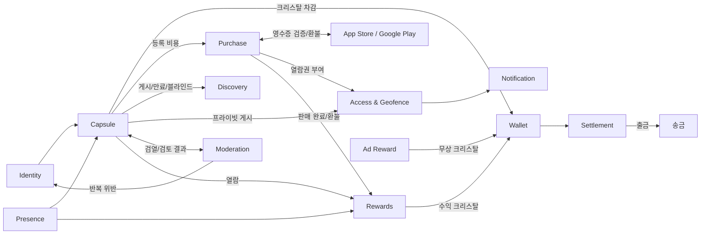
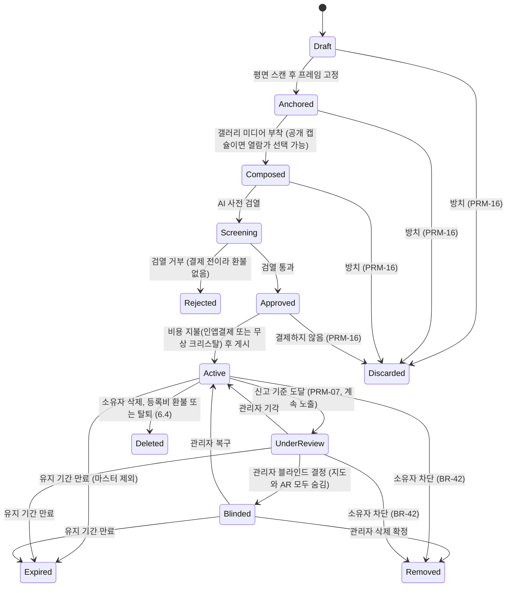

# Drop 도메인 정의서

> AR 타임캡슐 & Checkpoint 애플리케이션
>
> 문서 상태: **초안 (승인 전)** · 조정 가능한 수치의 단일 출처는 5.3 운영 파라미터(PRM)다. 본문은 수치를 PRM ID로만 참조한다. 등급별 유지 기간·가격은 5.1, 열람가는 5.2가 출처다.

## 변경 이력

| 버전 | 일자 | 변경자 | 변경내용 |
|---|---|---|---|
| 0.1 | 2026-10-01 | Claude Code | 초안 작성 |
| 0.2 | 2026-10-01 | Claude Code | OQ-1~8 결정사항 반영: 등급·가격 확정, 토스페이먼츠 결제, 정산/출금 정책, 검열 우선 확정, 열람 거리 10m, 신고 후 관리자 검토, 블라인드 범위, 개인정보 정책, 프라이빗 수신자 초대 |
| 0.3 | 2026-10-01 | Claude Code | 결제 수단을 토스페이먼츠에서 앱스토어 인앱결제(IAP)로 변경(OQ-10 해소), 유료 체크포인트(열람가 500/1,000/5,000원) 추가, 판매 수익 배분과 IAP 환불 처리 추가 |
| 0.4 | 2026-10-01 | Claude Code | 남은 미결 사항(OQ-9, 11~16)과 가정 항목을 모두 확정: 크리스탈 환산, 만 14세 미만 가입 불가, 정산 수치, 1회용 초대 링크, 프라이빗·열람가 제약, 미리보기와 녹화 방지, 열람권 유지 기간, 삭제된 유료 체크포인트 구매자 보상 |
| 0.7 | 2026-10-01 | Claude Code | 사용자 시나리오(3-user-scenario.md)에서 발견된 공백 반영(OQ-26~32): 결제 검증 복구(IAP-07), 결제 후 열람 증명, 정산 중 환불(ST-12), 회원 수신자 지정·프라이빗 노출·백그라운드 권한 거부, Blinded 중 만료 판정, 신고 사유·조건(BR-41), 차단 시 처리(BR-42), 탈퇴 시 미수금 |
| 0.6 | 2026-10-01 | Claude Code | 본문 수치를 PRM·5.1·5.2 참조로 바꿔 중복 제거(OQ-24), 이동 속도 이상치를 1,000km/h로 근거화하고 어뷰징 기준을 초기값·보정 절차로 명시(OQ-25) |
| 0.5 | 2026-10-01 | Claude Code | 품질 평가 반영(OQ-17~23): 운영 파라미터 표(5.3) 신설, 현장 증명 판정 기준(5.4), 생명주기 공백 보완(6.2~6.4), 신고 경계값·수익 계산·기준 시점 확정, 불변식·정책·이벤트·리스크 ID와 BR 매핑 추가, 미확인 항목 "잠정" 표시 |
| 1.1 | 2026-10-02 | Claude Code | 프레임 방향 직접 회전 반영(OQ-35): 앵커의 방향을 기기 방향이 아니라 프레임이 바라보는 방향(사용자가 0~360° 회전으로 정함)으로 정의 |
| 1.0 | 2026-10-02 | Claude Code | 드롭 위치 직접 배치 반영(OQ-34): 드롭 배치 반경 PRM-20(10m) 추가, 앵커 정의·BR-04·5.4 드롭 판정에 배치 거리 조건 추가 |
| 0.9 | 2026-10-01 | Claude Code | 문서 정합성 점검 미정 사항 반영: 탈퇴·등록비 환불 시 UnderReview·Blinded 캡슐 처리(OQ-33) |
| 0.8 | 2026-10-01 | Claude Code | 문서 정합성 점검: 6장 상태 다이어그램에 탈퇴 시 Deleted(6.4), 차단 시 Active·UnderReview → Removed(BR-42) 전이 추가 |

---

## 1. 개요

### 1.1 문제 정의
| # | 문제 | Drop의 해결 방향 |
|---|---|---|
| P1 | 기존 위치 기반 서비스는 GPS 조작이 쉬워 오프라인 방문의 희소성과 진정성이 떨어진다 | GPS와 AR 평면 스캔으로 **현장 증명**을 한다 |
| P2 | 특별한 장소에 추억이나 팁을 AR로 남기고 공유할 공간 기반 플랫폼이 없다 | 현실 공간에 고정되는 **AR 캡슐**을 제공한다 |
| P3 | 양질의 오프라인 위치 콘텐츠를 만들어도 직접 수익을 얻을 구조(C2C)가 없다 | **조회 보상**과 **유료 체크포인트 판매 수익**을 지급하고, 이를 **현금으로 정산**해 준다 |

### 1.2 비전
"그 장소에 가야만 볼 수 있는" 콘텐츠를 남기고, 열어 보고, 그것으로 보상받는 공간 기반 C2C 플랫폼.

---

## 2. 액터

| 액터 | 설명 |
|---|---|
| 크리에이터 | 캡슐을 등록(드롭)하고, 유료 체크포인트의 열람가를 정하고, 수익 정산을 신청하는 사용자 |
| 뷰어 | 캡슐을 탐색, 열람, 구매, 신고하는 사용자 |
| 수신자 | 프라이빗 캡슐을 열람할 권한이 있는 지정 회원 |
| 초대받은 사람 | 아직 회원이 아니며, 초대 링크를 받은 사람. 가입하면 수신자가 된다 |
| 관리자 | 신고 검토, 블라인드 결정, 정산 승인, 유저 차단 |
| 외부 시스템 | AI 검열 API, 보상형 광고 SDK, **App Store / Google Play 인앱결제**, 송금(정산 출금), 본인인증, 푸시(FCM/APNs), 지도, 미디어 스토리지/CDN, 카카오톡 등 공유 채널 |

> 한 사용자가 크리에이터이면서 뷰어일 수 있다. 액터는 역할 기준으로 나눈다.

---

## 3. 서브도메인과 바운디드 컨텍스트

| 구분 | 컨텍스트 | 책임 |
|---|---|---|
| **Core** | Capsule | 캡슐 생성, AR 앵커링, 미디어 부착, 등급별 수명, 열람가 설정, 상태 관리 |
| **Core** | Presence Verification | GPS, AR 평면 스캔, 센서를 교차 검증해 현장에 있는지 판정 (드롭, 결제, 열람할 때) |
| **Core** | Creator Rewards | 유효한 조회를 판정해 조회 보상을 지급하고, 유료 체크포인트의 판매 수익을 배분 |
| Supporting | Purchase | 인앱결제 영수증 검증, 등록 비용 결제와 열람권 구매 처리, 스토어 환불 반영 |
| Supporting | Settlement | 수익 크리스탈의 월 정산 신청, 관리자 승인, 출금 |
| Supporting | Discovery | 지도 탭과 AR 렌즈 탭에서 주변 캡슐 조회 (읽기 모델) |
| Supporting | Access & Geofence | 프라이빗 열람 권한, 초대 링크, 열람권 확인, 지오펜스(PRM-02) 진입 감지 |
| Supporting | Moderation | AI 사전 검열, 신고 누적, 관리자 검토, 블라인드 |
| Supporting | Wallet | 크리스탈 잔액(무상/수익)과 원장 관리 |
| Generic | Identity & Device Ban | 회원가입, 로그인, 연령 확인, 기기 식별자 수집, 영구 차단, 동의 관리 |
| Generic | Store Billing / Ad Reward / Notification / Media Storage | 외부 연동 (ACL 뒤에 둠). Store Billing은 StoreKit과 Google Play Billing을 쓴다 |



---

## 4. 유비쿼터스 언어

| 용어 | 정의 |
|---|---|
| 캡슐 (Capsule) | 특정 장소의 AR 공간에 고정된 미디어 콘텐츠 단위. 지도에서는 마커로 표시된다 |
| 드롭 (Drop) | 캡슐을 현장에 배치하고 게시하는 행위 |
| 프레임 (Frame) | 미디어(사진/영상)를 입히는 빈 3D 액자 객체 |
| 앵커 (Anchor) | 스캔한 3D 평면 위에 고정된 프레임의 위치와 자세 (GPS 좌표, 평면 포즈, 방향). 드롭하는 사람이 자기 위치에서 드롭 배치 반경(PRM-20) 안으로 끌어 놓은 지점이고, 방향은 프레임 앞면이 바라보는 방위(북 0°, 시계 방향)로 드롭하는 사람이 돌려서 정한다 |
| 현장 증명 (Presence Proof) | 사용자가 실제로 그 장소에 있음을 검증한 결과. 판정 기준은 5.4 |
| 등급 (Grade) | 캡슐의 유지 기간과 등록 비용을 정하는 정책 (브론즈, 실버, 마스터) |
| 유료 체크포인트 | 크리에이터가 열람가를 걸어 둔 공개 캡슐. 뷰어가 결제해야만 열람할 수 있다 |
| 열람가 (View Price) | 유료 체크포인트를 열람하는 데 드는 금액 (5.2) |
| 미리보기 (Teaser) | 결제 전에 보여 주는 정보. 제목, 크리에이터, 열람가, 남은 유지 기간, 블러 처리된 썸네일 |
| 열람권 (Entitlement) | 유료 체크포인트를 결제한 뷰어에게 주어지는 열람 권한. 캡슐이 사라질 때까지 유지된다 |
| 인앱결제 (IAP) | App Store와 Google Play의 결제 시스템. 모든 현금 결제는 이것으로 한다 |
| 무상 크리스탈 | 보상형 광고 시청이나 운영 보상으로 얻는 재화. 브론즈 등록에만 쓸 수 있고 **출금할 수 없다**. 보상 환산 비율은 PRM-11 |
| 수익 크리스탈 | 조회 보상과 판매 수익으로 얻는 재화. 1개 = 1원이며, **정산을 신청해 출금할 수 있다** |
| 열람 (Open) | AR 렌즈 탭에서 열람 반경(PRM-01) 안의 캡슐을 터치해 콘텐츠를 보는 행위 |
| 조회 보상 (View Reward) | 무료 캡슐이 유효하게 열람될 때마다 소유자에게 지급되는 수익 크리스탈 |
| 판매 수익 (Sales Share) | 유료 체크포인트가 팔렸을 때 크리에이터 몫으로 지급되는 수익 크리스탈 |
| 정산 보류 (Hold) | 환불에 대비해 판매 수익을 보류 기간(PRM-13) 동안 출금할 수 없게 묶어 두는 것 |
| 정산 (Settlement) | 수익 크리스탈을 현금으로 바꿔 달라는 월 단위 신청과 그 처리 |
| 미수금 (Receivable) | 이미 출금한 판매 수익이 환불되어 크리에이터가 플랫폼에 갚아야 하는 금액. 다음 정산에서 뺀다 |
| 프라이빗 캡슐 | 지정된 수신자만 열람할 수 있는 무료 캡슐 |
| 초대 링크 (Invitation) | 회원이 아닌 사람에게 카카오톡이나 DM으로 보내는 1회용 프라이빗 캡슐 공유 링크 |
| 지오펜스 (Geofence) | 캡슐 중심 반경 PRM-02 영역. 수신자가 들어오면 알림을 보낸다 |
| 사전 검열 (Pre-screening) | 결제 전에 AI가 미디어를 검사하는 단계 |
| 검토 대기 (Under Review) | 유효 신고가 기준(PRM-07)에 이르러 관리자 검토를 기다리는 상태. 이때는 계속 노출된다 |
| 블라인드 (Blind) | 관리자가 부적절하다고 판정해 지도와 AR 렌즈에서 모두 숨긴 상태 |
| 기기 밴 (Device Ban) | 기기 식별자 단위의 영구 차단 |

---

## 5. 핵심 도메인 모델

| ID | 애그리거트 | 주요 속성 | 불변식 | 관련 BR |
|---|---|---|---|---|
| INV-01 | **User** | userId, credentials, birthDate, devices[], status(ACTIVE/BANNED/WITHDRAWN), consents[] | 만 14세 미만은 가입할 수 없다. 차단된 기기 식별자로는 가입하거나 로그인할 수 없다. 필수 동의 없이는 가입할 수 없다 | BR-01~03, BR-37, BR-39 |
| INV-02 | **Capsule** | capsuleId, ownerId, grade, anchor, media, title, visibility(PUBLIC/PRIVATE+recipientIds), viewPrice(null/500/1000/5000), status, publishedAt, expiresAt | 게시하려면 앵커, 미디어, 검열 통과, 비용 지불이 이 순서로 모두 필요하다. `expiresAt = publishedAt + grade.retention`(5.1, PRM-06)이고, 마스터는 null이다. 프라이빗이면 viewPrice는 null이다. **게시 후에는 viewPrice를 바꿀 수 없다**. UnderReview·Blinded 상태에서는 소유자가 삭제할 수 없다 | BR-04~06, BR-10~14, BR-33 |
| INV-03 | **PresenceProof** | proofId, userId, deviceId, action(DROP/PURCHASE/OPEN), capsuleId, geoPoint, accuracy, planeScanMatch, verdict(VERIFIED/SUSPICIOUS), issuedAt | 드롭, 결제, 열람할 때 모두 발급되어야 한다. 판정은 5.4를 따른다. 유효 시간(PRM-04) 안에 해당 행위 1회에만 쓸 수 있다 | BR-04, BR-16, BR-18, BR-27, BR-40 |
| INV-04 | **Purchase** | purchaseId, userId, deviceId, type(DROP_FEE/VIEW_ACCESS), refId(capsuleId), price, store(APPLE/GOOGLE), storeTransactionId, storeFeeRate, status(PENDING/VERIFIED/FAILED/REFUNDED), verifiedAt | 서버에서 영수증을 검증한 경우에만 VERIFIED가 된다. 같은 storeTransactionId는 한 번만 처리한다. 소유자는 자기 캡슐의 열람권을 살 수 없다 | BR-07~09, BR-17, BR-19, BR-38 |
| INV-05 | **Entitlement** | userId, capsuleId, purchaseId, grantedAt, revokedAt | 결제가 VERIFIED여야 생긴다. 캡슐이 Expired, Removed, Deleted가 되면 끝나고, 환불되면 회수된다. 캡슐이 Blinded인 동안에는 유지되지만 열람할 수 없다 | BR-17~20 |
| INV-06 | **ViewRecord** | capsuleId, viewerId, deviceId, ip, presenceProofId, viewedAt, rewarded | 무료 공개 캡슐의 유효한 조회일 때만 rewarded=true가 된다 | BR-27, BR-29, BR-31 |
| INV-07 | **Wallet** | userId, freeBalance, earnedBalance, heldBalance, lockedBalance, receivable, ledger[{type, amount, reason, refId}] | 잔액은 모두 음수가 될 수 없다. 환불 상계로 생긴 부족분은 receivable(미수금)에 기록한다. 출금은 earnedBalance에서만 할 수 있다. 정산 신청 금액은 lockedBalance로 옮겨 잠근다 | BR-08, BR-19, BR-20, BR-29~32 |
| INV-08 | **Settlement** | settlementId, userId, period(YYYY-MM), amount, status(REQUESTED/APPROVED/REJECTED/PAID), reviewedBy | 사용자 1명당 한 달에 1건만 신청할 수 있다. 신청한 금액은 처리가 끝날 때까지 잠긴다 | BR-32 |
| INV-09 | **ModerationCase** | capsuleId, aiVerdict, reports[{reporterId, reason(SEXUAL/VIOLENCE/HATE/PRIVACY/SPAM/OTHER)}], state(OPEN/UNDER_REVIEW/DISMISSED/BLINDED/REMOVED), decidedBy | 신고는 1인당 캡슐 1개에 1회만 인정한다. 블라인드와 삭제는 관리자만 결정한다 | BR-33~36, BR-41 |
| INV-10 | **Invitation** | invitationId, capsuleId, token, expiresAt, redeemedBy | 유효 기간(PRM-15) 동안 유효하고, 1회만 쓸 수 있다. 로그인한 회원만 쓸 수 있으며(기존 회원 포함), 쓰면 그 회원이 recipientIds에 추가된다 | BR-22~24 |

**주요 값객체:** `Anchor`, `Grade`, `ViewPrice`, `Money(KRW)`, `GeoPoint`, `MediaRef(type, url, hash)`, `Visibility`

### 5.1 등급 정책

| 등급 | 유지 기간 | 현금 가격 (잠정, 15장 스토어 확인) | 무상 크리스탈 |
|---|---|---|---|
| 브론즈 | 1개월 (30일) | 1,000원 | 등록 가능 (필요 개수 PRM-11) |
| 실버 | 1년 (365일) | 2,000원 | 사용 불가 |
| 마스터 | 영구 | 5,000원 | 사용 불가 |

> 무상 크리스탈은 브론즈에만 쓸 수 있게 해서, 오래 유지되는 등급의 현금 매출을 지킵니다. 광고 보상(PRM-10)은 하루 최대치를 모아야 브론즈 1개(PRM-11)를 등록할 수 있게 맞춘 값입니다.

### 5.2 유료 체크포인트 열람가

| 열람가 (잠정, 15장 스토어 확인) | 비고 |
|---|---|
| 500원 | |
| 1,000원 | |
| 5,000원 | |

> 등록 비용과 열람가는 모두 인앱결제 상품으로 등록합니다. 스토어에서 쓸 수 있는 가격 단위에 맞춰 실제 금액이 조금 달라질 수 있습니다.

### 5.3 운영 파라미터 (단일 출처)

수치를 바꿀 때는 이 표만 고치고 변경 이력에 남긴다. 14장 결정 로그는 결정 당시 값을 남긴 이력이므로 수치를 그대로 둔다. "초기값"은 근거 데이터가 없어 출시 후 보정할 값이다(5.3.1).

| ID | 항목 | 값 |
|---|---|---|
| PRM-01 | 열람·결제 반경 | 10m |
| PRM-02 | 지오펜스 반경 | 50m |
| PRM-03 | GPS 정확도 보정 상한 / 재측정 기준 | 20m / 30m |
| PRM-04 | 현장 증명 유효 시간 | 발급 후 60초, 1회 사용 |
| PRM-05 | 이동 속도 이상치 | 직전 증명 대비 시속 1,000km 초과 (여객기 순항 속도 약 900km/h를 넘는 이동은 불가능하다고 본다) |
| PRM-06 | 등급 유지 기간 계산 | 5.1의 기간을 게시 시각부터 시간 단위로 계산한다 (30일 = 720시간, 365일 = 8,760시간) |
| PRM-07 | 검토 대기 전이 | 유효 신고 4회 이상 |
| PRM-08 | 조회 보상 | 유효 조회 1건 = 수익 크리스탈 1개(1원), 캡슐당 하루 100건 |
| PRM-09 | 재조회 제외 | 같은 뷰어·같은 캡슐 24시간 |
| PRM-10 | 광고 보상 | 1회 10개, 하루 10회 |
| PRM-11 | 무상 크리스탈 | 브론즈 등록 100개, 보상 환산 1개 = 10원 |
| PRM-12 | 판매 수익 배분 | 크리에이터 70%, 플랫폼 30% (스토어 수수료 차감 후) |
| PRM-13 | 정산 보류 | 영수증 검증 시각(verifiedAt)부터 720시간(30일) |
| PRM-14 | 정산 | 신청 매월 1~5일, 최소 10,000원, 지급 매월 15일, 원천징수 3.3%(잠정, 15장 세무 확인) |
| PRM-15 | 초대 링크 유효 기간 | 발급 후 7일(168시간) |
| PRM-16 | 미완성 캡슐 폐기 | 마지막 변경 후 24시간 |
| PRM-17 | "하루" 기준 | 한국 표준시(KST) 00:00~24:00 |
| PRM-18 | 어뷰징 검토 대상 (초기값) | ① 같은 기기 또는 같은 IP에서 한 크리에이터의 캡슐을 하루 10회 이상 조회 ② 캡슐의 하루 조회 수가 직전 7일 평균의 5배 이상이면서 50건 이상 ③ 같은 구매자 또는 같은 기기가 한 크리에이터의 유료 체크포인트를 한 달에 5회 이상 구매 |
| PRM-19 | 가입 연령 | 만 14세 이상 |
| PRM-20 | 드롭 배치 반경 | 드롭하는 사람의 위치에서 10m 이내 |

#### 5.3.1 초기값 보정

- PRM-18은 관리자 검토 대상을 표시하는 기준일 뿐, 자동 반려나 차단의 근거가 아니다. 그래서 초기값이 틀려도 지급이 잘못되지 않고 검토량만 달라진다.
- 출시 후 첫 3회 정산의 실제 분포를 보고, 정상 크리에이터의 상위 1%가 걸리는 수준으로 PRM-18 수치를 다시 정한다.
- 관리자가 반려한 건이 기준에 걸리지 않았다면, 그 패턴을 PRM-18 항목으로 추가한다.

### 5.4 현장 증명 판정 기준

| 행위 | VERIFIED 조건 (모두 충족) |
|---|---|
| 드롭 | GPS accuracy ≤ 재측정 기준(PRM-03), `앵커와 드롭하는 사람 위치의 거리 ≤ 드롭 배치 반경 PRM-20`, AR 평면 1개 이상 검출(planeScanMatch=true), 이동 속도 이상치(PRM-05) 아님, 기기 무결성 검증 통과 |
| 결제·열람 | GPS accuracy ≤ 재측정 기준(PRM-03), `캡슐까지 거리 − min(accuracy, 보정 상한 PRM-03) ≤ 열람 반경 PRM-01`, 캡슐 앵커 평면과 일치(planeScanMatch=true), 이동 속도 이상치 아님, 기기 무결성 검증 통과 |

- accuracy가 재측정 기준(PRM-03)보다 나쁘면 판정하지 않고 재측정을 안내한다(증명 미발급).
- 그 밖에 하나라도 어긋나면 SUSPICIOUS로 발급하고, 해당 행위를 거부한다(BR-40). SUSPICIOUS 기록은 정산 어뷰징 검토(ST-08)에 쓴다.

---

## 6. 캡슐 생명주기



### 6.1 유료 체크포인트 열람 흐름

```
지도에서 발견 (미리보기 노출) ──▶ 열람 반경(PRM-01) 안으로 접근 + 현장 증명 ──▶ 열람권이 있는가?
   ├─ 있음 ──▶ 열람
   └─ 없음 ──▶ 남은 유지 기간 안내 ──▶ 인앱결제 ──▶ 서버에서 영수증 검증 ──▶ 열람권 부여 ──▶ 새 현장 증명(OPEN) ──▶ 열람
                                                                       └─▶ 크리에이터에게 판매 수익 적립 (PRM-13 보류)
```

### 6.2 예외 상태 처리

| 상황 | 처리 |
|---|---|
| Rejected | 종료 상태다. 같은 캡슐을 다시 제출할 수 없고, 미디어를 바꾸려면 새 Draft로 시작한다. 업로드된 미디어는 삭제한다 |
| 미완성·결제 이탈 (Draft, Anchored, Composed, Approved) | 폐기 기준 시간(PRM-16)이 지나면 Discarded로 바꾸고 미디어를 삭제한다. 결제가 없었으므로 환불할 것이 없다 |
| 소유자 삭제 (Deleted) | Active 상태에서만 할 수 있다(INV-02). 유료 체크포인트라면 BR-20 보상을 똑같이 적용한다 |
| 등록비 환불 | 스토어가 DROP_FEE를 환불하면 캡슐을 Deleted로 바꾼다(BR-38). Active뿐 아니라 UnderReview·Blinded 상태여도 같다(스토어 환불은 막을 수 없다). 열린 검토 사건은 종료한다. 유료 체크포인트라면 BR-20을 적용한다 |
| Blinded 중 열람권·판매 수익 | 열람권은 유지하되 열람할 수 없다. 보류 기간이 끝난 판매 수익도 지급을 미룬다. Active로 복구되면 지급하고, Removed가 되면 지급하지 않는다(BR-20) |
| UnderReview 중 만료 | 유지 기간이 끝나면 Expired로 바꾸고 검토 사건을 DISMISSED로 닫는다. 계속 노출되던 상태였으므로 판매 수익은 정상 지급한다 |
| Blinded 중 만료 | 유지 기간이 끝나면 Expired로 바꾸되, 검토 사건은 BLINDED로 열어 두고 관리자가 판정한다. DISMISSED면 미뤄 둔 판매 수익을 지급하고, REMOVED면 지급하지 않고 BR-20을 적용한다 |

### 6.3 다른 애그리거트의 상태 전이

| 애그리거트 | 전이 |
|---|---|
| Purchase | PENDING → VERIFIED(영수증 검증 성공) / FAILED(검증 실패) · VERIFIED → REFUNDED(스토어 환불 알림) |
| Settlement | REQUESTED → APPROVED → PAID · REQUESTED → REJECTED(잠금 금액을 잔액으로 되돌림) |
| ModerationCase | OPEN(신고 접수) → UNDER_REVIEW(PRM-07) → DISMISSED(캡슐 Active 복귀) / BLINDED → REMOVED 또는 DISMISSED(복구) |

### 6.4 회원 탈퇴

- 진행 중인 정산(REQUESTED, APPROVED)이 있으면 탈퇴할 수 없다.
- 미수금이 있어도 탈퇴할 수 있다. 미수금은 플랫폼 손실로 처리하되, 정산 본인인증(ST-07) 정보의 해시와 함께 결제 기록 보관 기간(PRV-06) 동안 기록한다. 같은 본인인증으로 다시 가입해 정산을 신청하면 그 미수금을 먼저 뺀다.
- 남은 수익 크리스탈과 무상 크리스탈은 탈퇴 시 소멸한다는 데 동의해야 한다.
- 탈퇴하면 그 회원의 Active·UnderReview·Blinded 캡슐을 모두 Deleted로 바꾸고 열린 검토 사건을 종료한다. 유료 체크포인트에는 BR-20을 적용한다(판매 수익을 지급하지 않으므로 검토 회피로 얻는 이익이 없다).
- 개인정보는 11장 정책에 따라 파기한다. 결제 기록은 5년 보관한다(PRV-06).

---

## 7. 비즈니스 규칙

| ID | 영역 | 규칙 |
|---|---|---|
| BR-01 | 인증 | 회원가입과 로그인을 완료해야만 앱의 모든 기능을 쓸 수 있다 |
| BR-02 | 인증 | 가입 연령(PRM-19)에 미달하면 가입할 수 없다 |
| BR-03 | 인증 | 가입과 로그인 시 기기 식별자를 수집한다. 차단된 기기는 계정을 새로 만들어도 사용할 수 없다 (11장 정책을 따른다) |
| BR-04 | 등록 | 캡슐은 AR 평면 스캔으로 3D 프레임을 앵커링한 경우에만 등록할 수 있다. 현장 증명이 필수다. 앵커는 드롭하는 사람의 위치에서 드롭 배치 반경(PRM-20) 안에만 놓을 수 있다 |
| BR-05 | 등록 | 미디어는 스마트폰 갤러리의 사진이나 영상에서만 불러온다 |
| BR-06 | 등급 | 등록 시 등급을 반드시 지정한다. 등급별 유지 기간과 가격은 5.1을 따른다 |
| BR-07 | 결제 | **모든 현금 결제는 인앱결제(App Store / Google Play)로 한다** |
| BR-08 | 결제 | 브론즈는 무상 크리스탈(PRM-11)로도 등록할 수 있다. 실버와 마스터는 현금으로만 등록할 수 있다 |
| BR-09 | 결제 | 결제는 서버에서 스토어 영수증을 검증한 뒤에만 확정한다. 같은 거래는 두 번 처리하지 않는다 |
| BR-10 | 등록 | **AI 사전 검열을 결제보다 먼저 한다.** 검열을 통과한 캡슐만 결제 단계로 넘어간다 |
| BR-11 | 등급 | 유지 기간이 끝난 캡슐은 Expired 상태가 되고 지도와 AR에서 사라진다 |
| BR-12 | 유료 | 크리에이터는 공개 캡슐을 등록할 때 열람가를 5.2의 금액 중에서 고를 수 있다. 고르지 않으면 무료 캡슐이다 |
| BR-13 | 유료 | 프라이빗 캡슐에는 열람가를 걸 수 없다 |
| BR-14 | 유료 | 게시한 뒤에는 열람가를 바꿀 수 없다. 바꾸려면 새로 등록해야 한다 |
| BR-15 | 유료 | 결제 전에는 미리보기(제목, 크리에이터, 열람가, 남은 유지 기간, 블러 처리된 썸네일)만 보여 준다 |
| BR-16 | 유료 | 결제는 열람 반경(PRM-01) 안에서 현장 증명이 통과된 뒤에만 할 수 있다. 현장에 가지 않고는 살 수 없다 |
| BR-17 | 유료 | 유료 체크포인트는 열람권이 있는 뷰어만 열람할 수 있다. 소유자는 결제 없이 열람하고, 자기 캡슐을 살 수 없다 |
| BR-18 | 유료 | 한 번 결제하면 캡슐이 사라질 때까지 다시 열람할 수 있다. 다만 열람할 때마다 열람 반경(PRM-01)과 현장 증명 조건은 지켜야 한다 |
| BR-19 | 유료 | 스토어에서 환불되면 열람권을 회수하고, 크리에이터에게 적립한 판매 수익을 차감한다 |
| BR-20 | 유료 | 유료 체크포인트가 Removed(관리자 삭제) 또는 Deleted(소유자 삭제·등록비 환불·탈퇴)가 되면, 영수증 검증 후 보류 기간(PRM-13)이 지나지 않은 구매자에게 구매가를 PRM-11 비율로 환산한 무상 크리스탈을 보상하고, 그 판매 수익은 크리에이터에게 지급하지 않는다 |
| BR-21 | 유료 | 열람 화면은 Android에서는 캡처와 녹화를 막고, iOS에서는 녹화가 감지되면 콘텐츠를 가린다. 영상에는 뷰어 식별 워터마크를 넣는다 |
| BR-22 | 프라이빗 | 프라이빗 캡슐은 지정된 수신자만 열람할 수 있다. 수신자 수에는 제한이 없다. 프라이빗 캡슐은 소유자와 수신자의 지도·AR에만 보이고, 다른 사용자에게는 존재 자체를 보여 주지 않는다 |
| BR-23 | 프라이빗 | 수신자는 앱 회원이어야 한다. 수신자는 회원 여부와 관계없이 초대 링크로만 지정한다(회원 검색 기능은 두지 않는다). 기존 회원은 링크를 열고 로그인하면, 회원이 아닌 사람은 앱을 설치하고 가입하면 수신자가 된다 |
| BR-24 | 프라이빗 | 초대 링크는 유효 기간(PRM-15) 동안만 쓸 수 있고 1회만 쓸 수 있다. 크리에이터는 초대할 사람마다 링크를 따로 만든다 |
| BR-25 | 프라이빗 | 수신자가 지오펜스(PRM-02) 안에 들어오면 지오펜싱 푸시를 보낸다. 같은 수신자에게는 캡슐당 1회만 보낸다. 백그라운드 위치 권한을 거부한 수신자에게는 푸시 대신, 앱을 사용하는 중에 지오펜스에 들어오면 앱 안 알림을 1회 보낸다 |
| BR-26 | 탐색 | 지도 탭에서는 주변 캡슐을 탐색한다. 열람은 AR 렌즈 탭에서 해야 한다 |
| BR-27 | 열람 | 캡슐의 **열람 반경(PRM-01) 안**에 있고 현장 증명이 VERIFIED일 때만 열람할 수 있다 (판정식은 5.4) |
| BR-28 | 열람 | 타인의 캡슐을 열람하는 뷰어에게는 광고를 노출하지 않는다 |
| BR-29 | 보상 | 무료 공개 캡슐은 유효한 조회마다 소유자에게 PRM-08의 단가로 수익 크리스탈을 지급한다. 캡슐 1개당 하루(PRM-17) 상한(PRM-08)까지 지급한다 |
| BR-30 | 보상 | 유료 체크포인트는 조회 보상 대신, 판매될 때마다 판매 수익을 지급한다 |
| BR-31 | 보상 | 본인 조회와, 같은 뷰어가 같은 캡슐을 재조회 제외 기간(PRM-09) 안에 다시 조회한 경우는 유효한 조회가 아니다. 프라이빗 캡슐의 조회에는 보상하지 않는다 |
| BR-32 | 정산 | 수익 크리스탈만 출금할 수 있다. 정산은 한 달에 1회 신청하고, 관리자가 승인한 뒤에 지급한다 (9장) |
| BR-33 | 검열 | 모든 캡슐은 게시 전에 AI 사전 검열을 통과해야 한다 |
| BR-34 | 신고 | 뷰어는 부적절한 캡슐을 신고할 수 있고, 1인당 캡슐 1개에 1회만 인정한다 |
| BR-35 | 신고 | 유효 신고가 기준(PRM-07)에 이르면 관리자 검토 대기로 넘어간다. 자동으로 숨기지 않는다 |
| BR-36 | 신고 | 관리자가 블라인드를 결정하면 지도와 AR 렌즈 모두에서 숨긴다 |
| BR-37 | 제재 | 관리자는 악성 유저를 기기 식별자 단위로 영구 차단할 수 있다 |
| BR-38 | 결제 | 스토어에서 등록비(DROP_FEE)가 환불되면 해당 캡슐을 Deleted로 바꾼다. 무상 크리스탈로 등록한 캡슐은 해당하지 않는다 |
| BR-39 | 인증 | 회원 탈퇴는 6.4 조건을 따른다 |
| BR-40 | 현장 증명 | 현장 증명이 SUSPICIOUS이거나, 유효 시간(PRM-04)이 지났거나, 이미 사용된 경우 드롭·결제·열람을 거부한다. 결제에 쓴 증명으로는 열람할 수 없고, 결제 후 열람에는 새 증명이 필요하다 |
| BR-41 | 신고 | 신고 사유는 음란물, 폭력, 혐오, 개인정보 노출, 스팸·광고, 기타(직접 입력) 중 하나를 고른다. 지도나 AR에서 자신에게 보이는 캡슐이면 거리와 관계없이 신고할 수 있다(유료 체크포인트는 미리보기 기준, 프라이빗은 수신자만). 자기 캡슐은 신고할 수 없다 |
| BR-42 | 제재 | 차단(BR-37)하면 그 유저의 Active·UnderReview 캡슐을 모두 Removed로 바꾸고 BR-20을 적용한다. 진행 중인 정산은 REJECTED로 바꾸고, 수익 크리스탈은 동결한다. 동결된 금액은 관리자가 어뷰징 여부를 확인해 정당한 수익만 1회 최종 정산하고, 나머지는 소멸시킨다. 미수금 기록은 6.4와 같이 보관한다 |

---

## 8. 재화 흐름

```
[무상] 보상형 광고 시청(PRM-10) ──▶ 무상 크리스탈 ──▶ 브론즈 등록(PRM-11) (출금 불가)
[현금] 인앱결제 ──────────────────────────────────────────▶ 캡슐 등록 비용
[현금] 뷰어 인앱결제(열람가) ──▶ 스토어 수수료 차감 ──▶ 플랫폼 / 크리에이터 배분(PRM-12, 수익 크리스탈, PRM-13 보류)
[수익] 내 무료 공개 캡슐이 유효하게 조회됨 ──▶ 수익 크리스탈(PRM-08)
       수익 크리스탈 ──▶ 월 정산 신청 ──▶ 관리자 승인 ──▶ 원천징수 후 계좌 출금
```

- **플랫폼 수익원:** 등록 단계의 보상형 광고 수익, 등록 비용 결제, 유료 체크포인트 판매 수수료
- **크리에이터 수익원:** 무료 캡슐의 조회 보상과 유료 체크포인트의 판매 수익 (C2C)
- **크리스탈을 두 종류로 나누는 이유:** 광고 시청으로 얻은 크리스탈까지 출금할 수 있으면, 광고만 반복 시청해 현금을 빼 가는 어뷰징이 생긴다

---

## 9. 수익 배분·정산 정책

| ID | 항목 | 정책 |
|---|---|---|
| ST-01 | 판매 수익 배분 | 크리에이터 몫 = `floor(열람가 × (1 − storeFeeRate) × 크리에이터 배분율 PRM-12)`원. storeFeeRate는 그 거래에 스토어가 실제 적용한 수수료율(15% 또는 30%)이고, 1원 미만은 버린다. 나머지는 플랫폼 몫이다 |
| ST-02 | 조회 보상 단가 | PRM-08 |
| ST-03 | 조회 보상 상한 | PRM-08. 브론즈 한 개가 유지 기간 동안 받을 수 있는 최대 보상이 등록 매출과 광고 수익 범위 안에 들도록 정한다 |
| ST-04 | 정산 보류 | 판매 수익은 영수증 검증 시각부터 보류 기간(PRM-13)이 지나야 출금할 수 있다 |
| ST-05 | 신청 주기 | 신청 기간(PRM-14, KST)에 직전 달 말일 24:00까지 출금 가능해진 금액 **전액**을 신청한다. 금액을 나눠 신청할 수 없다 |
| ST-06 | 최소 신청 금액 | PRM-14 (미수금을 뺀 금액 기준) |
| ST-07 | 신청 요건 | 본인인증을 하고 본인 명의 계좌를 등록해야 한다 |
| ST-08 | 승인 | 신청 기간이 끝난 뒤 관리자가 어뷰징 검토 대상(PRM-18)과 SUSPICIOUS 현장 증명 기록을 검토해 승인하거나 반려한다 |
| ST-09 | 지급 | 지급일(PRM-14)에 원천징수(PRM-14, 잠정 — 15장 세무 확인)를 빼고 송금한다. 지급일이 영업일이 아니면 다음 영업일에 지급한다 |
| ST-10 | 반려 시 | 잠겨 있던 크리스탈을 잔액으로 되돌리고, 사유를 알린다 |
| ST-11 | 환불 상계 | 이미 출금한 판매 수익이 나중에 환불되면, 그 금액을 미수금으로 기록하고 다음 정산에서 뺀다 |
| ST-12 | 정산 중 환불 | 환불된 판매 수익은 heldBalance → earnedBalance → lockedBalance → 미수금 순서로 뺀다. lockedBalance에서 빼면 그만큼 정산 금액을 줄이고, 최소 신청 금액(PRM-14) 아래로 떨어지면 정산을 REJECTED로 바꾸고 남은 잠금 금액을 잔액으로 되돌린다 |

---

## 10. 인앱결제 정책

| ID | 항목 | 정책 |
|---|---|---|
| IAP-01 | 상품 종류 | 등록 비용 3종(5.1)과 열람가 3종(5.2)을 **소모성 상품**으로 등록한다 |
| IAP-02 | 상품과 캡슐 연결 | 같은 가격의 상품을 여러 캡슐이 함께 쓴다. 어느 캡슐을 산 것인지는 서버의 Purchase 기록으로 구분한다 |
| IAP-03 | 검증 | 클라이언트 결과를 믿지 않고, 서버가 스토어 API로 영수증을 검증한다 |
| IAP-04 | 환불 | 스토어의 환불 알림(App Store Server Notifications, Google Play RTDN)을 받아 열람권을 회수하고 판매 수익을 차감한다. 등록비 환불은 BR-38을 따른다 |
| IAP-05 | 수수료 | 스토어 수수료(15~30%)는 플랫폼과 크리에이터 배분 전에 뺀다. 거래별 실제 적용률을 Purchase.storeFeeRate에 기록한다(ST-01) |
| IAP-06 | 운영 보상 | iOS에서는 개발사가 직접 환불할 수 없으므로, 운영상 보상(BR-20)은 무상 크리스탈로 한다 |
| IAP-07 | 검증 복구 | 서버 검증이 끝나기 전에는 스토어 거래를 완료(finish/acknowledge) 처리하지 않는다. 앱이 꺼지거나 네트워크가 끊겨도 앱을 다시 켜면 미완료 거래를 서버로 다시 보내고, 서버는 스토어 서버 알림으로도 같은 거래를 확인한다. 검증이 FAILED로 끝나면 열람권·게시를 주지 않고 스토어 환불 요청을 안내한다(Google Play는 미확인 거래를 자동 환불한다) |

---

## 11. 개인정보·위치정보 정책

개인정보 보호법과 위치정보법을 기준으로 잡은 정책입니다.

| ID | 항목 | 정책 |
|---|---|---|
| PRV-01 | 연령 | 가입 연령(PRM-19)에 미달하면 가입할 수 없다. 법정대리인 동의 절차와 아동 위치정보 처리 부담을 피하기 위해서다 |
| PRV-02 | 기기 식별자 종류 | 광고 ID(ADID/IDFA)는 사용자가 초기화할 수 있어 차단용으로 쓰지 않는다. 앱이 직접 만든 설치 ID를 보안 저장소(iOS Keychain, Android Keystore)에 저장하고, 기기 무결성 검증(Play Integrity, App Attest)과 함께 쓴다 |
| PRV-03 | 동의 | 회원가입 시 필수 동의로 받는다. 수집 항목(기기 식별자, 조회·결제 시 IP), 목적(부정 이용 방지와 차단), 보유 기간을 명시한다 |
| PRV-04 | 저장 방식 | 원문 대신 해시값으로 저장하고, 접근 권한을 관리자로 제한한다 |
| PRV-05 | 보유 기간 | 정상 회원은 탈퇴할 때 바로 파기한다. 차단된 회원은 재가입 방지를 위해 해시값만 차단 목록에 5년 보관하고, 이 기간을 동의서에 명시한다 (잠정, 15장 법무 확인) |
| PRV-06 | 결제 기록 | 전자상거래법에 따라 대금 결제와 공급 기록은 5년 보관한다 |
| PRV-07 | 위치정보 | 위치정보 수집 동의를 따로 받는다. 지오펜싱 푸시를 위해 백그라운드 위치 권한이 필요하므로 별도로 안내한다 |
| PRV-08 | 사업자 신고 | 위치기반서비스사업자로 신고한다 |

---

## 12. 핵심 도메인 이벤트

| ID | 이벤트 | 발행 애그리거트 | 근거 |
|---|---|---|---|
| EV-01 | `UserRegistered` | User | BR-01~03 |
| EV-02 | `UserWithdrawn` | User | BR-39, 6.4 |
| EV-03 | `DeviceBanned` | User | BR-37 |
| EV-04 | `PresenceVerified` / `PresenceSuspicious` | PresenceProof | BR-04, BR-16, BR-27, BR-40 |
| EV-05 | `CapsuleAnchored` | Capsule | BR-04 |
| EV-06 | `MediaAttached` | Capsule | BR-05 |
| EV-07 | `ScreeningPassed` / `ScreeningRejected` | Capsule | BR-10, BR-33 |
| EV-08 | `CapsuleDiscarded` | Capsule | 6.2, PRM-16 |
| EV-09 | `DropCostPaid` | Capsule | BR-06~08 |
| EV-10 | `CapsulePublished` | Capsule | BR-06, BR-11 |
| EV-11 | `CapsuleExpired` | Capsule | BR-11 |
| EV-12 | `CapsuleDeleted` | Capsule | 6.2, BR-20, BR-38 |
| EV-13 | `CapsuleOpened` | ViewRecord | BR-27 |
| EV-14 | `ViewRewardGranted` | Wallet | BR-29, BR-31 |
| EV-15 | `AdRewardGranted` | Wallet | PRM-10 |
| EV-16 | `PurchaseVerified` / `PurchaseFailed` | Purchase | BR-09 |
| EV-17 | `EntitlementGranted` | Entitlement | BR-17, BR-18 |
| EV-18 | `SalesShareGranted` | Wallet | BR-30, ST-01 |
| EV-19 | `SalesShareReleased` | Wallet | ST-04 |
| EV-20 | `PurchaseRefunded` | Purchase | BR-19, BR-38 |
| EV-21 | `EntitlementRevoked` | Entitlement | BR-19 |
| EV-22 | `SalesShareReversed` | Wallet | BR-19, ST-11 |
| EV-23 | `BuyerCompensated` | Wallet | BR-20 |
| EV-24 | `InvitationSent` | Invitation | BR-23, BR-24 |
| EV-25 | `InvitationRedeemed` | Invitation | BR-23 |
| EV-26 | `InvitationExpired` | Invitation | BR-24 |
| EV-27 | `RecipientEnteredGeofence` | Capsule | BR-25 |
| EV-28 | `CapsuleReported` | ModerationCase | BR-34 |
| EV-29 | `CapsuleUnderReview` (v0.4의 `ReviewRequested`) | ModerationCase | BR-35 |
| EV-30 | `ReviewDismissed` | ModerationCase | BR-35 |
| EV-31 | `CapsuleBlinded` | ModerationCase | BR-36 |
| EV-32 | `CapsuleRestored` | ModerationCase | 6.2 |
| EV-33 | `CapsuleRemoved` | ModerationCase | BR-20 |
| EV-34 | `SettlementRequested` | Settlement | BR-32, ST-05 |
| EV-35 | `SettlementApproved` / `SettlementRejected` | Settlement | ST-08, ST-10 |
| EV-36 | `SettlementPaid` | Settlement | ST-09 |
| EV-37 | `EarningsFrozen` | Wallet | BR-42 |

---

## 13. 주요 리스크와 대응

| ID | 리스크 | 대응 |
|---|---|---|
| RISK-01 | GPS 스푸핑 | 드롭, 결제, 열람할 때 GPS, AR 평면 스캔, 센서, 이동 속도, 기기 무결성을 교차 검증한다 (5.4, BR-04, BR-16, BR-27, BR-40) |
| RISK-02 | 자기 조회와 상호 조회로 보상 부풀리기 | 중복 조회를 제외하고, 캡슐당 하루 상한(PRM-08)을 두고, 정산할 때 관리자가 검토한다 (BR-29, BR-31, PRM-18 ①②) |
| RISK-03 | 자전 거래 (본인이나 지인 계정으로 자기 체크포인트 구매) | 소유자는 구매할 수 없고, 같은 구매자나 같은 기기(Purchase.deviceId)로 반복 구매하는 패턴을 정산 검토 때 확인한다 (BR-17, PRM-18 ③, ST-08) |
| RISK-04 | 결제 후 환불로 콘텐츠만 보고 돈 돌려받기 | 환불되면 열람권을 회수하고 판매 수익을 차감한다. 판매 수익은 보류 기간(PRM-13)이 지난 뒤 정산한다 (BR-19, ST-04) |
| RISK-05 | 영수증 위조 | 서버가 스토어 API로 검증한다 (BR-09, IAP-03) |
| RISK-06 | 광고 시청을 현금으로 바꾸는 어뷰징 | 무상 크리스탈은 출금할 수 없고, 하루 광고 보상 횟수를 제한한다 (PRM-10, 8장) |
| RISK-07 | 신고 악용(담합 신고) | 1인당 1회만 인정하고, 블라인드는 관리자만 결정한다 (BR-34~36) |
| RISK-08 | 다중 계정으로 차단 우회 | 기기 식별자 기반으로 차단하고, 무결성 검증을 함께 한다 (PRV-02) |
| RISK-09 | 유료 콘텐츠 유출 | Android 캡처·녹화 차단, iOS 녹화 감지 시 가림, 뷰어 워터마크로 대응한다. 다른 기기로 화면을 찍는 것은 막을 수 없다 (BR-21) |
| RISK-10 | 초대 링크 무단 전달 | 1회용 링크에 유효 기간(PRM-15)을 둔다 (BR-24) |
| RISK-11 | 조회 보상 재원 부족 | 조회 보상 상한을 등록 매출 범위 안에서 정했다. 실제 운영 데이터를 보고 단가와 상한을 조정한다 (ST-03) |
| RISK-12 | 판매 직후 삭제로 구매자 피해 | 소유자 삭제·등록비 환불·탈퇴·차단에도 구매자 보상을 적용하고 판매 수익을 지급하지 않는다 (BR-20, BR-42, 6.2) |
| RISK-13 | 미수금을 남기고 탈퇴 후 재가입 | 본인인증 해시로 미수금을 기록해 재가입 후 정산에서 뺀다 (6.4) |

---

## 14. 결정 사항

| ID | 결정 | 영향 BR·정책 | 버전 |
|---|---|---|---|
| OQ-1 | 브론즈 1개월 1,000원, 실버 1년 2,000원, 마스터 영구 5,000원 | BR-06, 5.1 | 0.2 |
| OQ-2 | 월 1회 정산을 신청하고 관리자가 승인하면 출금한다 | BR-32, 9장 | 0.2 |
| OQ-3 | 검열을 결제보다 먼저 한다 | BR-10 | 0.2 |
| OQ-4 | 반경 10m 안에서만 열람할 수 있다 | BR-16, BR-18, BR-27, PRM-01 | 0.2 |
| OQ-5 | 신고가 3회를 넘으면 관리자가 검토한 뒤 블라인드할지 정한다 (경계값은 OQ-17) | BR-35 | 0.2 |
| OQ-6 | 블라인드되면 지도와 AR 렌즈 모두에서 숨긴다 | BR-36 | 0.2 |
| OQ-7 | 11장의 개인정보·위치정보 정책을 따른다 | 11장 | 0.2 |
| OQ-8 | 수신자 수에는 제한이 없다. 회원만 열람할 수 있고, 회원이 아니면 초대 링크로 가입하게 한다 | BR-22, BR-23 | 0.2 |
| OQ-9 | 무상 크리스탈은 브론즈 등록에만 쓸 수 있고, 100개가 필요하다. 광고 1회에 10개, 하루 최대 10회 | BR-08, PRM-10, PRM-11 | 0.4 |
| OQ-10 | 모든 현금 결제를 인앱결제로 한다 (토스페이먼츠는 쓰지 않는다) | BR-07, 10장 | 0.3 |
| OQ-10-1 | 유료 체크포인트를 도입한다. 열람가는 500원, 1,000원, 5,000원 3가지다 | BR-12~21 | 0.3 |
| OQ-11 | 만 14세 미만은 가입할 수 없다 | BR-02, PRV-01 | 0.4 |
| OQ-12 | 판매 수익 크리에이터 70%, 조회 보상 1건 1원·캡슐당 하루 100건, 정산 보류 30일, 최소 신청 10,000원, 매월 15일 지급 | PRM-08, PRM-12~14 | 0.4 |
| OQ-13 | 초대 링크는 7일 동안 유효한 1회용 링크다 | BR-24, PRM-15 | 0.4 |
| OQ-14 | 프라이빗 캡슐에는 열람가를 걸 수 없다. 게시 후에는 열람가를 바꿀 수 없다 | BR-13, BR-14 | 0.4 |
| OQ-15 | 결제 전에는 블러 처리된 미리보기를 보여 준다. Android는 캡처·녹화를 막고, iOS는 녹화 감지 시 가리고, 워터마크를 넣는다 | BR-15, BR-21 | 0.4 |
| OQ-16 | 열람권은 캡슐이 사라질 때까지 유지된다. 관리자 삭제 시 30일 안의 구매자는 무상 크리스탈로 보상한다 | BR-18, BR-20 | 0.4 |
| OQ-17 | 검토 대기 전이는 유효 신고 4회 이상이다 ("3회 초과"와 같은 뜻) | BR-35, PRM-07 | 0.5 |
| OQ-18 | 크리에이터 몫은 거래별 실제 스토어 수수료율로 계산하고 1원 미만은 버린다 | ST-01, IAP-05 | 0.5 |
| OQ-19 | 무상 크리스탈 보상 환산은 1개 = 10원(브론즈 1,000원 = 100개 기준)이다 | BR-20, PRM-11 | 0.5 |
| OQ-20 | 1개월 = 30일, 1년 = 365일, "하루" = KST 자정 기준, 30일 보류와 보상 기준 시점은 영수증 검증 시각이다. 지급일이 휴일이면 다음 영업일에 지급한다 | PRM-06, PRM-13, PRM-17, ST-09 | 0.5 |
| OQ-21 | 현장 증명은 5.4 기준으로 판정하고, SUSPICIOUS면 행위를 거부한다. 증명은 60초 동안 1회만 쓸 수 있다 | BR-40, 5.4, PRM-03~05 | 0.5 |
| OQ-22 | 소유자 삭제·등록비 환불·탈퇴에도 BR-20 보상을 적용한다. UnderReview·Blinded 중에는 소유자가 삭제할 수 없다. Blinded 중 열람권은 유지되고 판매 수익 지급은 미룬다 | BR-20, BR-38, BR-39, 6.2 | 0.5 |
| OQ-23 | 어뷰징 검토 대상 기준을 PRM-18로 정하고, 정산은 출금 가능 전액만 신청한다 | ST-05, ST-08, PRM-18 | 0.5 |
| OQ-24 | 본문은 조정 가능한 수치를 PRM ID로만 참조한다. 등급 기간·가격은 5.1, 열람가는 5.2가 출처다. 결정 로그는 이력이라 수치를 그대로 둔다 | 문서 전체 | 0.6 |
| OQ-25 | 이동 속도 이상치를 1,000km/h로 바꾼다(항공 이동 오탐 방지). PRM-18은 초기값이며 검토 표시용으로만 쓰고, 출시 후 3회 정산 데이터로 보정한다 | PRM-05, PRM-18, 5.3.1 | 0.6 |
| OQ-26 | 서버 검증 전에는 스토어 거래를 완료 처리하지 않고, 앱 재시작과 스토어 서버 알림으로 복구한다 | IAP-07 | 0.7 |
| OQ-27 | 결제 후 열람에도 새 현장 증명이 필요하다 | BR-40, 6.1 | 0.7 |
| OQ-28 | 정산 중 환불은 보류 → 잔액 → 잠금 → 미수금 순으로 상계한다 | ST-12 | 0.7 |
| OQ-29 | 수신자는 초대 링크로만 지정하고, 프라이빗 캡슐은 소유자·수신자에게만 보인다. 백그라운드 위치 권한이 없으면 앱 안 알림으로 대신한다 | BR-22, BR-23, BR-25 | 0.7 |
| OQ-30 | UnderReview 중 만료는 사건을 닫고 수익을 지급한다. Blinded 중 만료는 관리자 판정까지 사건을 열어 둔다 | 6.2 | 0.7 |
| OQ-31 | 신고 사유 6종, 보이는 캡슐이면 거리 무관하게 신고 가능, 자기 캡슐 신고 불가. 차단 시 캡슐 Removed, 정산 반려, 수익 동결 후 관리자 최종 정산 | BR-41, BR-42 | 0.7 |
| OQ-32 | 미수금이 있어도 탈퇴할 수 있고, 본인인증 해시로 기록해 재가입 시 상계한다 | 6.4, RISK-13 | 0.7 |
| OQ-33 | 탈퇴와 등록비 환불은 UnderReview·Blinded 캡슐도 Deleted로 바꾸고 검토 사건을 종료하며 BR-20을 적용한다 | 6.2, 6.4, BR-38 | 0.9 |
| OQ-34 | 드롭하는 사람이 프레임을 직접 끌어 위치를 정한다. 현장 증명 취지를 지키도록 자기 위치에서 10m(열람 반경과 같은 값) 안으로 제한하고, 서버가 두 좌표 거리를 검증한다 | PRM-20, BR-04, 5.4 | 1.0 |
| OQ-35 | 앵커 방향은 프레임 앞면이 바라보는 방위다. 드롭하는 사람이 사진을 고른 뒤 위치와 함께 0~360°로 돌려 정하고, 모든 사용자에게 그 방향으로 보인다 | 유비쿼터스 언어(앵커), BR-04 | 1.1 |

## 15. 출시 전 확인 사항

미결 사항은 모두 결정했습니다. 아래는 도메인 결정이 아니라, 외부 전문가의 확인이 필요한 항목입니다. 확인 전까지 관련 수치는 "잠정"으로 표시합니다.

| 항목 | 확인할 내용 | 잠정 표시 항목 | 상태 | 기한 |
|---|---|---|---|---|
| 법무 | 차단 회원의 기기 식별자 해시 5년 보관이 개인정보 보호법상 적법한지, 위치기반서비스사업자 신고 절차 | PRV-05, PRV-08 | 미확인 | 출시 전 |
| 세무 | 크리에이터 지급액의 소득 구분(사업소득 3.3%와 기타소득 중 무엇인지) | PRM-14, ST-09 | 미확인 | 정산 기능 출시 전 |
| 스토어 | 1,000원, 2,000원, 5,000원, 500원이 스토어 가격 단위로 등록되는지, 크리에이터 수익 배분 구조가 App Store 심사 가이드라인에 맞는지 | 5.1, 5.2, ST-01 | 미확인 | 결제 기능 출시 전 |
