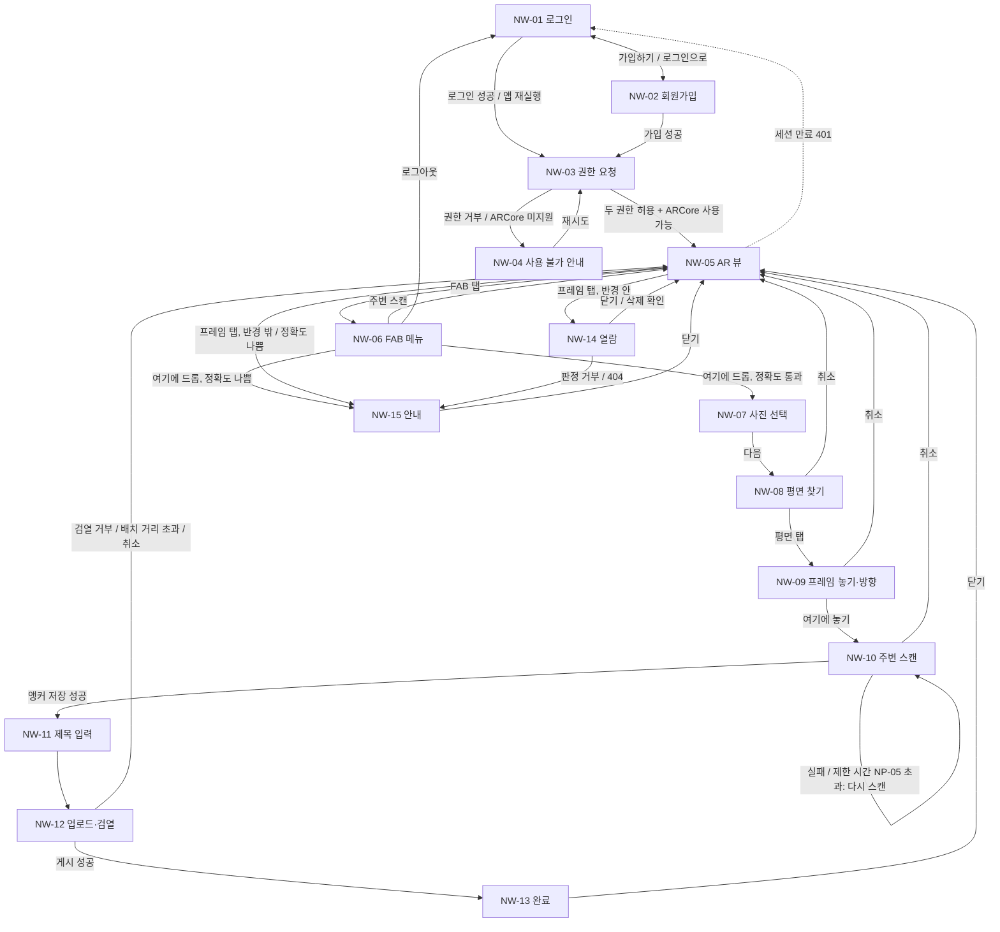

# Drop 네이티브 와이어프레임 (N1)

> 출처: `10-native-PRD.md`(네이티브 PRD v0.6, 3장 범위·4장 FR-N·4.1 NP 파라미터·7장 UX 원칙), `4-wireframes.md`(웹 와이어프레임 v0.7), `1-domain-definition.md`(도메인 정의서 v1.1). Android 세로 화면 기준이며 N1 범위 화면만 그린다. 웹과 같은 화면은 다시 그리지 않고 `4-wireframes.md`의 W-xx를 가리킨다. 수치는 PRM-xx / M-xx / NP-xx ID로만 참조하고, 색상·서체는 `9-style-guide.md`를 따른다.

## 1. 변경 이력

| 버전 | 일자 | 변경자 | 변경내용 |
|---|---|---|---|
| 0.1 | 2026-10-03 | Claude Code | 초안 작성 |

---

## 2. 화면 목록

| ID | 이름 | 웹 대비 | 관련 FR |
|---|---|---|---|
| NW-01 | 로그인 | W-01과 같음 | FR-N01 |
| NW-02 | 회원가입 | W-02와 같음. 위치정보 동의 문구에 "주변 공간 데이터가 Google에 전송됨"을 더한다 | FR-N01, NFR-N06 |
| NW-03 | 권한 요청(시작) | **변경.** 카메라·위치만 요청, 구글 고지 문구 추가 | FR-N02 |
| NW-04 | 사용 불가 안내 | **변경.** 권한 거부와 ARCore 미지원을 함께 다룬다 | FR-N02 |
| NW-05 | AR 뷰(기본 화면) | **변경.** 미니맵, 고정·대략 위치 구분 | FR-N07, FR-N09 |
| NW-06 | FAB 메뉴 | W-06과 같음 | FR-N11 |
| NW-07 | 드롭 1단계: 사진 선택 | W-07과 같음. 갤러리만 열고 촬영 옵션이 없다 | FR-N04 |
| NW-08 | 드롭 2단계: 평면 찾기 | **신규** | FR-N03 |
| NW-09 | 드롭 3단계: 프레임 놓기·방향 정하기 | **변경.** W-13에서 평면 위 배치로 | FR-N03 |
| NW-10 | 드롭 4단계: 주변 스캔(앵커 저장) | **신규** | FR-N05 |
| NW-11 | 드롭 5단계: 제목 입력 | W-08과 같음 | FR-N06 |
| NW-12 | 드롭 6단계: 업로드·검열 진행 | W-09와 같음 | FR-N06 |
| NW-13 | 드롭 7단계: 완료 | W-10과 같음 | FR-N06 |
| NW-14 | 열람 화면 | W-11과 같음 | FR-N08, FR-N10 |
| NW-15 | 반경 밖·재측정 안내 | W-12와 같음 | FR-N08 |

## 3. 화면 흐름도



---

## 4. 화면별 와이어프레임

공통 표기: `[ ]` 버튼, `( )` 입력 필드, `▓` 이미지 영역, `░` 인식된 평면, 실선 프레임은 반경 안, 점선 프레임은 반경 밖. 웹과 같은 화면(NW-01, 02, 06, 07, 11~15)은 `4-wireframes.md`를 본다.

### NW-03 권한 요청(시작)

```
┌──────────────────────────────┐
│                              │
│            D R O P           │
│                              │
│   이 앱은 아래 권한이 필요해요   │
│                              │
│   ◉ 카메라    AR 화면 표시     │
│   ◉ 위치      주변 캡슐 찾기    │
│                              │
│  ┌────────────────────────┐  │
│  │ To power this session, │  │
│  │ Google will process    │  │
│  │ sensor data (e.g.,     │  │
│  │ camera and location).  │  │
│  │ 자세히 알아보기 ↗         │  │
│  └────────────────────────┘  │
│                              │
│         [   시 작   ]         │
└──────────────────────────────┘
```

- "시작"을 누르면 카메라 → 위치(정확한 위치) 순으로 시스템 권한 창을 띄운다. 이미 허용했으면 바로 통과한다.
- 구글 고지 문구는 영어 원문 그대로 보여 주고 아래에 한국어 설명 한 줄을 붙일 수 있다. "자세히 알아보기"는 PRD 10장 V-07의 링크를 연다.
- 방향 센서 항목은 없다(Android는 별도 권한이 없다).
- 진입 시 ARCore 사용 가능 여부를 먼저 확인한다. 설치·업데이트가 필요하면 시스템 설치 창으로 보내고, 지원하지 않는 기기면 NW-04로 간다.

### NW-04 사용 불가 안내

```
┌──────────────────────────────┐
│                              │
│     AR 뷰를 사용할 수 없어요     │
│                              │
│   거부된 권한:                 │
│     · 카메라                  │
│                              │
│   두 권한 모두 있어야           │
│   캡슐을 놓고 볼 수 있어요       │
│                              │
│   권한 창이 뜨지 않으면         │
│   설정에서 허용해 주세요         │
│                              │
│   [  설정 열기  ] [ 재시도 ]    │
└──────────────────────────────┘
```

- 권한 거부: 거부된 권한 이름을 나열한다. "설정 열기"는 이 앱의 시스템 설정 화면을 연다.
- 카메라를 다른 앱이 쓰고 있어 못 여는 경우는 "거부된 권한"이 아니라 "카메라를 다른 앱이 사용 중이에요"로 구분해 보여 준다(웹 실기기 테스트에서 구분이 안 되어 혼란이 있었다).
- ARCore 미지원 기기: 본문을 "이 기기는 AR을 지원하지 않아요"로 바꾸고 버튼을 숨긴다.

### NW-05 AR 뷰(기본 화면)

```
┌──────────────────────────────┐
│ ⚠ GPS 정확도가 낮아요 …        │ ← 정확도 배너 (PRM-03 초과일 때만)
│                      ╭─────╮ │
│                      │  N  │ │ ← 미니맵 (NP-06)
│      ┌────────┐      │ · ▲ │ │   ▲ 나, · 캡슐, ○ 열람 반경
│      │▓▓▓▓▓▓▓▓│      │  ○  │ │
│      │▓▓▓▓▓▓▓▓│      ╰─────╯ │
│      └────────┘              │
│       한강 노을                │ ← 고정된 프레임 (실선)
│                              │
│            ┌ ─ ─ ─ ┐         │
│              ▓▓▓▓▓            │ ← 반경 밖 (점선, 흐림)
│            └ ─ ─ ─ ┘         │
│             12m 남음           │
│          대략적인 위치예요       │ ← GPS로만 그린 프레임에만 표시
│                              │
│        주변 확인 중…            │ ← 상태 한 줄
│             ( ＋ )            │ ← FAB
└──────────────────────────────┘
```

- 프레임 표시 위치는 FR-N07의 순서(클라우드 앵커 → Geospatial → GPS)로 정한다. 앵커 인식이 끝나기 전에는 GPS 위치에 먼저 그리고, 인식되면 제자리로 옮긴다.
- GPS로만 그린 프레임은 테두리를 물결(또는 점멸)로 구분하고 아래에 "대략적인 위치예요"를 붙인다. 고정되면 표시를 없앤다.
- 미니맵은 내 위치가 가운데, 보는 방향이 위쪽이다. 열람 가능한 캡슐은 밝게, 그 밖은 흐리게 그린다. 탭을 가로채지 않는다.
- 평면 표시(`░`)는 이 화면에서는 그리지 않는다(드롭 중에만 보인다).
- 정확도 배너, 상태 한 줄, FAB 동작은 W-05와 같다.

### NW-08 드롭 2단계: 평면 찾기

```
┌──────────────────────────────┐
│  ✕ 취소                       │
│                              │
│                              │
│        (카메라 화면)            │
│                              │
│     ░░░░░░░░░░░░░░░░          │ ← 찾은 평면
│   ░░░░░░░░░░░░░░░░░░░░        │
│     ░░░░░░░░░░░░░░░░          │
│                              │
│ ┌──────────────────────────┐ │
│ │ 주변을 천천히 비춰 주세요     │ │ ← 평면을 찾기 전
│ │ 바닥이나 벽을 찾고 있어요     │ │
│ └──────────────────────────┘ │
└──────────────────────────────┘
```

- 평면을 1개 이상 찾으면 안내를 "놓을 자리를 눌러 주세요"로 바꾼다.
- 평면을 탭하면 그 지점에 미리보기 프레임을 놓고 NW-09로 넘어간다. 탭한 지점이 내 위치에서 드롭 배치 반경(PRM-20) 밖이면 놓지 않고 "조금 더 가까운 곳을 눌러 주세요"를 보여 준다.
- 30초 동안 평면을 찾지 못하면 "밝은 곳에서 무늬가 있는 바닥이나 벽을 비춰 보세요"를 더한다.

### NW-09 드롭 3단계: 프레임 놓기·방향 정하기

```
┌──────────────────────────────┐
│  ✕ 취소                       │
│                              │
│        ┌──────────┐          │
│        │▓▓▓▓▓▓▓▓▓▓│          │ ← 고른 사진을 담은 미리보기 프레임
│        │▓▓▓▓▓▓▓▓▓▓│          │   (끌어서 평면 위에서 옮긴다)
│        └──────────┘          │
│     ░░░░░░░░░░░░░░░░          │
│   ░░░░░░░░░░░░░░░░░░░░        │
│                              │
│ ┌──────────────────────────┐ │
│ │ 내 위치에서 3m              │ │
│ │ 방향  ◀━━━━━●━━━━━▶  135°  │ │ ← 회전 슬라이더 (0~359°)
│ │ [ 취소 ]   [ 여기에 놓기 ]   │ │
│ └──────────────────────────┘ │
└──────────────────────────────┘
```

- 프레임을 끌면 평면 위에서만 움직인다. 드롭 배치 반경(PRM-20) 경계에서 멈춘다.
- 슬라이더를 건드리기 전에는 프레임이 나를 바라보게 맞춘다(W-13과 같다).
- 벽에 놓으면 프레임이 벽면에 붙고 슬라이더는 벽면 안에서의 회전이 아니라 숨긴다(벽 방향이 곧 프레임 방향이다).
- "여기에 놓기"는 GPS 정확도가 재측정 기준(PRM-03)보다 나쁘면 막고 NW-15 재측정 안내를 띄운다.

### NW-10 드롭 4단계: 주변 스캔(앵커 저장)

```
┌──────────────────────────────┐
│  ✕ 취소                       │
│                              │
│        ┌──────────┐          │
│        │▓▓▓▓▓▓▓▓▓▓│          │ ← 놓은 프레임 (고정됨)
│        │▓▓▓▓▓▓▓▓▓▓│          │
│        └──────────┘          │
│                              │
│                              │
│ ┌──────────────────────────┐ │
│ │ 프레임 주변을 돌며           │ │
│ │ 여러 각도에서 비춰 주세요     │ │
│ │                          │ │
│ │ 자리 기억하는 중             │ │
│ │ ▰▰▰▰▰▰▱▱▱▱   충분          │ │ ← 부족 / 충분 / 좋음 (NP-04)
│ └──────────────────────────┘ │
└──────────────────────────────┘
```

- 스캔 품질이 NP-04에 이르면 자동으로 앵커 저장을 시작하고 문구를 "저장하는 중…"으로 바꾼다. 저장이 끝나면 NW-11로 넘어간다.
- 저장에 실패하거나 제한 시간(NP-05)을 넘기면 "자리를 기억하지 못했어요. 다시 비춰 주세요"와 [다시 스캔] 버튼을 보여 준다. 프레임 위치와 방향은 그대로 둔다.
- 제자리에서 폰만 돌리면 품질이 오르지 않는다. 10초 동안 변화가 없으면 "한두 걸음 옆으로 움직이며 비춰 보세요"를 더한다.
- 취소하면 저장 중이던 작업을 버리고 NW-05로 돌아간다. 업로드 전이라 서버에 남는 것이 없다.

---

## 5. 후속 단계 화면(미작성)

N2 이후 화면은 그리지 않는다. 신고(콘텐츠·앵커 위치), 사용자 차단, 결제, 지도 탭 등은 해당 단계 PRD와 함께 작성한다(네이티브 PRD 9.3).

---

## 6. 결정 내역

| # | 항목 | 결정 | 반영 위치 |
|---|---|---|---|
| 1 | 웹과 같은 화면 | 다시 그리지 않고 W-xx를 가리킨다. 문구·배치는 그대로 옮긴다 | 2장 |
| 2 | 드롭 단계 수 | 웹 4단계에서 7단계로 늘어난다(평면 찾기, 주변 스캔 추가). 바텀시트는 사진 선택과 제목 이후에만 쓰고, 평면 찾기~주변 스캔은 AR 화면 위 하단 패널로 진행한다 | NW-08~10 |
| 3 | 구글 고지 위치 | 권한 요청 화면에 둔다. AR 기능을 켜기 직전이라 "기능을 켜는 시점에 눈에 띄게"라는 요구를 충족한다 | NW-03 |
| 4 | 카메라 사용 중 오류 | 권한 거부와 구분해 안내한다 | NW-04 |
| 5 | 벽면 배치 시 회전 | 슬라이더를 숨기고 벽 방향을 프레임 방향으로 쓴다. 바닥·탁자에 놓을 때만 회전한다 | NW-09 |
