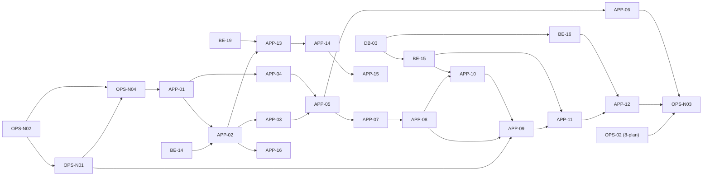

# Drop 네이티브 실행 계획 (N1)

> 출처: `10-native-PRD.md`(네이티브 PRD v0.7), `11-native-wireframes.md`(네이티브 와이어프레임 v0.1), `7-erd.md`(ERD v0.6), `8-plan.md`(실행 계획 v0.9), `5-project-principle.md`(프로젝트 원칙 v0.7), `9-style-guide.md`(스타일 가이드 v0.2). 수치는 PRM-xx(도메인 정의서 5.3)·M-xx(`2-PRD.md` 4.1)·NP-xx(네이티브 PRD 4.1) ID로만 참조한다.

## 1. 변경 이력

| 버전 | 일자 | 변경자 | 변경내용 |
|---|---|---|---|
| 0.1 | 2026-10-03 | Claude Code | 초안 작성 |
| 0.9 | 2026-10-04 | Claude Code | APP-16 Google 로그인 추가 |
| 0.8 | 2026-10-04 | Claude Code | APP-15 지도의 보는 방향 표시와 AR 길찾기 추가(네이티브 PRD v1.0) |
| 0.7 | 2026-10-04 | Claude Code | APP-14 내 캡슐 지도 추가(네이티브 PRD v0.9, osmdroid) |
| 0.6 | 2026-10-04 | Claude Code | APP-13 홈·보관함 추가(네이티브 PRD v0.8). 실증 화면을 임시 AR 화면으로 유지(결정 #7), 홈을 로그인 뒤 첫 화면으로(결정 #8) |
| 0.5 | 2026-10-04 | Claude Code | 7장에 N1.5(3D 캡슐 연출)와 캡슐 확장 로드맵 문서(`13-capsule-dev-plan.md`) 연결. N1 Task는 바뀌지 않는다 |
| 0.4 | 2026-10-03 | Claude Code | OPS-N01 일부와 OPS-N04 실증 결과 기록(Galaxy S25 Ultra): 키 없는 인증으로 보관 30일 저장·삭제 후 재설치 인식 성공, VPS 사용 가능, 액자 반복 생성·삭제 통과. 24시간 뒤 인식과 벽 배치는 남음 |
| 0.3 | 2026-10-03 | Claude Code | 패키지 이름 `com.hyunboee.drop` 확정, 1주차 완료 기준에서 VPS 실측 제거(OPS-N04로 통일) |
| 0.2 | 2026-10-03 | Claude Code | 네이티브 PRD v0.4 반영: 앱 기술을 Unity에서 Kotlin + ARCore SDK + SceneView로 변경. 2.4 앱 구조, OPS-N02(Android 명령줄 개발 환경), OPS-N04(키 없는 인증·그리기 실증) 추가, APP Task의 구현 방식과 테스트 표현(JVM 단위 테스트), 결정 #3·#4·#6 |

---

## 2. 개요

### 2.1 범위

- 네이티브 PRD 3.1 N1 In과 FR-N P0(FR-N01~N09, N11)를 구현한다. FR-N10 삭제(P1)는 여유 Task로 둔다.
- 네이티브 PRD 3.2 N1 Out은 Task를 만들지 않는다. 후속 단계용 폴더·스텁·컬럼도 만들지 않는다(원칙 P-02).
- 백엔드·DB Task(DB-03, BE-14~16)는 `/develop-backend` 스킬이 읽는 `8-plan.md` 6장에 둔다. 이 문서는 앱(APP)과 운영(OPS-N) Task를 담고, 백엔드 Task는 ID로 가리킨다.

### 2.2 Task ID 규칙

| 접두어 | 단위 | 위치 | 담당 |
|---|---|---|---|
| `APP-xx` | Android 앱(`app/`, Kotlin), 화면(NW-xx)·기능 단위 | 이 문서 | 개발(스킬 없음) |
| `OPS-Nxx` | Google Cloud 설정, 개발 환경, 실기기 테스트 | 이 문서 | 수동(사람이 수행) |
| `DB-03`, `BE-14`~`BE-16` | 마이그레이션, Express API 변경 | `8-plan.md` 6.1·6.2 | `/develop-backend` |

### 2.3 체크 규칙

- 완료 조건은 모두 `- [ ]`이며 검증이 끝난 항목만 `- [x]`로 바꾼다.
- 순수 로직(거리·판정·좌표 변환·검증)은 JVM 단위 테스트(JUnit, `gradlew test`)로 검증한다. 테스트 이름에 근거 ID를 넣는다(원칙 P-04).
- AR·카메라·센서가 필요한 부분은 자동 테스트 대신 **실기기 체크리스트**로 검증하고, 사람이 확인해 체크한다(네이티브 PRD NQ-10). 웹에서 `src/ar/`를 자동 테스트에서 뺐다가 실기기에서만 오류가 드러난 경험이 있으므로, 실기기 항목을 건너뛰고 체크하지 않는다.
- 선행 Task가 모두 체크된 뒤 시작한다.

### 2.4 앱 구조

```
app/                              Android 앱 (Kotlin, Gradle)
  settings.gradle.kts
  build.gradle.kts
  gradle/libs.versions.toml       의존성 버전을 여기 한 곳에 고정한다
  app/
    build.gradle.kts
    src/main/
      AndroidManifest.xml
      java/com/hyunboee/drop/
        Params.kt                 PRM·M·NP 상수 (ID 접두어 이름, 원칙 P-05)
        lib/                      순수 로직: Geo(거리·판정·좌표 변환), 검증. Android·ARCore API 의존 없음
        api/                      서버 통신(HttpURLConnection, org.json), 요청·응답 타입, 에러 코드
        auth/                     토큰 저장(Android Keystore), 세션 상태
        ar/                       ARCore 세션, 평면, 프레임 배치, 클라우드 앵커, Geospatial, 위치
        ui/                       화면(NW-xx)과 공용 컴포넌트 (Jetpack Compose)
    src/test/                     lib·api 단위 테스트 (JVM, JUnit)
```

- 의존 방향: `ui → ar, api, auth → lib`. `lib`는 다른 패키지를 참조하지 않는다(원칙 2.1과 같은 생각).
- 화면은 Jetpack Compose로 만든다. AR 화면은 SceneView의 `ARSceneView` 위에 Compose 화면 요소를 겹친다. 서체는 기기 기본 한국어 서체를 쓴다(`9-style-guide.md`의 `--font-sans`와 같은 생각, 서체 파일을 넣지 않는다).
- 색상·간격·서체 크기는 `9-style-guide.md` 토큰 값을 `ui/Tokens.kt` 한 곳에 옮겨 쓴다.
- 화면 요소는 시스템 상태 표시줄·내비게이션 막대·카메라 구멍과 겹치지 않게 안전 영역 안쪽에 둔다(`statusBarsPadding`, `navigationBarsPadding`). 타깃 API 36은 화면을 가장자리까지 채우는 것이 기본이라 따로 넣지 않으면 겹친다(실증 앱에서 상태 글자가 가려져 보이지 않았다).
- 판정식과 거리 계산은 백엔드 `lib/geo.js`·웹 `lib/geo.ts`와 같은 공식이며, `8-plan.md` BE-07의 공통 테스트 표(G-01~04, J-01~07, A-01~02)를 그대로 쓴다(APP-04).
- 그리기는 SceneView로만 하고, 클라우드 앵커·Geospatial은 `ar/`에서 ARCore `Session` 원본 API를 직접 호출한다. SceneView가 맞지 않아 그리기를 바꾸더라도 `ar/`의 앵커 코드와 `lib/`, `api/`, `auth/`가 그대로 남게 하려는 것이다(네이티브 PRD RISK-N03).
- 패키지 이름은 `com.hyunboee.drop`이다. 스토어에 올린 뒤에는 바꿀 수 없다.
- `.gitignore`에 Android 생성물(`app/.gradle/`, `app/build/`, `app/app/build/`, `app/local.properties`, `*.apk`, `*.aab`, `*.jks`, `*.keystore`)을 더한다. 서명 키와 OAuth 설정 파일은 저장소에 넣지 않는다.

---

## 3. Task 의존 관계



---

## 4. 일정 배치 (네이티브 PRD 8장)

| 주차 | Task | 완료 기준 |
|---|---|---|
| 0 | OPS-N02, OPS-N01, OPS-N04, `8-plan.md` OPS-02 | 키 없는 인증으로 저장한 앵커가 앱 재설치 뒤에도 인식됨, 요금 조건 기록, 배포된 서버 `/api/health` 200(서버 배포는 다른 기기·실외 테스트 전까지 미뤄도 된다) |
| 1 | BE-14, APP-01, APP-02, APP-03, APP-04, APP-05 | 실기기에서 로그인 후 평면이 인식됨 |
| 2 | DB-03, BE-15, APP-07, APP-08, APP-10 | 실기기에서 드롭한 캡슐이 DB에 저장됨(앵커 ID 없이) |
| 3 | APP-09, APP-11, APP-06 | 앱을 껐다 켜도 캡슐이 같은 자리에 보임 |
| 4 | BE-16, APP-12, OPS-N03 | 네이티브 PRD 1.3 KPI 충족 |

---

## 5. Task 목록 요약

| ID | 이름 | 선행 | 우선순위 |
|---|---|---|---|
| OPS-N02 | Android 개발 환경·프로젝트 생성·서명 키 | — | P0 |
| OPS-N01 | Google Cloud·ARCore API·OAuth 설정, 요금 확인 | OPS-N02 | P0 |
| OPS-N04 | 키 없는 인증·그리기 실증 | OPS-N01, OPS-N02 | P0 |
| DB-03 | 마이그레이션 002 (앵커·평면 일치 컬럼) | DB-01 | P0 |
| BE-14 | 앱용 토큰 세션 (Bearer) | BE-03 | P0 |
| BE-15 | 게시·주변 조회에 앵커 정보 | DB-03, BE-13 | P0 |
| BE-16 | 열람 요청에 평면 일치 기록 | DB-03, BE-09 | P0 |
| APP-01 | 앱 골격·API 클라이언트·토큰 저장 | OPS-N04 | P0 |
| APP-02 | 로그인·회원가입 화면 | APP-01, BE-14 | P0 |
| APP-03 | 권한 요청·사용 불가 안내·구글 고지 | APP-02 | P0 |
| APP-04 | 거리·판정·좌표 변환 lib | APP-01 | P0 |
| APP-05 | AR 화면 골격 (AR 세션, 위치, 주변 조회, 배너, 상태 한 줄, FAB 메뉴, 로그아웃) | APP-03, APP-04 | P0 |
| APP-06 | 미니맵 | APP-05 | P0 |
| APP-07 | 드롭: 사진 선택·재인코딩·썸네일 | APP-05 | P0 |
| APP-08 | 드롭: 평면 찾기·프레임 놓기·방향 정하기 | APP-07 | P0 |
| APP-09 | 드롭: 주변 스캔·클라우드 앵커 저장·Geospatial 포즈 | APP-08, APP-10, OPS-N01 | P0 |
| APP-10 | 드롭: 제목·업로드·게시·완료 | APP-08, BE-15 | P0 |
| APP-11 | 주변 캡슐 표시 (앵커 인식, 대체 순서, 대략 위치 표시) | APP-09, BE-15 | P0 |
| APP-12 | 열람 화면·판정 분기·이미지 캐시·삭제 | APP-11, BE-16 | P0 (삭제는 P1) |
| APP-13 | 홈·보관함 | APP-02, BE-19 | P0 |
| APP-14 | 내 캡슐 지도 | APP-13 | P1 |
| APP-15 | 보는 방향 표시·AR 길찾기 | APP-14 | P1 |
| APP-16 | Google 로그인 | APP-02, `8-plan.md` BE-20 | P1 |
| OPS-N03 | 실기기 현장 테스트 (KPI) | APP-12, APP-06, `8-plan.md` OPS-02 | P0 |

---

## 6. Task 상세

### 6.1 운영 (사람이 수행, 명령 실행은 Claude Code가 도울 수 있다)

#### OPS-N01 Google Cloud·ARCore API·OAuth 설정, 요금 확인

- **목표:** 클라우드 앵커를 30일 이상 보관할 수 있는 인증 구성을 만들고 요금 조건을 확인한다.
- **수행 작업**
  - Google Cloud 프로젝트를 만들고 ARCore API를 사용 설정한다.
  - Android 키 없는(keyless) 인증: 앱 패키지 이름과 서명 키 SHA-1 지문으로 OAuth 2.0 클라이언트 ID를 만든다. 디버그 키와 배포 키를 각각 등록한다.
  - 콘솔의 ARCore API 페이지에서 요금·할당량을 확인해 네이티브 PRD NFR-N05와 10장 V-05에 기록하고, 예산 알림을 건다.
  - 네이티브 PRD 10장의 값(고지 문구, 할당량, 인증 조건)을 원문 페이지와 대조한다.
- **완료 조건**
  - [ ] ARCore API가 사용 설정되어 있고 디버그·배포 서명 키의 OAuth 클라이언트가 등록되어 있다 (2026-10-03: ARCore API 사용 설정 확인, 디버그 키의 OAuth 클라이언트 `Drop debug` 등록. 배포 키는 스토어 단계에서 등록)
  - [ ] 요금 조건을 확인해 네이티브 PRD에 기록했다(무료 여부, 과금 단위)
  - [ ] 예산 알림이 설정되어 있다
  - [ ] 저장소 어디에도 API 키·서비스 계정 키·서명 키가 없다
- **선행 Task:** OPS-N02(패키지 이름과 SHA-1)
- **관련 ID:** NQ-03, NFR-N03, NFR-N05, RISK-N04, V-01, V-05

#### OPS-N02 Android 개발 환경·프로젝트 생성·서명 키

- **목표:** Android Studio 없이 명령줄로 앱을 빌드해 폰에 올리는 환경을 만들고, OAuth 등록에 필요한 패키지 이름과 SHA-1을 확보한다.
- **수행 작업**
  - JDK 21, Android 명령줄 도구(`cmdline-tools`), `platforms;android-37`, `build-tools`를 설치한다(`platform-tools`의 `adb`는 이미 설치됨).
  - 패키지 이름은 `com.hyunboee.drop`으로 한다.
  - `app/`에 Gradle 프로젝트를 만든다. 버전은 네이티브 PRD 6장 조합으로 `gradle/libs.versions.toml`에 고정한다(Gradle 9.8.0, AGP 9.4.1, Kotlin 2.4.20, ARCore 1.56.0, SceneView 4.52.0). 16KB 페이지 정렬 설정은 네이티브 라이브러리(ARCore, SceneView)가 들어오는 OPS-N04에서 넣는다.
  - `gradlew assembleDebug` → `adb install`로 빈 화면 앱을 폰에 올린다.
  - 디버그 서명 키의 SHA-1을 뽑는다(`keytool`).
  - `.gitignore`에 Android 생성물을 더한다(2.4).
- **완료 조건**
  - [x] `gradlew assembleDebug`가 성공하고 빈 화면 앱이 Galaxy S25 Ultra에서 실행된다
  - [x] `gradlew test`가 실행된다(테스트 0개여도 성공)
  - [x] 패키지 이름을 정해 네이티브 PRD 6장에 기록했다(값: `com.hyunboee.drop`)
  - [x] 디버그 서명 키의 SHA-1을 확보했다(`A4:AC:8F:DE:D2:39:1E:17:28:21:8B:AD:D1:EC:3F:C2:79:FB:04:C9`, 이 PC의 디버그 키)
  - [x] `git status`에 빌드 생성물과 서명 키가 나오지 않는다
- **선행 Task:** —
- **관련 ID:** NFR-N01, V-13, 네이티브 PRD 6장

#### OPS-N04 키 없는 인증·그리기 실증

- **목표:** 설계의 전제 두 가지(키 없는 인증으로 30일 보관, SceneView로 사진 액자 그리기)를 앱 Task 전에 실기기에서 확인한다.
- **수행 작업**
  - 최소한의 실증 앱: 평면을 탭하면 사진 액자(`ImageNode`)를 놓고, ARCore `Session`으로 클라우드 앵커를 보관 30일로 저장한 뒤 ID를 화면에 보여 준다. ID를 넣으면 인식해 같은 자리에 액자를 그린다.
  - 저장한 뒤 앱을 지우고 다시 설치해 인식한다. 하루 뒤에도 한 번 더 인식한다(API 키 방식의 1일 한도를 넘는지 확인).
  - 액자 20개를 놓고 지우기를 반복하고, 벽에도 놓아 본다(RISK-N03).
  - 테스트 장소에서 `checkVpsAvailabilityAsync` 결과를 기록한다(RISK-N02).
  - 시스템 사진 선택기가 권한 창 없이 열리는지 확인한다.
  - 실증 코드는 버리는 코드다. 통과하면 지우고 APP-01부터 새로 만든다.
- **완료 조건**
  - [x] 보관 30일로 저장한 앵커가 앱 재설치 뒤 인식된다 (2026-10-03: 저장 5회 모두 성공(6~10초). 앱 삭제 후 재설치해 인식 성공, 사용자가 놓았던 자리와 같음을 확인. 인식에 1초~32초)
  - [ ] 저장 후 24시간이 지난 뒤에도 인식된다
  - [x] 액자 20개 생성·삭제 반복에서 앱이 죽지 않는다 (4회 실행)
  - [ ] 벽 배치 결과를 기록했다(결과: ____). 안 되면 N1에서 벽 배치를 빼는 것을 검토한다
  - [x] VPS 가용 여부를 기록했다(결과: `AVAILABLE`, 실내 테스트 장소 좌표 37.4790, 126.8109 기준. 다른 장소는 미확인)
  - [x] 사진 선택기가 권한 창 없이 열린다 (앱이 저장소 권한을 선언하지 않은 상태에서 사진 선택 성공)
  - [ ] 실패 항목이 있으면 대체 경로(네이티브 PRD RISK-N03) 적용 여부를 결정해 기록했다
- **선행 Task:** OPS-N01, OPS-N02
- **관련 ID:** RISK-N02, RISK-N03, RISK-N10, NQ-03, V-12

#### OPS-N03 실기기 현장 테스트 (KPI)

- **목표:** 네이티브 PRD 1.3의 성공 지표를 실내·실외에서 측정한다.
- **수행 작업**
  - 실내 2곳, 실외 2곳에서 캡슐을 드롭하고, 시간대를 바꿔(낮·저녁) 다시 방문해 표시 위치를 잰다.
  - 다른 기기·다른 계정으로 같은 캡슐을 본다.
  - 측정값으로 NP-01~NP-07 초기값을 조정하고 네이티브 PRD에 반영한다.
- **완료 조건**
  - [ ] 재방문 시 위치 오차가 NP-01 이내: 10회 중 8회 이상 (결과: __/10)
  - [ ] 다른 기기·계정으로 캡슐 5개 모두 NP-01 이내 (결과: __/5)
  - [ ] 캡슐을 향해 걸을 때 화면에서 연속으로 가까워진다(실내·실외)
  - [ ] 앵커 인식 시간이 NP-03 이내: 10회 중 8회 이상 (결과: __/10)
  - [ ] 드롭 → 다른 계정으로 열람 전 흐름 성공
  - [ ] 반경 밖 좌표로 열람 API를 직접 호출하면 403이다(NFR-N04)
  - [ ] AR 화면이 30fps 이상이다(NFR-N02, 결과: __fps)
- **선행 Task:** APP-12, APP-06, `8-plan.md` OPS-02
- **관련 ID:** 네이티브 PRD 1.3, NP-01~07, NFR-N02, NFR-N04, RISK-N01

### 6.2 백엔드·DB

DB-03, BE-14, BE-15, BE-16의 상세와 완료 조건은 `8-plan.md` 6.1·6.2에 있다.

### 6.3 앱

#### APP-01 앱 골격·API 클라이언트·토큰 저장

- **목표:** 서버와 통신하고 토큰을 안전하게 보관하는 앱 뼈대를 만든다.
- **수행 작업**
  - `Params.kt`: 앱이 쓰는 PRM·M·NP 상수를 ID 접두어 이름으로 정의한다. 다른 파일에 수치 리터럴을 두지 않는다.
  - `api/`: `HttpURLConnection` 기반 클라이언트(코루틴으로 백그라운드 실행). 서버 주소는 빌드 설정 한 곳에서 읽는다. 모든 요청에 `X-Client: app`과 (있으면) `Authorization: Bearer <토큰>`을 붙인다. 응답의 `{ error: { code, message } }`를 에러 타입으로 바꾸고, 401 `AUTH_REQUIRED`면 토큰을 지우고 로그인 화면으로 보낸다.
  - `auth/`: Android Keystore에 AES-GCM 키를 만들고 토큰 암호문만 앱 저장소에 둔다. 평문을 저장하지 않는다.
  - 앱 시작 시 `GET /api/me`로 NW-01/NW-03을 고른다.
  - 로그: 개발 빌드에서만 남기고 토큰·좌표·이메일 원문은 남기지 않는다.
- **완료 조건**
  - [ ] 에러 응답 파싱, 401 처리, 요청 헤더 구성이 단위 테스트로 검증된다
  - [ ] `Params.kt` 밖에 PRM·M·NP 수치 리터럴이 없다(코드 확인)
  - [ ] 실기기: 저장한 토큰이 앱을 다시 켜도 유지되고, 앱 데이터 폴더에 토큰 평문이 없다
  - [ ] 실기기: 토큰이 유효하면 NW-03으로, 없거나 만료면 NW-01로 간다
- **선행 Task:** OPS-N04
- **관련 ID:** FR-N01, NFR-N03, V-11, 원칙 P-05

#### APP-02 로그인·회원가입 화면

- **목표:** NW-01·NW-02를 만들고 서버 응답의 토큰을 저장한다.
- **수행 작업**
  - W-01·W-02와 같은 입력·검증(이메일 형식, M-10, 필수 동의 3개)과 오류 문구(401, 409, 429)를 옮긴다.
  - 가입 동의 문구에 주변 공간 데이터의 Google 전송을 더하고 약관 버전을 올린다(NFR-N06).
  - 성공하면 응답 본문의 토큰을 저장하고 NW-03으로 간다.
- **완료 조건**
  - [ ] 입력 검증 규칙이 단위 테스트로 검증된다(M-10 경계, 동의 누락)
  - [ ] 실기기: 가입 → 자동 로그인 → NW-03, 로그인 실패 문구, 잠금 429 문구가 보인다
  - [ ] 화면이 `9-style-guide.md` 토큰을 쓴다
- **선행 Task:** APP-01, BE-14
- **관련 ID:** FR-N01, NW-01, NW-02, M-05, M-10, NFR-N06

#### APP-03 권한 요청·사용 불가 안내·구글 고지

- **목표:** NW-03·NW-04를 만든다.
- **수행 작업**
  - ARCore 사용 가능 여부 확인과 설치 요청(`ArCoreApk.checkAvailability`, `requestInstall`).
  - 카메라·정밀 위치 권한 요청, 거부 시 NW-04와 "설정 열기".
  - 구글 필수 고지 문구와 링크를 NW-03에 표시한다(네이티브 PRD 10장 V-07, 원문과 대조).
  - 카메라를 다른 앱이 쓰는 경우를 권한 거부와 구분해 안내한다.
- **완료 조건**
  - [ ] 실기기: 두 권한 허용 시 NW-05로, 하나라도 거부 시 NW-04로 간다
  - [ ] 실기기: "설정 열기"가 이 앱의 시스템 설정을 연다
  - [ ] 실기기: 고지 문구가 원문과 같고 링크가 열린다
  - [ ] ARCore 미지원 분기는 지원 여부 값을 바꿔 확인한다
- **선행 Task:** APP-02
- **관련 ID:** FR-N02, NW-03, NW-04, NFR-N06, V-07

#### APP-04 거리·판정·좌표 변환 lib

- **목표:** 서버·웹과 같은 공식을 Kotlin으로 옮기고 같은 테스트 표로 검증한다.
- **수행 작업**
  - `lib/Geo.kt`: `distanceM`(하버사인), `isLowAccuracy`, `judgeOpen`, `frameState`(열람 가능 여부·남은 거리 문구), `clampOffset`, `offsetToLatLng`, `latLngToOffset`, `bearingDeg`. 웹 `frontend/src/lib/geo.ts`와 같은 이름·동작.
  - AR 월드 좌표(m, 동·북·위)와 위경도 사이 변환: 기준점(AR 세션이 시작된 위치의 위경도)에서의 동·북 오프셋으로 계산한다.
- **완료 조건**
  - [ ] `8-plan.md` BE-07 공통 테스트 표 G-01~G-04, J-01~J-07, A-01~A-02가 단위 테스트로 모두 통과한다
  - [ ] 남은 거리 표시가 정수 m 올림이다(`8-plan.md` 결정 #8)
  - [ ] `lib/`가 Android·ARCore API와 다른 패키지를 참조하지 않는다(JVM만으로 테스트가 돈다)
- **선행 Task:** APP-01
- **관련 ID:** FR-N07, FR-N08, PRM-01, PRM-03, PRM-20, NFR-N04, 원칙 4.3

#### APP-05 AR 화면 골격

- **목표:** NW-05의 뼈대(AR 세션, 위치 수집, 주변 조회, 배너, 상태 한 줄, FAB 메뉴)를 만든다.
- **수행 작업**
  - SceneView `ARSceneView`와 ARCore 세션 구성(평면 인식, 클라우드 앵커 사용, Geospatial 사용). 카메라 영상은 기기가 지원하는 고해상도 설정을 고른다.
  - 위치: Google Play 서비스 위치(`FusedLocationProviderClient`)에서 좌표·정확도를 받는다. Geospatial을 쓸 수 있으면 그 값을 우선한다.
  - 주변 조회: 위치가 바뀌면 다시 받되 최소 간격 M-02를 지킨다. 응답의 캡슐을 GPS 기준 위치에 임시 프레임으로 그린다(앵커 인식은 APP-11).
  - 정확도 배너(PRM-03), 상태 한 줄("주변 확인 중…", "주변에 캡슐이 없어요…"), FAB와 메뉴(주변 스캔, 여기에 드롭, 로그아웃). 로그아웃은 서버 세션과 저장한 토큰을 지운다.
- **완료 조건**
  - [ ] 주변 조회 간격 제한(M-02)과 상태 문구 선택이 단위 테스트로 검증된다
  - [ ] 실기기: AR 화면에서 카메라 영상이 보이고, 걸으면 화면 속 위치가 걸음을 따라 연속으로 움직인다
  - [ ] 실기기: 정확도가 PRM-03보다 나쁘면 배너가 뜨고 "여기에 드롭"이 재측정 안내로 간다
  - [ ] 실기기: 로그아웃하면 NW-01로 가고 앱을 다시 켜도 로그인 화면이다
- **선행 Task:** APP-03, APP-04
- **관련 ID:** FR-N07, FR-N11, NW-05, NW-06, M-02, PRM-03

#### APP-06 미니맵

- **목표:** 웹 `MiniMap`과 같은 규칙의 미니맵을 넣는다.
- **수행 작업**
  - 내 위치 가운데, 보는 방향 위쪽, 캡슐 점, 열람 반경(PRM-01) 원, 북쪽 표시. 범위 NP-06, 더 먼 캡슐은 가장자리에 붙인다. 열람 가능한 캡슐은 밝게.
  - 점 좌표 계산은 `lib/`에 순수 함수로 둔다. 미니맵은 Compose `Canvas`로 그린다.
  - 탭을 가로채지 않는다. 열람 화면에서는 숨긴다.
- **완료 조건**
  - [ ] 점 좌표 계산(동쪽은 오른쪽·북쪽은 위, 범위 밖은 가장자리, 방향 회전)이 단위 테스트로 검증된다(웹 `MiniMap.test.tsx`와 같은 경우)
  - [ ] 실기기: 폰을 돌리면 미니맵이 함께 돌고, 걸으면 점이 움직인다
- **선행 Task:** APP-05
- **관련 ID:** FR-N09, NW-05, NP-06, PRM-01

#### APP-07 드롭: 사진 선택·재인코딩·썸네일

- **목표:** 갤러리에서 사진을 골라 업로드용 원본과 썸네일을 만든다.
- **수행 작업**
  - 시스템 사진 선택기(`PickVisualMedia`, 이미지만)로 1장을 고른다(촬영 옵션 없음, 권한 요청 없음). 고른 즉시 읽는다.
  - 긴 변 M-13으로 줄여 JPEG로 다시 인코딩한다(EXIF 위치정보가 사라진다). 썸네일은 긴 변 M-07.
  - 사전 검사: 이미지가 아니거나 재인코딩 결과가 M-06을 넘으면 거부하고 문구를 보여 준다.
- **완료 조건**
  - [ ] 크기 계산(긴 변 기준 축소 비율)과 M-06 검사가 단위 테스트로 검증된다
  - [ ] 실기기: 고른 사진이 미리보기에 바른 방향으로 보인다(회전 정보 반영)
  - [ ] 실기기: 저장소 권한 창 없이 고를 수 있다
  - [ ] 업로드된 원본에 EXIF 위치정보가 없다(파일로 확인)
- **선행 Task:** APP-05
- **관련 ID:** FR-N04, NW-07, M-06, M-07, M-13, BR-05, NQ-08, V-10

#### APP-08 드롭: 평면 찾기·프레임 놓기·방향 정하기

- **목표:** NW-08·NW-09를 만든다.
- **수행 작업**
  - 평면 표시, 평면 찾기 전 안내, 30초 추가 안내.
  - 평면 탭(레이캐스트)으로 미리보기 프레임을 놓고, 끌어서 평면 위에서 옮긴다. 내 위치에서 PRM-20을 넘지 못하게 `clampOffset`으로 줄인다.
  - 회전 슬라이더(0~359°), 건드리기 전에는 나를 바라보게. 벽면이면 슬라이더를 숨기고 벽 방향을 `heading`으로 쓴다.
  - "여기에 놓기": 정확도가 PRM-03보다 나쁘면 재측정 안내. 통과하면 프레임 위경도(APP-04 변환), `heading`, 내 좌표·정확도를 앵커 정보로 넘긴다.
- **완료 조건**
  - [ ] 배치 반경 제한과 `heading` 계산(나를 바라보는 방향, 0 이상 360 미만 정수)이 단위 테스트로 검증된다
  - [ ] 실기기: 평면을 찾기 전에는 놓을 수 없고, 찾은 뒤 탭한 자리에 프레임이 놓인다
  - [ ] 실기기: 프레임이 PRM-20 경계에서 멈춘다
  - [ ] 실기기: 바닥·탁자에서 슬라이더로 프레임이 돌고, 벽에서는 벽면에 붙는다
- **선행 Task:** APP-07
- **관련 ID:** FR-N03, NW-08, NW-09, BR-04, PRM-03, PRM-20, 도메인 5.4

#### APP-09 드롭: 주변 스캔·클라우드 앵커 저장·Geospatial 포즈

- **목표:** NW-10을 만들고 놓은 자리를 클라우드 앵커로 저장한다.
- **수행 작업**
  - 놓은 자리에 로컬 앵커를 만들고 `estimateFeatureMapQualityForHosting`으로 품질을 주기적으로 읽어 진행 표시를 갱신한다.
  - NP-04에 이르면 호스팅을 시작한다. 보관 기간은 PRM-06(브론즈) 이상으로 요청한다. 제한 시간 NP-05, 실패 시 [다시 스캔].
  - `checkVpsAvailabilityAsync`가 `Available`이면 Geospatial 포즈(위도·경도·고도·회전)를 구한다. 아니면 생략한다.
  - 결과: 클라우드 앵커 ID와 (있으면) Geospatial 포즈를 APP-10의 게시 요청에 싣는다. 이 Task가 끝나면 앱은 앵커 ID 없이는 게시하지 않는다(NQ-04).
- **완료 조건**
  - [ ] 품질 단계별 진행 표시와 저장 허용 판단(NP-04: 좋음 즉시, 충분은 20초 뒤, 부족은 불가)이 단위 테스트로 검증된다
  - [ ] 실기기: 여러 각도에서 비추면 품질이 올라가 저장이 끝나고 앵커 ID를 받는다
  - [ ] 실기기: 제자리에서 폰만 돌리면 추가 안내가 뜬다
  - [ ] 실기기: 네트워크를 끊으면 NP-05 뒤 [다시 스캔]이 뜨고, 프레임 위치·방향이 유지된다
  - [ ] 실기기: 취소하면 NW-05로 돌아가고 서버에 남는 것이 없다
  - [ ] 실기기: 드롭한 캡슐이 DB에 `cloud_anchor_id`와 함께 저장된다
- **선행 Task:** APP-08, APP-10, OPS-N01
- **관련 ID:** FR-N05, NW-10, NP-04, NP-05, NQ-03, NQ-04, RISK-N01, RISK-N02, V-08

#### APP-10 드롭: 제목·업로드·게시·완료

- **목표:** NW-11~NW-13을 만들고 게시까지 끝낸다. 앵커 저장(APP-09)보다 먼저 만들어 드롭 흐름을 끝까지 잇는다(8장 #5).
- **수행 작업**
  - 제목 입력(M-11, 코드 포인트 기준).
  - `POST /api/uploads` → 원본·썸네일을 Presigned URL로 PUT(응답의 헤더 그대로) → `POST /api/capsules`(앵커, 제목, `media_id`, 그리고 APP-09가 붙은 뒤에는 `cloud_anchor_id`, `geo_pose`).
  - 오류 처리: 네트워크 실패 시 새 URL로 재시도, 422 `MODERATION_REJECTED`·`DROP_TOO_FAR`·`LOW_ACCURACY`, 503 `MODERATION_UNAVAILABLE`(같은 `media_id`로 재요청), 응답 유실 후 재게시 200(멱등).
  - 진행 중에는 닫을 수 없다. 완료 화면에 `expires_at`으로 "○월 ○일까지 보여요". 닫으면 주변 목록을 다시 받는다.
- **완료 조건**
  - [ ] 제목 검증(M-11 경계)과 오류 코드별 다음 동작 선택이 단위 테스트로 검증된다
  - [ ] 실기기: 드롭한 캡슐이 DB에 저장된다
  - [ ] 실기기: 완료 뒤 닫으면 새 캡슐이 AR 화면에 바로 보인다
  - [ ] 실기기: 업로드 중 네트워크를 끊었다 켜면 재시도로 게시된다
- **선행 Task:** APP-08, BE-15
- **관련 ID:** FR-N04, FR-N06, NW-11~13, M-11, M-03, `2-PRD.md` FR-06·FR-07

#### APP-11 주변 캡슐 표시

- **목표:** 주변 캡슐을 정확한 자리에 고정해 보여 준다(N1의 핵심).
- **수행 작업**
  - 캡슐까지 거리가 NP-02 안이면 가까운 순서로 NP-07개까지 클라우드 앵커 인식을 시작한다. 반경을 벗어나면 취소한다.
  - 표시 위치: ① 클라우드 앵커 인식 성공 → 그 자리·방향 ② 실패했고 `geo_pose`가 있고 VPS 사용 가능 → Geospatial 앵커 ③ 그 밖 → GPS 좌표 + `heading`, "대략적인 위치예요" 표시.
  - 인식 전에는 ③으로 먼저 그리고, 인식되면 프레임을 부드럽게 제자리로 옮긴다. 고정된 뒤에는 GPS 변화로 움직이지 않는다.
  - 프레임 모양: 썸네일, 제목, 반경 안·밖 구분, 남은 거리(APP-04 `frameState`).
  - 어떤 방식으로 고정됐는지를 캡슐별로 기억한다(APP-12의 `plane_match`).
- **완료 조건**
  - [ ] 인식 대상 선택(NP-02 반경, 가까운 순 NP-07개, 벗어나면 취소)과 표시 방식 선택(①②③)이 단위 테스트로 검증된다
  - [ ] 실기기: 앱을 껐다 켜고 같은 자리에 가면 캡슐이 드롭한 자리에 보인다
  - [ ] 실기기: 고정된 프레임은 내가 걸어도 제자리에 있고, 다가가면 커진다
  - [ ] 실기기: 앵커가 없는 웹 캡슐은 "대략적인 위치예요"와 함께 GPS 위치에 보인다
  - [ ] 실기기: 반경 안·밖 구분과 남은 거리가 보인다
- **선행 Task:** APP-09, BE-15
- **관련 ID:** FR-N07, NW-05, NP-01~03, NP-07, NQ-09, RISK-N01

#### APP-12 열람 화면·판정 분기·이미지 캐시·삭제

- **목표:** NW-14·NW-15를 만들고 열람 흐름을 끝낸다.
- **수행 작업**
  - 프레임 탭: 반경 밖이면 서버를 부르지 않고 남은 거리 안내, 정확도가 나쁘면 재측정 안내, 그 밖에는 `POST /api/capsules/:id/open`(`lat`, `lng`, `accuracy`, `plane_match`).
  - `plane_match`는 탭한 프레임이 클라우드 앵커나 Geospatial로 고정된 상태면 true.
  - 응답의 `media_url`을 내려받아 보여 준다. `media_id`를 키로 기기 캐시에 저장해 다시 열 때 내려받지 않는다.
  - 서버 거부 처리: 403 `OUT_OF_RANGE`(`remaining_m`), 422 `LOW_ACCURACY`, 404(안내 후 주변 목록 다시 받기).
  - (P1) `is_mine`이면 삭제 버튼, 확인 뒤 `DELETE /api/capsules/:id`.
- **완료 조건**
  - [ ] 탭 분기(반경 밖, 정확도 나쁨, 서버 호출)와 서버 오류별 안내 선택이 단위 테스트로 검증된다
  - [ ] 실기기: 다른 계정의 캡슐을 반경 안에서 눌러 원본이 열리고 `view_records`에 `plane_match` 값과 함께 한 행이 생긴다
  - [ ] 실기기: 같은 캡슐을 다시 열면 네트워크 요청 없이 이미지가 뜬다
  - [ ] 실기기: 반경 밖에서는 남은 거리 안내가 뜨고 서버 요청이 없다
  - [ ] (P1) 실기기: 내 캡슐을 삭제하면 AR 화면에서 사라진다
- **선행 Task:** APP-11, BE-16
- **관련 ID:** FR-N08, FR-N10, NW-14, NW-15, NQ-06, NFR-N04, `2-PRD.md` FR-10·FR-11·NFR-05

#### APP-13 홈·보관함

- **목표:** NW-16~NW-18을 만들고 로그인 뒤 첫 화면을 홈으로 바꾼다.
- **수행 작업**
  - `ui/HomeScreen.kt`: 홈(등급 칩, 사용자, 숫자 카드, 내가 남긴 캡슐, 보관함 미리 보기, "AR 카메라 열기", 로그아웃), 보관함(3열), 사진 보기·저장. 모양은 스타일 가이드 4.7.
  - `GET /api/capsules/mine`·`/archive`를 불러 목록을 받고 숫자는 앱이 센다. 사진은 미디어 프록시에서 토큰을 붙여 받는다(`ApiClient.bitmap`).
  - `lib`: 남은 날 계산 `daysLeft`, 사용자 이름 `displayName`. `Params.kt`: NP-08·NP-09.
  - `MainActivity`: 로그인 → 홈 → AR. AR·보관함에서 뒤로 가기를 누르면 홈으로 돌아온다.
- **완료 조건**
  - [x] 남은 날 계산(올림, 지나면 0)과 사용자 이름이 단위 테스트로 검증된다
  - [x] 실기기: 로그인하면 홈이 뜨고 내 캡슐 수·목록·썸네일이 서버 값으로 보인다
  - [ ] 실기기: 보관함에서 사진을 눌러 원본을 보고 갤러리에 저장된다(열어 본 캡슐이 있는 계정으로 확인)
  - [ ] 실기기: "AR 카메라 열기"로 AR에 들어가고 뒤로 가기로 홈에 돌아온다
- **선행 Task:** APP-02, `8-plan.md` BE-19
- **관련 ID:** FR-N12, FR-N13, FR-N11, NW-16~NW-18, NP-08, NP-09, 스타일 가이드 4.7

#### APP-14 내 캡슐 지도

- **목표:** NW-19를 만든다.
- **수행 작업**
  - `gradle/libs.versions.toml`: `org.osmdroid:osmdroid-android` 6.1.20. 매니페스트에 위치 권한(`ACCESS_FINE_LOCATION`, `ACCESS_COARSE_LOCATION`).
  - `ui/MapScreen.kt`: osmdroid `MapView`(OpenStreetMap 타일, 두 손가락 확대·축소), 캡슐마다 표식, 현재 위치 표시, 처음 범위 NP-10, 출처 표시 "© OpenStreetMap contributors".
  - 홈 아래에 "지도" 버튼. `/mine` 응답의 `lat`·`lng`를 쓴다.
- **완료 조건**
  - [ ] 실기기: 홈에서 "지도"를 누르면 내 둘레 약 100m가 보이고 내 캡슐 표식이 제자리에 있다
  - [ ] 실기기: 두 손가락으로 세계 전체까지 넓히고 다시 좁힐 수 있다
  - [ ] 실기기: 위치 권한을 거부해도 지도가 뜨고 캡슐 표식이 보인다
- **선행 Task:** APP-13
- **관련 ID:** FR-N14, NW-19, NP-10, NQ-14

#### APP-15 보는 방향 표시·AR 길찾기

- **목표:** 지도에 내가 보는 방향을 표시하고, 고른 캡슐까지 AR 화면에서 화살표로 안내한다(NW-20).
- **수행 작업**
  - `lib/Geo.kt`: 거리 `distanceM`, 방위 `bearingDeg`, 보는 방향 기준 목표 쪽 `relativeDeg`.
  - `lib/Sensors.kt`: 폰이 향하는 방위 `rememberAzimuth`(지도용·AR용), 현재 위치 `rememberLocation`, 자북·진북 보정.
  - `ui/MapScreen.kt`: 내 위치의 방향 부채꼴, 표식을 고르면 "AR 길찾기" 버튼.
  - `ar/NavGuide.kt`: 남은 거리, 도착 안내(NP-11), "‹ 지도로"(지도 화면으로 바로 복귀), 끝내기. 화살표는 AR 화면(`SpikeScreen`)에서 반투명 파란 3D 갈매기 무늬 세 개가 목표 쪽으로 흐르게 그린다(미래 느낌).
  - AR 화면: "플래시" 버튼(ARCore 플래시 모드 TORCH, 어두운 곳의 바닥 인식 보조). "완료" 때 캡슐 이름을 받아 `api/Drop.kt`로 업로드·게시(홈·지도에 나온다). 서버는 브론즈만 받아 실버도 브론즈로 저장한다.
- **완료 조건**
  - [x] 방위·거리·목표 쪽 계산이 단위 테스트로 검증된다
  - [ ] 실기기: 지도에서 폰을 돌리면 부채꼴이 같이 돈다
  - [ ] 실기기(실외): 표식을 고르고 "AR 길찾기"를 누르면 AR 화면에 화살표와 거리가 뜨고, 몸을 돌려도 화살표가 캡슐 쪽을 가리킨다
  - [ ] 실기기: 10m 안에 들어가면 도착 안내로 바뀐다
  - [ ] 실기기: 파란 3D 화살표가 보이고 "‹ 지도로"로 지도에 돌아온다
  - [ ] 실기기: AR에서 이름을 붙여 완료하면 서버에 저장되어 홈·지도에 나온다(GPS 정확도 30m 이내)
  - [ ] 실기기: 플래시 버튼으로 어두운 곳의 바닥 인식이 나아지는지
- **선행 Task:** APP-14
- **관련 ID:** FR-N14, FR-N15, NW-19, NW-20, NP-11, NQ-15

#### APP-16 Google 로그인

- **목표:** 로그인 화면에서 폰에 로그인된 Google 계정으로 바로 로그인한다(FR-N16).
- **수행 작업**
  - Credential Manager와 구글 ID(`androidx.credentials`, `googleid`) 의존성. `auth/GoogleSignIn.kt`: 계정 선택 창을 띄우고 ID 토큰을 받는다(취소, 계정 없음, 실패를 구분).
  - `Session.googleLogin`, 로그인 화면의 "Google로 계속하기" 버튼, 처음 오는 계정(서버가 CONSENT_REQUIRED)에게 동의 3개 창.
  - 구글 클라우드: 웹 OAuth 클라이언트 `Drop server (Google sign-in)` 생성(서버가 토큰 대상 확인), 안드로이드 클라이언트는 집·밖 패키지 둘 다 등록, 테스트 사용자 추가.
- **완료 조건**
  - [ ] 실기기: "Google로 계속하기"를 누르면 폰의 구글 계정 선택 창이 뜬다
  - [ ] 실기기: 계정을 고르면 처음이면 동의 창 뒤에, 이미 가입했으면 바로 홈으로 간다
  - [ ] 실기기: 같은 이메일로 이미 가입한 계정이면 그 계정(내 캡슐)으로 로그인된다
- **선행 Task:** APP-02, BE-20
- **관련 ID:** FR-N16, NQ-16

---

## 7. 후속 단계 (계획 제외)

네이티브 PRD 3.2와 9.3의 N2 이후 항목(신고·차단·약관 동의, 스토어 비공개 테스트, iOS, 결제, 등급, 보상·정산, 프라이빗, 지도 탭, 영상)은 Task를 만들지 않는다.

N1 다음 단계인 N1.5(3D 캡슐 연출)의 요구사항과 일정은 `13-capsule-dev-plan.md` 1부에 있고, 백엔드 Task는 `8-plan.md` BE-17이다. 앱 Task는 N1 KPI(OPS-N03)를 충족한 뒤 이 문서에 추가한다. 같은 문서 2부(프라이빗 캡슐, 열리는 날짜, 음성·영상, 꾸미기 상점)는 결정 항목이 남아 있어 Task를 만들지 않는다.

---

## 8. 결정 내역

| # | 항목 | 결정 | 반영 위치 |
|---|---|---|---|
| 1 | 백엔드 Task 위치 | `/develop-backend` 스킬이 `8-plan.md`를 읽으므로 DB-03, BE-14~16은 `8-plan.md`에 둔다 | 2.1, 6.2 |
| 2 | 앱 폴더 | 저장소 루트의 `app/`(기존 `frontend/`, `backend/`와 나란히) | 2.4 |
| 3 | 화면 구성 기술 | Jetpack Compose. AR 화면은 SceneView 위에 Compose를 겹친다. 서체 파일을 넣지 않고 기기 기본 서체를 쓴다 | 2.4 |
| 4 | 앱 테스트 범위 | 순수 로직은 JVM 단위 테스트(JUnit), AR·센서는 실기기 체크리스트(네이티브 PRD NQ-10). 커버리지 수치 기준은 두지 않는다 | 2.3 |
| 5 | 게시를 앵커 저장보다 먼저 | APP-10(게시)을 APP-09(앵커 저장)보다 먼저 만들어 2주차에 드롭 흐름을 끝까지 잇고, 3주차에 앵커 저장을 끼운다. 서버가 `cloud_anchor_id`를 선택 입력으로 받으므로 가능하다 | 3~5장, APP-09, APP-10, BE-15 |
| 6 | 실증을 앱 Task보다 먼저 (v0.2) | 키 없는 인증과 SceneView는 조사로만 확인했고 실행해 보지 않았다. OPS-N04에서 버리는 코드로 먼저 확인하고, 통과해야 APP-01을 시작한다 | OPS-N04, 네이티브 PRD RISK-N03·RISK-N10 |
| 7 | 실증 화면의 처리 (2026-10-04) | OPS-N04의 실증 코드를 버리지 않고 `ar/SpikeScreen.kt`로 옮겨 로그인 뒤의 임시 AR 화면으로 쓴다. 등급별 표시·선택·결제 확인 창 등 실험한 조작을 계속 볼 수 있게 하려는 것이다. APP-05 이후 Task에서 서버와 연결된 화면으로 바꾸면서 없앤다 | APP-01, APP-02, OPS-N04 |
| 8 | 로그인 뒤 첫 화면 (2026-10-04) | 홈(NW-16)이다. 권한 화면(APP-03)은 "AR 카메라 열기" 뒤로 옮긴다. 앱 사진 캐시(APP-12)가 생기기 전까지 홈·보관함은 들어올 때마다 사진을 다시 받는다 | APP-13, APP-03 |
| 9 | 서버 캡슐 AR 표시 (2026-10-04) | "완료" 때 캡슐 자리를 클라우드 앵커로 자동 저장하고 그 ID·크기와 함께 서버에 게시한다. AR 화면은 켜져 있는 동안 주변 서버 캡슐을 15초마다 받아 가까운 순서로 30개까지 앵커를 찾아 띄운다(자리를 못 찾은 것은 그 자리를 비추면 나타난다). 실험용 "자리 저장"·"저장한 자리 찾기" 버튼과 폰 저장 앵커 ID는 없앴다. 서버에 앵커 없이 저장된 캡슐은 홈·지도에만 보인다 | APP-07~11 일부 |
| 10 | 앱 두 가지(flavor) (2026-10-04) | **Drop 집**(`com.hyunboee.drop.home`, 서버 localhost + adb reverse)과 **Drop 밖**(`com.hyunboee.drop`, 터널 주소)을 한 폰에 함께 설치한다. 밖 앱은 기존 패키지 이름이라 클라우드 앵커 인증이 맞고, 집 앱은 새 패키지 이름이라 구글 클라우드에 OAuth 클라이언트 `Drop home debug`(Android, 패키지 `com.hyunboee.drop.home`, 같은 디버그 SHA-1)를 2026-10-04에 등록했다(반영에 몇 분이 걸릴 수 있다). 빌드: `gradlew assembleHomeDebug`, `assembleOutdoorDebug -PapiBaseUrl=터널주소`. 아이콘은 사용자가 준 이미지 | OPS-N01 |
| 11 | 밖 앱의 앱 자체 업데이트 (2026-10-04) | 서버 `backend/updates/`에 설치 파일(`drop-outdoor.apk`)과 `latest.json`(버전, 변경사항, sha256)을 두고, 서버의 `GET /api/app/latest`(정보)·`/api/app/download`(파일, 로그인 없이)로 내려준다. 밖 앱(`IN_APP_UPDATE=true`)은 켤 때와 홈의 "업데이트 확인"에서 새 버전(versionCode가 더 큼)을 찾으면 안내 창 → 내려받기(sha256 확인) → 설치 화면으로 넘긴다. 설치 버튼은 사용자가 눌러야 하고, 처음 한 번 "출처를 알 수 없는 앱 설치"를 허용해야 한다. 새 버전 내기: `gradlew assembleOutdoorRelease -PapiBaseUrl=터널주소 -PappVersionCode=N -PappVersionName=x.y.z` 후 `python app/tools/publish_update.py <apk> N x.y.z "변경사항"`. 서버를 다시 켜지 않아도 바로 적용된다. 집 앱은 대상이 아니다 | OPS-N01, `8-plan.md` 결정 #18 |
