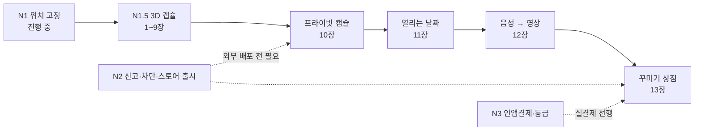
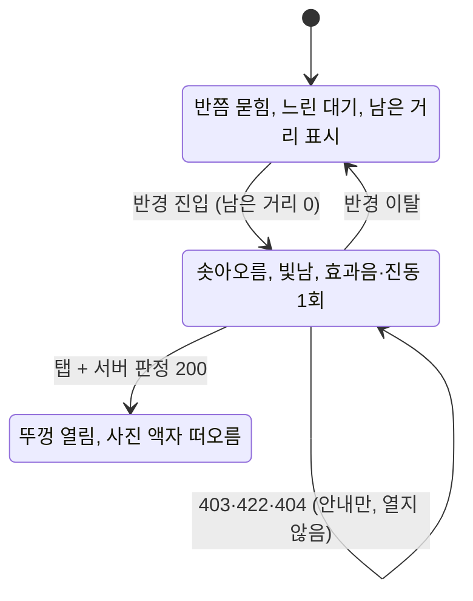

# Drop 캡슐 디벨롭 기획 (N1.5 이후)

> 출처: 원본 기획 "Drop 캡슐 디벨롭 기획"(창현, 2026-10-04)을 기존 문서와 대조해 옮긴 것이다. 대조 대상은 `1-domain-definition.md`(도메인 정의서 v1.1), `2-PRD.md`(PRD v1.2), `10-native-PRD.md`(네이티브 PRD v0.7), `7-erd.md`(ERD v0.6), `8-plan.md`(실행 계획 v0.9), `5-project-principle.md`(프로젝트 원칙 v0.7)와 `backend/` 코드다.
>
> 문서 상태: **1부(1~9장, N1.5)는 요구사항 초안**, **2부(10~13장)는 로드맵 초안**이다. 2부에는 확정된 도메인 규칙과 부딪히는 항목이 있다. 15장의 결정이 끝나기 전에는 도메인 정의서가 우선하며, 2부는 단계마다 별도 PRD로 상세화한다(네이티브 PRD 9.3). 원본의 사실 오류를 바로잡은 내역은 16장에 있다.

## 변경 이력

| 버전 | 일자 | 변경자 | 변경내용 |
|---|---|---|---|
| 0.2 | 2026-10-04 | Claude Code | 실증 앱(OPS-N04)에서 써 본 조작 규칙을 17장으로 추가: 등급별 표시, 열 때 결제, 고른 뒤 동작, 크기·회전, 여러 개 놓기, 사진 받기, 주인만 삭제(FR-X01~X14, XP-01~03). 서버·DB 설계(17.4)와 결정 필요 항목 DQ-10~14 추가 |
| 0.1 | 2026-10-04 | 창현(원본 기획), Claude Code(docs 반영) | 원본 기획을 기존 문서·코드와 대조해 작성. 사실 오류 11건 수정(16장), 기존 문서와의 차이와 결정 필요 항목 정리(15장), N1.5의 DB 변경을 없애고 주변 조회 `opened`만 남김(8장) |

---

## 전체 그림

앱의 정체성은 **"그 자리에 가야만 열리는 타임캡슐"** 하나다. N1(위치 고정)을 끝낸 뒤 캡슐만 더 깊게 키운다. 다음 단계는 앞 단계의 검증 지표(14장)를 통과해야 시작한다.



- **지금 위치:** N1 실증 중이다. 2026-10-03 밤 실내 테스트에서 클라우드 앵커 저장은 됐지만 다시 켰을 때 인식이 들쭉날쭉했다(스캔 품질이 계속 부족으로 나옴). 낮·밝은 곳 재테스트와 24시간 뒤 인식 확인이 남아 있다(`12-native-plan.md` OPS-N04).
- **원본에 없던 선행 조건:** 원본 로드맵에는 N2(신고·차단·스토어 출시)와 N3(인앱결제)가 없다. 상점의 통과 기준 "유료 구매 전환"은 실결제가 있어야 하므로 N2·N3가 먼저다. 프라이빗도 초대받은 사람이 앱을 설치할 경로가 있어야 한다(15장 DQ-02).

---

# 1부. 3D 캡슐 연출 (N1.5)

## 1. 개요

캡슐을 사진 액자 대신 **살아 있는 3D 오브젝트**로 보여 주고, 다가가고 여는 과정 자체를 연출로 만든다. 사진은 그 캡슐 안에 담기는 내용물이 된다.

- **배경:** 위치 고정(N1)만으로는 "신기함"이 약하다. 재미는 사진을 3D로 바꾸는 기술이 아니라 미리 잘 만든 3D 모델, 애니메이션, 접근 시 반응에서 나온다.
- **목표:** 처음 캡슐을 연 사용자가 "와" 하고 다시 찾아보고 싶게 만든다. 앵커·서버·DB는 거의 그대로 두고 표시 계층만 바꾼다.
- **기존 문서와의 관계:** `10-native-PRD.md`(N1)의 후속 단계다. 앵커·판정·열람 규칙은 N1을 그대로 따르고, 이 문서는 바뀌는 것만 적는다. 콘셉트는 `9-style-guide.md`의 "흙 속 타임캡슐"을 잇는다.
- **착수 조건:** 네이티브 PRD 1.3의 KPI 다섯 개를 모두 충족한다(원본은 위치 고정 한 개만 적었다, CQ-08).

## 2. 범위

### In

| 항목 | 비고 |
|---|---|
| 3D 캡슐 모델 1종(브론즈) | 땅에 반쯤 묻힌 타임캡슐. GLB, 애니메이션 포함 |
| 상태별 연출: 대기 → 접근 → 개봉 | 3장 |
| 개봉 시 사진 표시 | 캡슐 위로 떠오르는 액자. 기존 액자 노드 재사용 |
| 효과음·진동 | 접근·개봉 순간에만 |
| 반경 안/밖 구분 연출 | N1의 색·투명도 구분을 모델 상태로 대체 |

### Out (후속)

| 항목 | 이유 |
|---|---|
| 실버·마스터 전용 모델, 모델 종류 컬럼 | 결제(N3)·상점(13장) 도입 시. 지금 컬럼을 미리 두지 않는다(CQ-05) |
| 벽면에 놓인 캡슐용 모델 | 모델은 수평면용 1종만 만든다(CQ-07) |
| 사진 → 개인 맞춤 3D 생성 | 외부 AI API·비용·검열 문제. 기본 연출 반응을 본 뒤 결정 |
| 캐릭터 수집·도감 | 게임화는 사용 데이터를 본 뒤 |
| 영상 캡슐 | 12장 |
| iOS | N2 |

## 3. 캡슐 상태 흐름



- 연출 기준(반경 진입)과 열람 허용(서버 판정)은 N1의 판정식을 똑같이 쓴다. 연출은 "열 수 있다"는 신호일 뿐이고 실제 원본 접근은 서버가 정한다(`2-PRD.md` NFR-08, 네이티브 PRD NFR-N04).
- 이미 연 캡슐과 내 캡슐은 처음부터 뚜껑이 열린 모습으로 보인다(FR-C05).
- 이 상태는 **화면 표시 상태**다. 도메인의 캡슐 생명주기(도메인 정의서 6장)와는 별개이며 서버에 저장하지 않는다. "개봉"은 도메인 용어 "열람(Open)"과 같은 행위다.

## 4. 기능 요구사항

우선순위: P0 = N1.5 필수, P1 = 여유 시

| ID | 요구사항 | 우선순위 | 수용 기준 |
|---|---|---|---|
| FR-C01 | 3D 캡슐 표시 | P0 | N1 FR-N07의 액자 노드를 3D 캡슐 모델 노드로 바꾼다. 앵커 위치·`heading`은 그대로 쓴다(`heading`은 떠오르는 액자의 방향이다). 모델은 앱에 포함된 정적 GLB이며 서버에서 내려받지 않는다. 클라우드 앵커로 고정되기 전의 "대략적인 위치예요" 표시(FR-N07 ③)는 모델에도 그대로 적용한다 |
| FR-C02 | 대기 상태 | P0 | 열람 반경 밖(서버 판정식과 같은 기준의 남은 거리 > 0)이면 캡슐은 땅에 반쯤 묻힌 채 느린 대기 애니메이션만 재생한다. 남은 거리 표시는 N1과 같다 |
| FR-C03 | 접근 연출 | P0 | 남은 거리가 0이 되는 순간 캡슐이 흔들리며 땅 위로 솟아오르고 빛난다(CP-02). 효과음 1회, 짧은 진동 1회. 이후 반경 안에 있는 동안 빛나는 대기 상태를 유지한다. 연출은 앱 세션당 캡슐마다 1회만 재생하고(CQ-03), 반경을 벗어났다 다시 들어오면 연출 없이 솟은 모습으로 바꾼다 |
| FR-C04 | 개봉 연출 | P0 | 빛나는 캡슐을 탭하면 먼저 서버 열람 판정(N1 FR-N08)을 요청한다. 응답을 기다리는 동안 "흔들림"으로 대기한다. 200이면 뚜껑이 열리는 애니메이션(CP-07) 뒤 사진 액자가 캡슐 위로 떠오른다. 403·422면 개봉하지 않고 기존 안내를 보여 준다. 404(만료·삭제)면 "더 이상 볼 수 없는 캡슐이에요"를 안내하고 주변 목록을 다시 받는다(`2-PRD.md` FR-10). 대기가 CP-06을 넘으면 흔들림을 멈추고 "다시 시도"를 안내한다 |
| FR-C05 | 이미 연 캡슐 | P0 | 내가 연 적 있거나(`opened`) 내 캡슐(`is_mine`)이면 뚜껑이 열린 모습으로 바로 표시하고 접근 연출을 생략한다. **사진은 탭할 때 기존 열람 판정을 거쳐 보여 준다**(반경 밖에서는 열린 모습만 보인다, CQ-06) |
| FR-C06 | 성능 단계 | P0 | 거리에 따라 표시 수준을 나눈다: CP-03 안은 애니메이션 재생, 그 밖은 정지 모델, CP-04 밖은 단순 마커. 동시에 애니메이션하는 캡슐은 CP-05개까지 |
| FR-C07 | 소리·진동 끄기 | P1 | FAB 메뉴에 소리 켜기/끄기 토글. 기기 무음 모드에서는 효과음을 내지 않는다 |
| FR-C08 | 모델 종류 필드 | 보류 | 원본은 `capsules.model_kind`를 P1로 두었다. N1.5는 모델이 하나뿐이라 모든 행이 같은 값이 되고, 후속 단계용 컬럼을 미리 두지 않는 원칙(P-02)에 어긋나 넣지 않는다. 사용자가 모델을 고르게 되는 상점 단계(13장)에서 추가한다(CQ-05) |

## 5. 파라미터

모두 초기값이며 실기기에서 조정한다. 도메인 수치(PRM)와 N1 수치(NP)는 기존 문서를 따른다.

| ID | 항목 | 값 (초기값) |
|---|---|---|
| CP-01 | 캡슐 모델 크기 | 높이 약 40cm(실제 크기 기준) |
| CP-02 | 솟아오르기 애니메이션 길이 | 1.2초 |
| CP-03 | 애니메이션 재생 거리 | 30m 이내(NP-02와 같게) |
| CP-04 | 단순 마커로 바꾸는 거리 | 100m 밖 |
| CP-05 | 동시에 애니메이션하는 캡슐 수 | 가까운 순서로 5개 |
| CP-06 | 개봉 판정 대기 상한 | 5초 |
| CP-07 | 개봉(뚜껑 열림) 애니메이션 길이 | 0.8초. 원본에 없어 추가했다. CP-02와 합쳐 2초 이내(RISK-C04) |

## 6. 와이어프레임

기존 AR 뷰(`11-native-wireframes.md` NW-05)에서 캡슐 표시만 바뀐다. FAB·미니맵·정확도 배너는 그대로다.

**CW-01 대기 (반경 밖)**

```
┌──────────────────────────┐
│                 [미니맵] │
│                          │
│      "남은 거리 12m"      │
│            ▲             │
│       ___( )___   ← 반쯤 │
│   ░░░░░░░░░░░░░░░   묻힘 │
│                          │
│          (+) FAB         │
└──────────────────────────┘
```

**CW-02 접근 (반경 안 진입 순간)**

```
┌──────────────────────────┐
│                 [미니맵] │
│        ✦  ✦  ✦           │
│        ┌──────┐          │
│        │ 캡슐 │ ← 솟아올라│
│        └──────┘    빛남  │
│   ░░░░░░░░░░░░░░░        │
│   "탭해서 열어 보세요"    │
│           (+)            │
└──────────────────────────┘
```

**CW-03 개봉 (판정 200 뒤)**

```
┌──────────────────────────┐
│       ┌────────┐         │
│       │  사진  │ ← 떠오름│
│       │        │         │
│       └────────┘         │
│         "제목"           │
│        \__/ ← 열린 뚜껑  │
│   ░░░░░░░░░░░░░░░        │
│ [삭제] (내 캡슐만)  (+)  │
└──────────────────────────┘
```

- 떠오른 액자를 탭하면 전체 화면 보기(NW-14)로 간다(CQ-02).
- 드롭 중 미리보기(NW-09)는 지금처럼 고른 사진이 담긴 액자로 둔다. 캡슐 모델은 게시된 뒤에 보인다.

## 7. 비기능 요구사항·에셋 기준

| ID | 구분 | 요구사항 | 측정 방법 |
|---|---|---|---|
| NFR-C01 | 성능 | 캡슐 20개가 보이는 상태에서 30fps 이상(NFR-N02 유지) | `adb shell dumpsys gfxinfo` |
| NFR-C02 | 용량 | 캡슐 GLB 1개 1MB 이하, 폴리곤 5천 개 이하, 텍스처 1024px 이하 | 빌드 산출물 점검 |
| NFR-C03 | 로딩 | AR 화면 진입 뒤 첫 캡슐 모델 표시까지 1초 이내(모델은 앱 시작 시 한 번 로드해 재사용) | 실기기 측정 |
| NFR-C04 | 라이선스 | 모델·효과음은 직접 제작이거나 상업 이용 가능 라이선스(CC0 등)만 쓴다. 출처를 `docs/`에 기록한다 | 코드 리뷰 |
| NFR-C05 | 독창성 | 기존 게임·캐릭터를 닮은 디자인을 쓰지 않는다 | 디자인 검토 |

**에셋 제작 방법 (택1, CQ-01)**

- Blender로 직접 제작: 품질과 독창성이 가장 확실하지만 시간이 든다.
- CC0 에셋을 고쳐 쓰기: 빠르지만 다른 앱과 겹칠 수 있다.
- AI 3D 생성으로 시제품만 만들기: 이틀 안에 반응을 보기 좋다. 정식 버전은 다시 다듬는다.

**기술 제약 변경:** 네이티브 PRD 6장은 SceneView를 "사진 액자·글자·탭·끌기에만" 쓰도록 좁혀 두었다(RISK-N03). N1.5는 GLB 모델과 애니메이션까지 쓰므로 이 범위를 넓힌다. SceneView 4.52.0에 모델·애니메이션 관련 클래스(`ModelNode`, `ModelLoader`, `ModelAnimator`)가 들어 있는 것까지만 확인했고, Galaxy S25 Ultra에서의 동작과 안정성은 확인하지 않았다. 일정 1단계에서 먼저 실증한다(RISK-C02).

## 8. 백엔드·DB 변경

**DB 변경은 없다.** 판정·검열·미디어 프록시 규칙도 바뀌지 않는다. 바뀌는 것은 주변 조회 응답 한 필드다.

| 대상 | 변경 |
|---|---|
| DB | 없음. 원본의 마이그레이션 003(`model_kind`)은 넣지 않는다(FR-C08, CQ-05) |
| `POST /api/capsules` | 바꾸지 않는다 |
| `GET /api/capsules/nearby` | 응답 항목에 `opened`(세션 유저의 열람 기록 존재 여부, boolean) 추가. Task는 `8-plan.md` BE-17 |
| 인덱스 | 추가하지 않는다. 이미 있는 `idx_view_records_capsule_id_user_id (capsule_id, user_id)`로 계산한다 |
| 웹 프론트 | 변경 없음. 웹은 응답을 런타임에 검사하지 않아 새 필드가 무시된다 |

`opened`는 조회 쿼리의 SELECT 목록에 아래 한 줄을 더해 계산한다. `view_records`에는 (capsule_id, user_id) UNIQUE가 없어 같은 캡슐을 여러 번 열면 행이 여러 개다. JOIN으로 붙이면 캡슐이 목록에 중복으로 나오므로 `EXISTS`를 쓴다.

```sql
EXISTS (SELECT 1 FROM view_records v WHERE v.capsule_id = capsules.id AND v.user_id = $9) AS opened
```

## 9. 일정·결정 필요 항목·리스크

### 일정 (1인, 추정 1~1.5주, N1 KPI 충족 뒤)

1. 캡슐 모델 시제품 1종과 애니메이션 3개(대기·솟아오름·개봉) 준비 → 검증: SceneView에서 재생, S25 Ultra에서 반복 생성·삭제해도 앱이 죽지 않음
2. FR-C01·C02: 액자 노드를 모델 노드로 교체 → 검증: 앵커 위치·방향이 N1과 같음
3. FR-C03·C04·C05: 상태 전환과 서버 판정 연결, `8-plan.md` BE-17 → 검증: 반경 진입·개봉·재방문이 상태대로 동작
4. FR-C06과 성능 측정 → 검증: NFR-C01 충족
5. 지인 5명 현장 테스트 → 검증: "다시 찾아보고 싶다" 반응을 인터뷰로 기록

### 결정 필요 항목

| ID | 쟁점 | 기본안 |
|---|---|---|
| CQ-01 | 에셋 제작 방법 | 시제품은 AI 3D 생성, 정식은 Blender 직접 제작 |
| CQ-02 | 개봉 시 사진 표시 방식 | 캡슐 위 떠오르는 액자(기존 노드 재사용). 전체 화면 보기는 액자 탭으로 |
| CQ-03 | 접근 연출을 반경 진입마다 반복할지 | 앱 세션당 캡슐마다 1회 |
| CQ-04 | `opened` 판단 기준 | 서버 열람 기록. 앱 캐시에만 의존하지 않는다 |
| CQ-05 | `model_kind` 컬럼을 N1.5에 넣을지 (원본: 넣음) | 넣지 않는다. 값이 하나뿐이고 원칙 P-02에 어긋난다. 넣지 않으면 N1.5의 DB 변경이 0건이다 |
| CQ-06 | 이미 연 캡슐을 반경 밖에서 어디까지 보여 줄지 | 열린 모습까지만. 사진은 탭해서 기존 열람 판정을 통과해야 보인다. "그 자리에 가야만 열린다"는 정체성과 맞춘다 |
| CQ-07 | 벽·탁자에 놓인 캡슐 | N1.5는 수평면(바닥·탁자)만. "땅에 묻힌 캡슐"은 벽에서 성립하지 않고, 벽 배치는 N1에서도 아직 확인되지 않았다 |
| CQ-08 | N1.5 착수 조건 (원본: 위치 고정 10회 중 8회 한 가지) | 네이티브 PRD 1.3의 KPI 다섯 개 전부. N1 완료 기준(네이티브 PRD 8장)과 같게 둔다 |

### 리스크

| ID | 리스크 | 대응 |
|---|---|---|
| RISK-C01 | GPS 판정 오차 때문에 바로 앞인데 캡슐이 안 솟아오름 | 연출 기준과 서버 판정을 같은 식으로 맞추고, 대기 상태에도 남은 거리를 계속 보여 준다 |
| RISK-C02 | SceneView 모델 애니메이션이 S25 Ultra에서 불안정 | 1단계에서 먼저 실증. 안 되면 애니메이션 없이 위치 이동·크기 변화만으로 연출 |
| RISK-C03 | 여러 캡슐이 모이면 프레임 저하 | FR-C06 거리 단계와 CP-05 상한 |
| RISK-C04 | 연출이 열람 속도를 늦춰 답답함 | 애니메이션 합계 2초 이내(CP-02 + CP-07), 판정 응답과 동시에 진행 |

---

# 2부. 캡슐 확장 로드맵 (초안)

2부는 원본의 요구사항을 그대로 싣고, 각 장 끝에 **기존 문서와의 차이**를 붙였다. 차이가 풀리기 전에는 구현하지 않으며, 착수할 때 단계별 PRD로 상세화한다.

## 10. 프라이빗 캡슐

"너만 와서 열어 봐." 받는 사람이 정해진 캡슐이다. 커플·가족이라는 1순위 타깃의 가장 감정적인 쓰임새이고, 받는 사람이 정해져 있어 공개 콘텐츠가 적은 "텅 빈 지도" 문제를 피한다. 다음 단계 중 가장 먼저 한다.

| ID | 요구사항 | 우선순위 | 수용 기준 |
|---|---|---|---|
| FR-P01 | 공개 범위 선택 | P0 | 드롭 시 "공개 / 특정 사람에게만" 선택. 기본값은 공개(현행 유지) |
| FR-P02 | 초대 링크 | P0 | "특정 사람에게만"이면 게시 후 초대 링크를 발급하고 메신저로 공유한다. 링크를 연 사람이 로그인하면 수신자로 등록된다 |
| FR-P03 | 노출 제한 | P0 | 프라이빗 캡슐은 작성자와 등록된 수신자에게만 주변 조회·지도에 나온다. 그 외에는 존재 자체를 알 수 없다 |
| FR-P04 | 열람 판정 | P0 | 수신자도 공개 캡슐과 같은 반경 판정(서버)을 통과해야 연다. 링크만으로 원본을 볼 수 없다 |
| FR-P05 | 찾아가기 안내 | P0 | 수신자에게 캡슐 위치를 지도에 보여 주고 "도착하면 열려요"를 안내한다 |
| FR-P06 | 개봉 알림 | P1 | 수신자가 열면 작성자에게 "OO님이 캡슐을 열었어요" 알림 |
| FR-P07 | 수신자 수 상한 | P1 | 캡슐당 수신자 PP-01명까지 |

파라미터(초기값): PP-01 수신자 상한 10명, PP-02 초대 링크 유효 기간 30일

### 기존 문서와의 차이

| 원본 | 기존 문서 | 판정 |
|---|---|---|
| 수신자 상한 10명(PP-01) | BR-22·OQ-8 "수신자 수에는 제한이 없다" | 충돌 (DQ-04) |
| 초대 링크 유효 30일(PP-02) | PRM-15·OQ-13 "7일" | 충돌 (DQ-04) |
| 링크 하나를 여러 명이 쓰는지 적지 않음 | BR-24·INV-10 "1회용, 초대할 사람마다 링크를 따로 만든다" | 미정 (DQ-04) |
| 작성자가 링크를 무효화 | 도메인에 무효화 규칙 없음 | 새 규칙 |
| 지오펜싱 언급 없음, 대신 찾아가기 안내·개봉 알림 | BR-25 지오펜싱 푸시(PRM-02, PRV-07 백그라운드 위치) | BR-25를 유지·보류·폐기 중 무엇으로 할지 미정 (DQ-06) |
| "지도에 보여 준다"(FR-P03·P05) | 지도 탭은 후속이고 지도 라이브러리는 허용 목록 밖(`2-PRD.md` Q-06, 네이티브 PRD 6장) | 충돌 (DQ-05) |
| 알림(FR-P06) | 푸시 수단이 기술 스택에 없다(Firebase 금지, `2-PRD.md` 6장) | 충돌 (DQ-06) |
| 존재를 숨김, 로그인하면 수신자 등록, 수신자도 반경 판정 | BR-22, BR-23, BR-27 | 일치 |

### 기술 메모 (착수 시 상세화)

- **DB 방향:** `capsules.visibility`(`'PUBLIC'`/`'PRIVATE'`, CHECK), `capsule_recipients`(capsule_id, user_id, 등록 시각), `capsule_invites`(토큰 해시, 만료, 무효화 시각, 1회용이면 사용자). 값은 대문자 + CHECK로 쓴다(원칙 3.2).
- **원본에 빠진 경로:** 공개 범위 확인은 주변 조회와 열람뿐 아니라 **썸네일·원본 미디어 프록시, 삭제**에도 걸어야 한다. 지금 썸네일은 로그인만 하면 받을 수 있고, 삭제는 남의 캡슐에 403을 줘서 존재가 드러난다. 캡슐을 찾는 조회 함수 세 개에 같은 조건을 넣으면 모든 경로가 404로 통일된다.
- **멀리 있는 수신자:** 주변 조회는 200m(M-01) 안만 돌려준다. 수신자가 캡슐 위치를 알려면 초대 수락 응답이나 "받은 캡슐" 조회가 따로 필요하다.
- **토큰 보안:** 세션 토큰과 같은 방식(무작위 값, DB에는 해시)으로 한다. 요청 로그가 경로를 그대로 남기므로 토큰을 URL 경로에 넣지 않고 요청 본문으로 받는다.
- **앱 설치 경로:** 초대받은 사람이 앱을 설치할 방법이 필요하다. N1은 APK 직접 설치와 내부 테스트 트랙뿐이다(DQ-02).

## 11. 열리는 날짜 지정

"이 날짜부터 이 자리에서 열기." 장소 조건에 시간 조건을 더해 진짜 타임캡슐이 된다. 기념일·졸업·새해처럼 다시 올 이유를 만든다.

| ID | 요구사항 | 우선순위 | 수용 기준 |
|---|---|---|---|
| FR-T01 | 개봉 날짜 설정 | P0 | 드롭 시 선택 사항으로 "이 날짜부터 열림"을 고른다. 최소 내일, 최대는 캡슐 유지 기간(등급별 만료) 안 |
| FR-T02 | 잠긴 캡슐 표시 | P0 | 개봉 날짜 전에는 반경 안이어도 잠긴 모습(자물쇠·남은 날짜 "D-12")으로 보이고 열리지 않는다 |
| FR-T03 | 서버 판정 | P0 | 열람 판정에 "현재 시각 ≥ 개봉 시각"을 추가한다. 기기 시계를 믿지 않는다 |
| FR-T04 | 개봉일 알림 | P1 | 개봉 날짜에 작성자·수신자에게 "오늘 열 수 있어요" 알림 |
| FR-T05 | 미리보기 숨김 | P0 | 잠긴 동안에는 썸네일도 내려주지 않는다. 제목만 공개할지는 작성자가 고른다 |

변경: `capsules.opens_at`(timestamptz, NULL이면 즉시 열림). 3D 캡슐 연출(3장)에 "잠김" 상태를 추가해 대기·접근과 구분한다. 프라이빗 캡슐과 함께 쓰면 "이 날, 너만, 여기서"가 된다.

### 기존 문서와의 차이

| 원본 | 기존 문서 | 판정 |
|---|---|---|
| "1년 뒤 이 자리에서 열기", "D-120" | 지금 등급은 브론즈(30일, PRM-06)뿐이고 실버·마스터는 결제(N3) 뒤다. 클라우드 앵커 보관도 최대 365일이다(네이티브 PRD NQ-05) | **지금은 30일 안으로만 가능.** 장기 개봉일은 실버·마스터와 함께 (DQ-07) |
| 잠김 상태 | 도메인 INV-02·6장·5.4·BR-27에 시간 조건이 없다. 열람 확인 순서(401 → 400 → 404 → 422 → 403)에 잠김 응답이 없다 | 도메인 개정 필요 |
| 반경 안이어도 열리지 않는다(FR-T02) | 내 캡슐은 열린 상태로 보이고(FR-C05) 소유자는 원본을 받을 수 있다(`2-PRD.md` FR-10) | 작성자에게 잠금이 적용되는지 미정 (DQ-08) |
| 잠긴 동안 썸네일을 주지 않는다(FR-T05) | 주변 조회는 썸네일 경로를 항상 담고(FR-08), 썸네일 프록시는 로그인만 확인한다 | 서버 변경 필요 |
| 제목만 공개할지 작성자가 고른다 | 원본의 DB 변경에 이 선택을 담을 필드가 없다 | 누락 (DQ-08) |
| "최소 내일" | 도메인의 하루 기준은 KST 자정(PRM-17)이고 컬럼은 시각 단위다 | 기준 시각 미정 |
| 유료 체크포인트·신고·블라인드와의 관계 | 정해지지 않음 | 착수 시 결정 |

### 기술 메모

- 잠김은 캡슐 상태값이 아니라 `opens_at > now()`로 판정한다(만료를 `expires_at`으로 판정하는 지금 방식과 같다).
- 잠긴 캡슐을 열려고 하면 새 에러 코드가 필요하다(예: `CAPSULE_LOCKED` 403, 404 확인 다음·422 앞).
- 개봉 날짜 상한은 서버가 `expires_at`보다 앞인지 검증한다.
- 웹 프론트는 `thumb_url`이 항상 문자열이라고 가정한다. 잠긴 캡슐을 웹 요청에서 제외할지 정해야 한다(네이티브 PRD NQ-09).

## 12. 영상·음성 캡슐

목소리와 움직임은 사진보다 감정이 훨씬 크게 전달된다. `2-PRD.md` FR-05(30초·50MB)를 구체화한다.

| ID | 요구사항 | 우선순위 | 수용 기준 |
|---|---|---|---|
| FR-V01 | 음성 메시지 첨부 | P0 | 사진 캡슐에 최대 VP-01초 음성을 붙인다. 개봉하면 사진과 함께 재생 |
| FR-V02 | 영상 캡슐 | P1 | 최대 VP-02초 영상. 업로드 전 기기에서 압축(AndroidX Media3 Transformer) |
| FR-V03 | AR 재생 | P1 | 개봉 시 액자 안에서 영상을 재생한다. 소리는 기기 무음 모드를 따른다 |
| FR-V04 | 비동기 검열 | P0 | 영상·음성은 올린 뒤 "검열 중" 상태로 두고, 통과해야 게시된다(검열 중에는 어떤 조회에도 나오지 않는다). 작성자에게 결과를 알린다 |
| FR-V05 | 스트리밍 | P1 | 미디어 프록시가 Range 요청을 지원해 부분 재생·건너뛰기가 된다 |

파라미터(초기값): VP-01 음성 60초, VP-02 영상 30초, VP-03 영상 최대 용량 50MB

### 기존 문서와의 차이

| 원본 | 기존 문서 | 판정 |
|---|---|---|
| "음성 첨부(작고 쉬움)를 먼저" | 검열 수단이 Rekognition뿐인데 음성 검열 기능이 없다. 모든 캡슐은 게시 전 검열을 통과해야 한다(BR-33) | **음성이 영상보다 쉽지 않다.** 검열 수단을 정하기 전에는 착수할 수 없다 (DQ-09) |
| 음성 메시지 | BR-05 "미디어는 갤러리의 사진이나 영상에서만". 앱 안 녹음이면 BR-05 예외와 마이크 권한이 필요하다(지금은 카메라·위치만, FR-N02) | 충돌 (DQ-09) |
| 사진 + 음성 | 도메인의 캡슐 미디어는 하나다(INV-02) | 도메인 개정 필요 |
| 검열 중 상태 | 지금은 검열을 통과해야 캡슐 행을 만든다(`2-PRD.md` FR-06). 캡슐 `status`는 `ACTIVE`·`DELETED`뿐이다 | 게시 흐름·스키마 변경 필요 |
| "작성자에게 결과를 알린다" | `2-PRD.md` FR-05는 폴링으로 확인하기로 했다. 푸시 수단은 없다 | 폴링으로 맞춘다 (DQ-06) |
| Media3 Transformer, 액자 안 영상 재생 | 네이티브 PRD 6장의 허용 목록에 없다 | 승인 필요 |
| "CDN 캐시를 재검토" | 미디어는 열람 기록을 확인한 뒤 `private`으로 응답한다(NFR-05·06, Q-07·Q-08). CDN 캐시와 양립하려면 따로 설계해야 한다 | 설계 필요 |

### 기술 메모

- 지금 서버는 미디어를 JPEG 한 종류로 가정한다(S3 키 `media/{id}.jpg`, `Content-Type: image/jpeg`, 크기 상한 M-06). 종류별 키·형식·크기와 캡슐의 미디어 종류 필드가 필요하다.
- 미디어 프록시는 지금 항상 전체를 200으로 보낸다. Range를 받으면 S3에 범위를 넘기고 206으로 응답하도록 바꿔야 한다.
- Presigned PUT은 업로드 크기를 강제하지 못한다. 50MB 상한은 올린 뒤에야 확인된다.
- 검열 중인 행이 오래 남는 경우의 정리 규칙이 필요하다(S3 수명 주기 M-08과 맞물린다).

## 13. 캡슐 꾸미기 상점

남기는 건 무료, 특별하게 남기는 건 유료다. 기본 캡슐로 누구나 드롭하고, 모양·연출·장식으로 마음을 더 표현하고 싶을 때 돈을 쓴다.

| 구분 | 품목 | 판매 방식 |
|---|---|---|
| 무료 | 기본 캡슐(브론즈), 기본 개봉 연출 | 무제한 |
| 무료 맛보기 | 특별 캡슐 모양 1종 | 가입 시 지급 |
| 유료 · 캡슐 모양 | 편지 상자, 보석함, 선물 상자, 계절 한정 | 영구 구매, 낮은 가격 |
| 유료 · 개봉 연출 | 꽃잎·불꽃·눈 내림, 효과음 | 영구 구매 |
| 유료 · 장식 | 캡슐 옆 동물·캐릭터(예: 지켜 주는 강아지) | 개별 판매, 애니메이션 포함 |
| 유료 · 기간 | 오래 남는 캡슐 | 기존 등급(실버·마스터)의 유지 기간 체계 |

**원칙 (원본)**

- 한 번 사면 계속 쓰는 영구 구매. 드롭할 때마다 돈이 나가는 소모형은 쓰지 않는다.
- 서버가 영수증을 검증하며 중복 지급 0건(`2-PRD.md` NFR-03)을 지킨다.
- 보유 품목은 서버가 관리하고, 보유하지 않은 품목으로 드롭하면 거부한다.
- 오리지널 디자인만 쓴다. 기존 캐릭터를 닮게 만들지 않는다.
- 가격에 스토어 수수료(15~30%)를 반영한다. 확률형 아이템(뽑기)은 넣지 않고, 출시 전 국내 등급분류 대상 여부를 확인한다.

### 기존 문서와의 차이

| 원본 | 기존 문서 | 판정 |
|---|---|---|
| "결제는 크리스탈 재화를 거쳐 인앱결제로" | 도메인에는 **돈 주고 사는 크리스탈이 없다.** 무상 크리스탈은 브론즈 등록에만 쓰고 출금할 수 없으며(BR-08, OQ-9), 수익 크리스탈은 정산용이다. 현금 결제는 모두 인앱결제로 직접 한다(BR-07) | 충돌 (DQ-03) |
| 브론즈 무료·무제한 | 브론즈는 1,000원 또는 무상 크리스탈 100개(도메인 5.1, PRM-11). 등록비는 플랫폼 수익원이고 조회 보상 재원의 전제다(ST-03, RISK-11). 지금 무료인 것은 MVP·N1 한정이다(`2-PRD.md` Q-04) | **가장 큰 사업 모델 충돌** (DQ-03) |
| 소모형은 쓰지 않는다 | 같은 표의 "유료 · 기간"은 실버·마스터인데, 이것은 드롭할 때마다 내는 등록비다(도메인 5.1) | 원본 안의 모순 (DQ-03) |
| 영구 구매 품목 | IAP-01은 등록비·열람가만 소모성 상품으로 정의한다. 구매 유형에 아이템이 없다(INV-04) | 도메인 개정 필요 |
| DB: `effect_kind`, `user_items` | 구매 기록(거래 ID UNIQUE를 걸 곳), 품목 목록, 환불 시 회수가 빠졌다. "장식" 품목은 캡슐에 저장할 필드가 없다 | 누락 |
| 상점 화면 | "별도 홈 화면이나 탭을 두지 않는다, FAB 하나"(`2-PRD.md` 7장) | 화면 구조 변경 필요 |
| 유료 구매 전환을 검증 | 실결제는 스토어 출시(N2)와 인앱결제(N3)가 먼저다 | 선행 조건 (DQ-02) |

## 14. 검증 지표·리스크·미룬 아이디어

정체성은 "그 자리에 가야만 열리는 타임캡슐" 하나로 지킨다. 새 기능은 이 문장을 더 강하게 만들 때만 넣는다.

### 단계별 검증 지표

| 단계 | 통과 기준 | 비고 |
|---|---|---|
| N1 위치 고정 | 네이티브 PRD 1.3의 KPI 전부(같은 자리 재표시 10회 중 8회 이상 NP-01 이내 포함) | 원본은 재표시 한 가지만 적었다 |
| N1.5 3D 캡슐 | 지인 5명 중 다수가 "다시 찾아보고 싶다" | "다수"의 기준 인원과 질문 문항을 테스트 전에 정한다 |
| 프라이빗 캡슐 | 링크로 수신자가 된 사람 중 실제로 그 장소에 가서 연 비율. 절반 이상이면 핵심 가설 성립 | 원본의 "링크를 받은 사람 중"은 서버가 셀 수 없어 분모를 바꿨다 |
| 열리는 날짜 | 날짜 지정 캡슐 비율과 개봉일 재방문율 | 목표값 미정. 개봉일이 지나야 잴 수 있다 |
| 영상·음성 | 첨부 비율, 개봉 후 끝까지 재생 비율 | 목표값 미정 |
| 꾸미기 상점 | 맛보기 아이템 사용자 중 유료 구매 전환 발생 | 몇 건이면 통과인지 미정 |

### 리스크

| ID | 리스크 | 대응 |
|---|---|---|
| RISK-X01 | 받은 사람이 장소까지 가지 않음 | 찾아가기 안내·개봉일 알림. 지표가 낮으면 반경·연출보다 "가고 싶게 만드는 이유"를 먼저 고친다 |
| RISK-X02 | 범위 폭주로 정체성이 흐려짐 | 위 정체성 문장 기준, 단계별 지표 통과 뒤 착수 |
| RISK-X03 | 초대 링크 유출 | 링크만으로는 못 열고 현장 판정 필요, 작성자가 링크 무효화 |
| RISK-X04 | 영상 비용 급증 | 길이·용량 상한과 CDN 재검토 |
| RISK-X05 | 2부가 확정 도메인 규칙과 충돌한 채 구현됨 | 15장의 결정을 먼저 하고 도메인 정의서를 개정한 뒤 착수 |

### 미룬 아이디어 (캡슐이 자리 잡은 뒤 재검토)

- **AR 짓기(블록으로 집·성 짓기):** 기술적으로 가능(기준 앵커 + 상대 좌표, 혼자 짓기 3~4주 추정). 앱 정체성이 흔들릴 수 있어 보류. 들어온다면 "캡슐을 꾸미는 기능"으로 작게 시작한다.
- **AR 방탈출·창고 체험관:** 짓기가 전제라 함께 보류. 팝업 협업으로 먼저 수요를 본다.
- **AI 안경:** Android XR은 개발자 미리보기 단계. 실외 캡슐에 Geospatial 포즈(`geo_pose`, 네이티브 PRD FR-N05)를 함께 저장해 두면 나중에 안경으로 이어진다.
- **사진 → 3D 생성, 가이드 스캔 재구성:** 비용·대기·품질 편차 문제로 보류. iOS(N2)에서는 애플 Object Capture로 재검토.

---

## 15. 기존 문서와의 차이에서 나온 결정 필요 항목

1부의 결정 항목은 9장 CQ에 있다. 아래는 2부와 단계 구성에 관한 것이다. **결정 전에는 도메인 정의서와 네이티브 PRD의 현재 내용이 유효하다.**

| ID | 쟁점 | 선택지 | 권고안 (근거) |
|---|---|---|---|
| DQ-01 | 이 기획을 어디까지 정식 문서에 반영할지 | ① 1부만 요구사항으로 확정하고 2부는 로드맵으로 둔다 ② 2부까지 도메인 정의서에 반영한다 | ①. 2부는 미정 항목이 많고 단계마다 별도 PRD를 쓰기로 했다 |
| DQ-02 | 단계 순서와 N2·N3의 위치 | ① 원본 순서(프라이빗 → 날짜 → 음성·영상 → 상점)를 따르되 N2를 외부 배포 전, N3를 상점 전 선행으로 둔다 ② 기존 순서(N2 → N3 → N4) 유지 | ①. 프라이빗·날짜는 지인 대상 내부 테스트로 검증할 수 있다. 상점은 N2·N3 없이 성립하지 않는다 |
| DQ-03 | 결제 모델 | ⓐ 아이템 결제: 크리스탈 경유 / 인앱결제 직접 + 서버가 보유 기록 ⓑ 브론즈 등록비: 무료·무제한 / 기존 유지(1,000원 또는 무상 크리스탈 100개) ⓒ 유료 체크포인트·조회 보상·정산: 보류 / 폐기 | ⓐ 인앱결제 직접. 새 재화와 환불·소멸 정책이 필요 없다. ⓑ 상점 단계 PRD에서 결정. 무료로 바꾸면 무상 크리스탈·광고 보상·조회 보상 재원 규칙을 함께 고쳐야 한다. ⓒ 보류. 지우면 되돌리기 어렵고 지금 정할 필요가 없다 |
| DQ-04 | 초대 링크 방식 | ① 도메인 유지: 1회용, 사람마다 따로, 7일, 수신자 상한 없음 ② 원본: 30일, 수신자 10명, 무효화 가능(링크 하나를 여러 명이 쓰는 방식으로 읽힘) | 쓰임새로 고른다. 가족 단체방에 링크 하나를 올리는 쓰임새면 ②이고 상한·무효화가 한 묶음이어야 한다. 한 사람에게 보내는 쓰임새면 ①이 구현이 단순하고 유출에 강하다 |
| DQ-05 | 찾아가기 안내 | ① 외부 지도 앱 열기(좌표 전달) ② 앱 안 지도(지도 라이브러리 승인 필요) ③ 거리·방향 글자만 | ①. 라이브러리 없이 된다 |
| DQ-06 | 알림(개봉, 개봉일, 검열 결과)과 지오펜싱 푸시(BR-25) | ① 푸시 도입(Firebase 금지 해제 필요) ② 앱을 열었을 때 앱 안에서만 표시 ③ 알림 제외 | 처음에는 ②. BR-25는 보류. 백그라운드 위치 권한 부담이 크다 |
| DQ-07 | 개봉 날짜 상한 | ① 유지 기간 안(브론즈는 30일 안) ② 유지 기간을 개봉 날짜부터 계산 | ①. 만료 계산식(INV-02)과 앵커 보관 기한을 건드리지 않는다. "1년 뒤 열기"는 실버·마스터 도입 뒤로 미룬다 |
| DQ-08 | 잠긴 캡슐의 세부 규칙 | ⓐ 작성자도 잠기는지 ⓑ 게시 뒤 개봉 날짜를 바꿀 수 있는지 ⓒ 제목 공개: 작성자 선택 / 항상 공개 / 항상 숨김 ⓓ 유료 체크포인트에 개봉 날짜를 허용할지 | ⓐ 작성자는 볼 수 있다(기존 소유자 예외와 같게) ⓑ 바꿀 수 없다(열람가 불변 BR-14와 같게) ⓒ 항상 공개(필드가 필요 없다) ⓓ 허용하지 않는다(결제·환불 조합을 피한다) |
| DQ-09 | 음성의 출처와 검열 | 출처: 앱 안 녹음(BR-05 예외 + 마이크 권한) / 파일 선택만. 검열: 음성 인식 뒤 글자 검사(새 서비스 승인 필요) / 프라이빗 캡슐에만 허용 / 검열 없음(BR-33 위반) | 검열 수단이 정해질 때까지 음성 단계를 확정하지 않는다. 영상을 먼저 하는 순서도 검토한다 |

## 16. 원본 대비 바로잡은 사실

원본 기획의 서술 가운데 실제 스키마·코드·문서와 달라 고친 것이다.

| # | 원본 | 실제 | 이 문서에서 |
|---|---|---|---|
| 1 | `view_records(viewer_id, capsule_id)`에 인덱스가 없으면 추가 | 컬럼 이름은 `user_id`이고 인덱스 `idx_view_records_capsule_id_user_id`가 이미 있다 | 인덱스 추가를 뺐다(8장) |
| 2 | `opened`를 LEFT JOIN으로 계산 | 열람 기록에 UNIQUE가 없어 JOIN하면 캡슐이 중복으로 나온다 | `EXISTS`로 바꿨다(8장) |
| 3 | DB 마이그레이션 003에 `model_kind` 추가 | 002도 아직 파일이 없다(`8-plan.md` DB-03 미완료). `model_kind`는 값이 하나뿐인 컬럼이다 | N1.5의 DB 변경을 없앴다(8장, CQ-05) |
| 4 | 값 표기 `'bronze_v1'`, `public / private` | 상태값은 대문자 + CHECK로 쓴다(원칙 3.2) | 대문자로 적었다(10장) |
| 5 | "판정·검열·미디어 프록시 규칙은 바뀌지 않는다" | N1.5에만 해당한다. 10~12장은 셋 다 바꾼다 | 8장 문구를 N1.5로 한정했다 |
| 6 | 개봉 연출이 403·422만 다룸 | 404(만료·삭제) 처리가 정해져 있다(`2-PRD.md` FR-10) | FR-C04에 404와 대기 상한을 넣었다 |
| 7 | "1년 뒤 이 자리에서 열기", "D-120" | 브론즈 유지 기간이 30일이라 지금은 30일 안만 가능하다 | 문구를 고치고 차이를 적었다(11장) |
| 8 | 프라이빗의 공개 범위 확인을 주변 조회와 열람에만 적음 | 썸네일·원본 프록시와 삭제 경로에도 필요하다 | 기술 메모에 추가했다(10장) |
| 9 | "음성 첨부(작고 쉬움)" | 음성 검열 수단이 없고 비동기 처리가 필요하다 | 차이로 적고 결정 항목으로 올렸다(12장, DQ-09) |
| 10 | 상점 DB에 `effect_kind`, `user_items`만 적음 | 구매 기록, 품목 목록, 환불 시 회수가 필요하다 | 누락으로 적었다(13장) |
| 11 | N1 통과 기준이 위치 고정 한 가지 | 네이티브 PRD 1.3의 KPI는 다섯 개다 | 다섯 개 전부로 맞췄다(1장, 14장) |

---

## 17. 실증 앱에서 써 본 조작 규칙 (2026-10-04)

OPS-N04 실증 앱(`app/.../ar/SpikeScreen.kt`)에서 실기기로 써 보고 쓸 만하다고 본 규칙이다. 원본 기획과 기존 문서에 없던 내용이라 여기에 모은다. **실증 앱은 서버와 연결되지 않았고 결제 창도 실제 결제를 하지 않는다.** 아래는 실제 앱에 넣을 때의 요구사항 초안이며, 기존 도메인 규칙과 부딪히는 것은 17.5의 결정 뒤에 확정한다.

### 17.1 기능 요구사항

| ID | 기능 | 실증 앱 동작 | 실제 앱 요구사항 |
|---|---|---|---|
| FR-X01 | 등급별 표시 | 브론즈는 놓자마자 사진이 보인다. 실버는 상자로 보인다 | 브론즈 캡슐은 AR에서 썸네일이 바로 보인다(지금의 프레임 표시와 같다). 상위 등급 캡슐은 닫힌 상자로 보이고 열어야 사진이 나온다. 상자에서는 썸네일을 내려받지 않는다 |
| FR-X02 | 열 때 결제 확인 | 실버 상자를 열면 "실버 상자입니다 / 유료 결제 1달러 진행하시겠습니까?" 창이 뜬다. 확인하면 빛 효과와 함께 사진이 나온다 | 유료 캡슐을 처음 열 때 금액을 보여 주고 확인을 받는다. 결제가 끝나야 열람 판정을 요청한다. 놓는 사람이 [완료] 전에 크기를 맞춰 보려고 여는 것은 결제 없이 바로 열리고, [완료]를 누르면 다시 닫힌 상자로 놓인다. 실결제는 인앱결제(N3)가 먼저다. 금액과 누가 내는지는 DQ-10 |
| FR-X03 | 결제한 캡슐 표시 | 결제한 상자는 회색이 되고 다시 열 때 결제 창이 뜨지 않는다 | 한 번 결제한 캡슐은 그 캡슐이 유지되는 동안 다시 결제하지 않는다. 주변 조회 응답의 `paid`로 구분해 회색 상자로 그린다 |
| FR-X04 | 고른 뒤 동작 | 캡슐을 탭하면 파란색(선택)이 되고 아래에 [열기/닫기] [삭제] [받기] [해제]가 나온다 | 캡슐이 여러 개 겹쳐 보일 때 잘못 누르는 것을 막기 위해 "탭 = 선택, 동작은 버튼"으로 한다. 선택은 한 번에 하나다. 열람 요청·삭제는 버튼을 눌렀을 때만 보낸다 |
| FR-X05 | 다시 닫기 | 연 캡슐을 닫으면 상자로 돌아간다 | 화면 표시만 바꾼다. 서버의 열람 기록은 지우지 않는다 |
| FR-X06 | 크기 | 슬라이더(XP-01)와 두 손가락 벌리기로 사진의 긴 변 길이를 바꾼다. 가로세로 비율은 유지된다 | 드롭할 때 정한 크기를 캡슐에 저장하고(`size_m`), 모든 사람에게 같은 크기로 보인다. 연 사람이 보기 편하게 바꾸는 것은 그 기기 화면에만 적용되고 저장하지 않는다 |
| FR-X07 | 회전 | 슬라이더로 세로축 회전. 가운데가 0°이고 -180° ~ +180° | 드롭할 때 정한 방향은 기존 `heading`(0~359)에 저장한다(새 컬럼 없음). 음수는 360을 더해 옮긴다(-90° → 270). 연 사람이 돌려 보는 것은 저장하지 않는다 |
| FR-X08 | 여러 개 놓기 | 하나를 놓고 [완료]를 누르면 다른 자리에 또 놓을 수 있다. [완료] 전에는 탭한 곳으로 옮겨진다 | 드롭 한 번은 캡슐 하나다. [완료]는 드롭 흐름의 "여기에 놓기" 확정(FR-N05)에 해당하고, 이어서 새 드롭을 시작할 수 있다. 캡슐마다 클라우드 앵커 하나를 쓴다 |
| FR-X09 | 사진 받기 | 연 캡슐의 [받기]를 누르면 갤러리(Pictures/Drop)에 저장된다. 저장 권한은 묻지 않는다 | 열람에 성공한 캡슐만 받을 수 있다. 원본은 열람 뒤에만 내려가는 기존 미디어 프록시로 받는다(새 API 없음). 허용 여부는 DQ-13 |
| FR-X10 | 주인만 삭제 | 내 캡슐을 길게 누르거나 고른 뒤 [삭제]를 누르면 확인 창 뒤에 지워진다 | `2-PRD.md` FR-11·네이티브 PRD FR-N10과 같다. 삭제 버튼은 `is_mine`인 캡슐에만 보인다 |
| FR-X11 | AR 화면 촬영 | 촬영 버튼(둥근 흰 버튼)을 누르면 카메라 영상과 캡슐이 함께 찍혀 갤러리(Pictures/Drop)에 저장된다. 버튼·상태 카드는 찍히지 않는다 | 서버 변경 없음. 열린 캡슐의 사진이 함께 찍혀 앱 밖으로 나갈 수 있으므로 허용 범위는 사진 받기(DQ-13)와 같이 정한다 |
| FR-X12 | 미니맵 | 상태 카드 아래 오른쪽에 둥근 미니맵. 가운데가 나, 위쪽이 보는 방향. 사진이 보이는 캡슐은 동그라미, 닫힌 상자는 네모. 실증은 범위 5m, 내가 놓은 캡슐만 | 네이티브 PRD FR-N09(범위 NP-06 30m, 서버의 주변 캡슐)에 "사진은 동그라미, 상자는 네모" 표시 규칙을 더한다 |
| FR-X13 | 조작 패널 접기 | 고른 캡슐 패널의 오른쪽 위 화살표(▾/▴)로 슬라이더와 동작 버튼을 접었다 편다 | 서버 변경 없음. 앱 화면 상태다 |
| FR-X14 | 놓는 중 표시 | [완료]를 누르기 전의 사진·상자에는 노란 테두리가 보이고, [완료]를 누르면 사라진다 | 서버 변경 없음. 아직 게시되지 않은 캡슐이라 나에게만 보인다 |

### 17.2 파라미터

| ID | 항목 | 값 |
|---|---|---|
| XP-01 | 사진 긴 변 길이 범위 | 0.1m ~ 2.0m |
| XP-02 | 사진 긴 변 길이 기본값 | 0.4m |
| XP-03 | 상자 색 | 닫힘 갈색 · 선택 파란색 · 결제 완료 회색 · 금색(강조). 색 값은 스타일 가이드 토큰으로 옮길 때 정한다 |

### 17.3 실증에서 얻은 구현 규칙 (SceneView 4.52.0)

- 사진 노드의 `size`는 만든 뒤에 바뀌지 않는다. 긴 변 1m로 만들고 `scale`로 크기를 바꾼다.
- 재질을 여러 노드가 나눠 쓰거나, 노드를 넣었다 빼거나, 재질을 바꿔 끼우면 상자·사진이 사라진다. 재질은 노드마다 따로 만들고, 노드는 항상 두고 아주 작은 `scale`로 숨기고, 색마다 상자를 따로 두고 하나만 보이게 한다.
- 탭 판정은 라이브러리의 노드 판정 대신 뷰·투영 행렬로 화면 좌표를 계산해 가장 가까운 캡슐을 고른다.
- 갤러리 사진은 EXIF 방향 정보를 반영해 세운 뒤에 쓴다(안 하면 90° 돌아간다).

### 17.4 서버·DB 설계

지금 넣는 것은 크기 저장 하나다. 결제와 관련된 것은 실결제(N3)가 있어야 하므로 설계만 적고 Task로 만들지 않는다.

| 대상 | 변경 | 시점 |
|---|---|---|
| DB `capsules.size_m` | 사진 긴 변 길이(m). `real NOT NULL DEFAULT 0.4`, CHECK 0.1~2.0(XP-01·02). 마이그레이션 003, ERD 1.7 | N1 (Task: `8-plan.md` DB-04) |
| `POST /api/capsules` | 요청에 `size_m`(선택, 없으면 기본값). 범위를 벗어나면 400 `INVALID_INPUT` | N1 (BE-18) |
| `GET /api/capsules/nearby` | 응답 항목에 `size_m` 추가. 웹은 새 필드를 무시한다 | N1 (BE-18) |
| 회전 | 변경 없음. 기존 `heading`(0~359, 프레임 앞면이 바라보는 방위)을 쓴다 | — |
| 사진 받기 | 변경 없음. `GET /api/media/:mediaId`(원본)는 열람 기록이 있는 유저에게만 내려간다 | — |
| 삭제 | 변경 없음. `DELETE /api/capsules/:id`(FR-11). 클라우드 앵커를 함께 지울지는 네이티브 PRD NQ-07 | — |
| 선택·다시 닫기·여러 개 놓기 | 서버 변경 없음. 앱 화면 상태다 | — |
| 등급 넓히기 | `capsules.grade` CHECK를 BRONZE·SILVER·MASTER로 넓히고 등급별 `expires_at`(도메인 5.1)을 계산한다. route의 `GRADE_NOT_ALLOWED`를 푼다 | N3 (설계만) |
| 유료 열람 | `capsules.view_price`(도메인 INV-02의 viewPrice)와 결제 기록 테이블(개념 ERD 2장의 결제·조회권)을 둔다. 열람 판정 순서에 "결제 확인"을 넣는다: 401 → 400 → 404 → **402 `PAYMENT_REQUIRED`** → 422 → 403. 주변 조회 응답에 `sealed`(상자로 그릴지)와 `paid`(세션 유저가 결제했는지)를 더한다 | N3 (설계만) |
| 상자 캡슐의 썸네일 | `sealed`이고 결제·열람 전인 유저에게는 `GET /api/media/:mediaId/thumb`를 403으로 막는다. 지금은 썸네일이 주변 사람 모두에게 내려가므로, 막지 않으면 상자를 열지 않고도 사진을 볼 수 있다 | N3 (설계만) |

### 17.5 기존 문서와의 차이·결정 필요 항목

**결정 전에는 도메인 정의서의 현재 내용이 유효하다.**

| ID | 쟁점 | 기존 문서 | 선택지 | 권고안 (근거) |
|---|---|---|---|---|
| DQ-10 | 여는 사람이 돈을 내는 것이 등급과 묶이는지 | 등급(브론즈·실버·마스터)은 **놓는 사람**이 내는 등록비와 유지 기간이다(도메인 5.1). 여는 사람이 내는 것은 등급과 별개인 **유료 체크포인트**(viewPrice 500·1,000·5,000원, INV-02)다 | ① 도메인 유지: 상자로 보이고 열 때 결제하는 것은 유료 체크포인트에만 적용한다. 등급은 유지 기간만 정한다 ② 실증대로: 실버 이상은 항상 상자이고 열 때 결제한다(등록비 + 열람료 이중 과금) | ①. 도메인의 정산 규칙(ST)과 맞고, "실버 = 열 때 1달러"는 실증용 문구였다. 상자 표시 기준은 "유료 체크포인트인가"로 둔다 |
| DQ-11 | 무료인 상위 등급 캡슐의 모습 | 없음 | ① 등급마다 상자 모양만 다르고 바로 열린다 ② 브론즈와 똑같이 사진이 바로 보인다 | ①. 놓는 사람이 낸 등록비의 값어치가 눈에 보인다. 모델은 13장 상점·CQ-05와 함께 정한다 |
| DQ-12 | 금액 표기 | 도메인의 금액은 원화다(500·1,000·5,000원) | ① 원화 유지 ② 달러 | ①. "1달러"는 실증용 문구다. 스토어 가격 단계에 맞추는 것은 N3에서 정한다 |
| DQ-13 | 사진 받기 허용 범위 | 없음. 현장에 가야만 볼 수 있다는 것이 서비스의 핵심이다(도메인 1장) | ① 연 사람 누구나 ② 놓는 사람이 드롭할 때 허용 여부를 고른다 ③ 내 캡슐만 | ②가 맞지만 N1에서는 ③으로 시작한다. 받은 사진은 앱 밖으로 퍼질 수 있어 놓는 사람의 동의가 필요하다. ②는 컬럼 하나(`allow_download`)가 든다 |
| DQ-14 | 크기 상한 | 없음 | ① XP-01(2.0m) 유지 ② 더 작게(예: 1.0m) | ①로 시작하고 실외 테스트에서 다른 캡슐을 가리는지 본다. 값은 `Params`와 CHECK 두 곳만 바꾸면 된다 |
