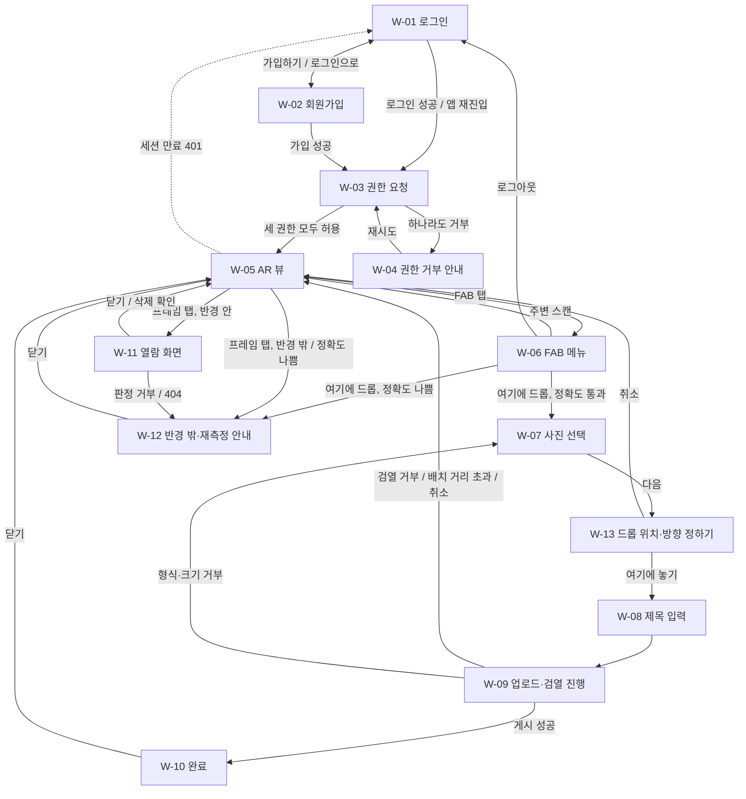

# Drop 와이어프레임

> 출처: `1-domain-definition.md`(도메인 정의서 v1.1), `2-PRD.md`(PRD v1.2, 3장 범위·4장 FR·4.1 M 파라미터·7장 UX 원칙), `3-user-scenario.md`(시나리오 v0.6). 모바일 세로 화면 기준이며 MVP(PRD 3.1, FR P0·P1) 화면만 그린다. 수치는 PRM-xx / M-xx ID로만 참조하고, 색상·폰트 등 시각 디자인은 정하지 않는다.

## 1. 변경 이력

| 버전 | 일자 | 변경자 | 변경내용 |
|---|---|---|---|
| 0.1 | 2026-10-01 | Claude Code | 초안 작성 |
| 0.2 | 2026-10-01 | Claude Code | 확인 필요 15건을 PRD v0.5 기본안으로 결정하고 화면에 반영 (가입 동의, 로그아웃, 로딩·빈 상태, 남은 거리 기준, 삭제 확인, 업로드 재시도, 만료일 안내 등) |
| 0.3 | 2026-10-01 | Claude Code | PRD v0.6 반영: W-07 사진 형식 문구를 JPEG 재인코딩(M-13)으로 변경, W-09 원본·썸네일 검열(M-14) 표기, W-11 원본 표시를 미디어 프록시 경로(`/api/media/:mediaId`)·브라우저 캐시 문구로 변경 |
| 0.4 | 2026-10-01 | Claude Code | 문서 정합성 점검: 출처를 도메인 v0.8·PRD v0.8·시나리오 v0.4로 갱신, W-01 잠금 429 표기, W-05 진입 설명을 W-03 경유로 수정(FR-02) |
| 0.5 | 2026-10-01 | Claude Code | 문서 정합성 점검 미정 사항 반영: W-11 삭제 버튼 표시 근거를 `is_mine`(FR-08)으로 명시 |
| 0.7 | 2026-10-02 | Claude Code | 프레임 방향 회전(PRD v1.2 Q-14): 순서를 W-07 → W-13 → W-08로 변경, W-13에 고른 사진·회전 슬라이더 추가, 결정 #17 |
| 0.6 | 2026-10-02 | Claude Code | 드롭 위치 직접 배치(PRD v1.1 FR-03·Q-13): W-13 드롭 위치 정하기 추가, W-06 ② 동작과 흐름도 변경, 결정 #16 |

---

## 2. 화면 목록

| ID | 이름 | 관련 SC |
|---|---|---|
| W-01 | 로그인 | SC-01 |
| W-02 | 회원가입 | SC-01 |
| W-03 | 권한 요청(시작) | SC-02 |
| W-04 | 권한 거부 안내 | SC-02 |
| W-05 | AR 뷰(기본 화면) | SC-04 |
| W-06 | FAB 메뉴 | SC-03, SC-04 |
| W-07 | 드롭 1단계: 사진 선택 | SC-03 |
| W-08 | 드롭 2단계: 제목 입력 | SC-03 |
| W-09 | 드롭 3단계: 업로드·검열 진행 | SC-03 |
| W-10 | 드롭 4단계: 완료 | SC-03 |
| W-11 | 열람 화면 | SC-05, SC-07 |
| W-12 | 반경 밖·재측정 안내 | SC-03, SC-04, SC-05 |
| W-13 | 드롭 위치·방향 정하기 | SC-03 |

SC-06(캡슐 만료)은 시스템 동작이라 별도 화면이 없다. 만료 캡슐은 W-05에 나타나지 않는다.

## 3. 화면 흐름도



---

## 4. 화면별 와이어프레임

공통 표기: `[ ]` 버튼, `( )` 입력 필드, `▓` 이미지 영역, 점선 프레임은 반경 밖, 실선 프레임은 반경 안.

### W-01 로그인

- 진입 경로: 앱 최초 접속, 세션 만료·로그아웃 후, W-02의 "로그인으로"

```
┌──────────────────────────┐
│                          │
│          Drop            │
│                          │
│  이메일                  │
│  (____________________)  │  ①
│  비밀번호                │
│  (____________________)  │  ②
│                          │
│  ⚠ 오류 메시지 영역      │  ③
│                          │
│  [      로그인       ]   │  ④
│                          │
│  계정이 없나요? [가입하기]│  ⑤
│                          │
└──────────────────────────┘
```

| # | 요소 | 동작 |
|---|---|---|
| ① | 이메일 입력 | 이메일 입력 |
| ② | 비밀번호 입력 | 비밀번호 입력 (가림 처리) |
| ③ | 오류 메시지 | 실패 시 표시 |
| ④ | 로그인 버튼 | 성공하면 W-03으로 이동 (SC-01) |
| ⑤ | 가입하기 | W-02로 이동 |

상태·예외
- 로그인 실패(401): 계정 존재 여부를 드러내지 않는 같은 메시지를 표시한다 (FR-01).
- 연속 실패가 M-05를 넘으면(429) 잠금 상태 메시지를 표시한다 (FR-01).
- 세션 만료·401: 이 화면으로 돌아온다 (FR-01, M-04).
- 전송 중에는 로그인 버튼을 비활성화한다.
- 비밀번호 분실 링크는 두지 않는다 (MVP 재설정 불가, PRD 3.2).

관련 ID: FR-01, BR-01, SC-01, M-04, M-05

### W-02 회원가입

- 진입 경로: W-01의 "가입하기"

```
┌──────────────────────────┐
│  ‹ 로그인                │  ⑤
│                          │
│          Drop            │
│                          │
│  이메일                  │
│  (____________________)  │  ①
│  비밀번호 (8자 이상)     │
│  (____________________)  │  ②
│                          │
│  [✓] 이용약관·개인정보   │  ⑥
│  [✓] 위치정보 이용       │
│  [✓] 만 14세 이상입니다  │
│                          │
│  ⚠ 오류 메시지 영역      │  ③
│                          │
│  [      가입하기     ]   │  ④
│                          │
└──────────────────────────┘
```

| # | 요소 | 동작 |
|---|---|---|
| ① | 이메일 입력 | 이메일 입력 |
| ② | 비밀번호 입력 | 비밀번호 입력 (가림 처리). 규칙은 M-10 |
| ③ | 오류 메시지 | 실패 시 표시 |
| ④ | 가입하기 버튼 | 필수 동의 3개를 모두 체크해야 활성화된다. 성공하면 로그인된 상태로 W-03으로 이동 (SC-01) |
| ⑤ | 로그인으로 | W-01로 이동 |
| ⑥ | 필수 동의 | 이용약관·개인정보 처리, 위치정보 이용(PRV-07), 만 14세 이상 자기 확인. 각 항목 옆에 전문 보기 링크를 둔다 (FR-01) |

상태·예외
- 이메일 중복(409): 중복 안내 메시지를 표시한다 (FR-01).
- 전송 중에는 가입하기 버튼을 비활성화한다.

관련 ID: FR-01, BR-01, BR-02, PRV-07, SC-01, M-10

### W-03 권한 요청(시작)

- 진입 경로: 로그인·가입 직후, 앱에 다시 들어올 때마다, W-04의 "재시도"

```
┌──────────────────────────┐
│                          │
│                          │
│      Drop을 시작하려면   │
│      아래 권한이 필요해요│  ①
│                          │
│   · 카메라               │
│   · 위치                 │  ②
│   · 방향 센서            │
│                          │
│                          │
│  [        시작        ]  │  ③
│                          │
└──────────────────────────┘
```

| # | 요소 | 동작 |
|---|---|---|
| ① | 안내 문구 | 세 권한이 모두 필수임을 알린다 (FR-02) |
| ② | 필요 권한 목록 | 카메라, 위치, 방향 센서 |
| ③ | 시작 버튼 | 탭하면 카메라·위치·방향 센서 권한을 요청한다. iOS는 이 탭으로 방향 센서 권한을 요청한다 (Q-12). 세 권한 모두 허용하면 W-05로, 하나라도 거부하면 W-04로 이동 |

상태·예외
- 앱에 들어올 때마다 이 화면을 거친다. 이미 세 권한을 허용했다면 "시작" 탭 한 번으로 바로 W-05로 간다 (FR-02).

관련 ID: FR-02, Q-12, SC-02

### W-04 권한 거부 안내

- 진입 경로: W-03에서 권한 하나라도 거부

```
┌──────────────────────────┐
│                          │
│                          │
│   AR 뷰를 사용할 수      │
│   없어요                 │
│                          │
│   거부된 권한:           │  ①
│   · 위치                 │
│                          │
│   세 권한 모두 있어야    │  ②
│   프레임을 배치할 수     │
│   있어요                 │
│                          │
│   권한 요청이 뜨지 않으면│  ④
│   브라우저 설정에서 허용 │
│   한 뒤 재시도하세요     │
│                          │
│  [       재시도       ]  │  ③
│                          │
└──────────────────────────┘
```

| # | 요소 | 동작 |
|---|---|---|
| ① | 거부된 권한 표시 | 거부된 권한 이름을 보여 준다 |
| ② | 안내 문구 | 방향 없이는 위치형 AR 프레임을 배치할 수 없어 세 권한이 모두 필요함을 알린다 (FR-02) |
| ③ | 재시도 버튼 | W-03으로 돌아가 권한을 다시 요청한다 |
| ④ | 차단 안내 | 브라우저가 권한을 차단해 다시 묻지 않을 때를 위한 안내. 브라우저별 상세 방법은 두지 않는다 (FR-02) |

관련 ID: FR-02, SC-02

### W-05 AR 뷰(기본 화면)

- 진입 경로: W-03에서 권한 허용, W-06·W-09·W-10·W-11·W-12에서 닫기
- 로그인 후 W-03을 거쳐 도달하는 기본 화면이다. 별도 홈·탭은 없다 (PRD 7장, FR-02).

```
┌──────────────────────────┐
│ ⚠ GPS 정확도가 낮아요.   │  ①
│   드롭·열람이 막혀요     │
│                          │
│     ┌ ─ ─ ─ ─ ┐          │
│     ╎  ▒▒▒▒   ╎          │  ②
│     ╎  ▒▒▒▒   ╎          │
│     └ ─ ─ ─ ─ ┘          │
│     "한강 반환점"        │
│     28m 남음             │  ③
│                          │
│          ┌───────┐       │
│          │ ▓▓▓▓▓ │       │  ④
│          │ ▓▓▓▓▓ │       │
│          └───────┘       │
│          "벚꽃길"        │
│                          │
│                          │
│      주변 확인 중…       │  ⑥
│           ( + )          │  ⑤
└──────────────────────────┘
```

| # | 요소 | 동작 |
|---|---|---|
| ① | GPS 정확도 경고 배너 | GPS accuracy가 재측정 기준(PRM-03)보다 나쁠 때만 상단에 얇게 표시한다. 정확도가 회복되면 사라진다. 표시되는 동안 드롭과 열람은 막힌다 (PRD 7장, FR-03, FR-10) |
| ② | 반경 밖 프레임 | 반경 밖(열람 불가) 프레임은 점선·낮은 투명도로 구분한다. 탭하면 서버를 부르지 않고 W-12(반경 밖 안내)를 연다. 원본 접근은 서버 판정을 통과해야만 가능하다 (PRD 7장, NFR-08) |
| ③ | 남은 거리 | 반경 밖 프레임에만 표시한다. 서버 판정식과 같은 기준 `max(0, d − min(accuracy, 보정 상한 PRM-03) − 열람 반경 PRM-01)`로 계산한다 (PRD 7장) |
| ④ | 반경 안 프레임 | 반경 안(열람 가능, PRM-01) 프레임은 실선·불투명으로 구분한다. 탭하면 W-11 열람 요청을 보낸다 (FR-10) |
| ⑤ | FAB | 하단 중앙에 하나만 둔다. 어느 상태에서든 항상 보인다. 탭하면 W-06을 연다 (PRD 7장) |
| ⑥ | 상태 한 줄 | FAB 위에 작게 표시한다. 목록 조회 중에는 "주변 확인 중…", 주변(M-01)에 캡슐이 없으면 "주변에 캡슐이 없어요. 첫 캡슐을 남겨 보세요". 그 밖에는 숨긴다 (PRD 7장) |

상태·예외
- 카메라 영상 위에 캡슐 프레임이 3D 위치형 AR 엔티티로 표시된다 (FR-09).
- 위치가 갱신되면 주변 캡슐 목록을 다시 받는다. 최소 간격은 M-02 (FR-09).
- 조회 반경은 M-01이다. 만료·미검열 캡슐은 나타나지 않는다 (FR-08, BR-11, BR-33).
- 목록에는 썸네일만 받는다 (NFR-06).
- 로딩·빈 상태: ⑥으로 표시한다.
- 세션 만료(401): W-01로 이동한다 (FR-01).

관련 ID: FR-08, FR-09, SC-04, BR-11, BR-26(지도 탭 제외), NFR-06, PRM-01, PRM-03, M-01, M-02

### W-06 FAB 메뉴

- 진입 경로: W-05에서 FAB 탭

```
┌──────────────────────────┐
│ (AR 뷰, 어둡게 처리)     │
│                          │
│                          │
│                          │
│                          │
│                          │
│                          │
│                          │
│         ┌──────────┐     │
│         │ 주변 스캔 │     │  ①
│         └──────────┘     │
│         ┌──────────┐     │
│         │여기에 드롭│     │  ②
│         └──────────┘     │
│           ( × )          │  ③
│        로그아웃          │  ④
└──────────────────────────┘
```

| # | 요소 | 동작 |
|---|---|---|
| ① | 주변 스캔 | 주변 캡슐 목록을 즉시 다시 받고 메뉴를 닫는다 (SC-04) |
| ② | 여기에 드롭 | W-07(사진 선택)을 연다. 캡슐 행은 아직 만들지 않는다 (FR-03, FR-06) |
| ③ | 닫기(FAB) | 메뉴를 닫는다. FAB 자리는 그대로 유지된다 |
| ④ | 로그아웃 | 작은 텍스트 버튼. 세션을 지우고 W-01로 이동한다 (FR-01, PRD 7장) |

상태·예외
- GPS 정확도가 재측정 기준(PRM-03)보다 나쁘면 ②를 선택해도 드롭을 막고 W-12(재측정 안내)를 연다 (FR-03).
- "주변 스캔"은 정확도 경고 중에도 쓸 수 있다 (PRD 7장).

관련 ID: FR-01, FR-03, FR-08, SC-01, SC-03, SC-04, PRM-03

### W-07 드롭 1단계: 사진 선택

- 진입 경로: W-06에서 "여기에 드롭"
- 바텀시트 4단계 중 1단계 (PRD 7장)

```
┌──────────────────────────┐
│ (AR 뷰)                  │
│                          │
├──────────────────────────┤
│ ━━  ① ○ ○ ○        [×]   │  ①
│                          │
│  사진을 선택하세요       │
│                          │
│  ┌────────────────────┐  │
│  │        ▓▓▓         │  │  ②
│  │   탭하여 사진 선택 │  │
│  └────────────────────┘  │
│                          │
│  [       다음        ]   │  ③
│           ( + )          │  FAB
└──────────────────────────┘
```

| # | 요소 | 동작 |
|---|---|---|
| ① | 단계 표시·닫기 | 4단계 중 현재 단계를 보여 준다. ×를 누르면 시트를 닫고 W-05로 돌아간다 |
| ② | 사진 선택 영역 | 탭하면 `accept="image/*"` 파일 선택을 연다. 촬영 옵션 노출을 허용한다 (FR-04, Q-10). 선택하면 미리보기를 보여 준다. 1장만 고른다 |
| ③ | 다음 | 사진을 고른 뒤에만 활성화된다. 위치를 아직 정하지 않았으면 W-13, 이미 정했으면 W-08로 이동 |

상태·예외
- 이미지 파일인지와 최대 크기(M-06)는 사진을 고를 때 브라우저가 먼저 검사한다. 벗어나면 선택 영역 아래에 안내하고 "다음"을 비활성화한다. 고른 사진은 브라우저가 JPEG로 재인코딩(M-13)해 올린다 (FR-04).
- 영상은 지원하지 않는다 (PRD 3.2).

관련 ID: FR-04, SC-03, BR-05(완화, Q-10), M-06, M-13

### W-08 드롭 2단계: 제목 입력

- 진입 경로: W-13에서 "여기에 놓기" (또는 위치를 정한 뒤 W-07에서 "다음")

```
┌──────────────────────────┐
│ (AR 뷰)                  │
│                          │
├──────────────────────────┤
│ ━━  ○ ② ○ ○        [×]   │  ①
│                          │
│  ┌──────┐                │
│  │ ▓▓▓▓ │ 선택한 사진    │  ②
│  └──────┘                │
│  제목 (필수, 0/40)       │
│  (____________________)  │  ③
│                          │
│  [‹ 이전]  [  드롭하기 ] │  ④
│           ( + )          │  FAB
└──────────────────────────┘
```

| # | 요소 | 동작 |
|---|---|---|
| ① | 단계 표시·닫기 | W-07과 같다 |
| ② | 사진 썸네일 | 선택한 사진을 작게 보여 준다 |
| ③ | 제목 입력 | 필수이며 길이는 M-11이다. 글자 수를 표시하고 넘으면 더 입력되지 않는다 (FR-07). 등급·열람가·공개 범위 입력은 없다 (PRD 7장, FR-07) |
| ④ | 이전 / 드롭하기 | 이전은 W-07로. 드롭하기는 제목이 입력된 뒤에만 활성화되며, W-09로 이동해 업로드와 게시 요청을 시작한다 |

관련 ID: FR-07, SC-03, PRD 7장, M-11

### W-09 드롭 3단계: 업로드·검열 진행

- 진입 경로: W-08에서 "드롭하기"

```
┌──────────────────────────┐
│ (AR 뷰)                  │
│                          │
├──────────────────────────┤
│ ━━  ○ ○ ③ ○              │  ①
│                          │
│  ┌──────┐                │
│  │ ▓▓▓▓ │ "한강 반환점"  │
│  └──────┘                │
│                          │
│   ◌ 사진 업로드 중…      │  ②
│   ◌ 검열 확인 중…        │
│                          │
│           ( + )          │  FAB
└──────────────────────────┘
```

| # | 요소 | 동작 |
|---|---|---|
| ① | 단계 표시 | 진행 중에는 닫기(×)를 두지 않는다 (PRD 7장) |
| ② | 진행 표시 | 순서대로 보여 준다. 브라우저가 썸네일(M-07)을 만들어 원본과 함께 Presigned URL(M-03)로 S3에 직접 올린다 → 앵커·제목·미디어 키를 한 번에 게시 요청하고 서버가 원본·썸네일을 검열한다(제한 시간 M-09, 기준 M-14). 통과하면 W-10으로 이동 (FR-04, FR-06) |

상태·예외

| 조건 | 화면 처리 |
|---|---|
| 검열 거부 | 사유를 안내한다. 캡슐 행은 만들어지지 않고 S3 객체는 지워진다. 확인 버튼으로 시트를 닫고 W-05로 돌아가며, 새로 드롭하려면 FAB에서 다시 시작한다 (FR-06, SC-03) |
| 검열 API 실패·시간 초과(M-09) | "다시 시도" 버튼을 보여 준다. 업로드한 객체로 재요청한다 (FR-06) |
| 업로드 실패(네트워크) | "업로드에 실패했어요"와 [다시 시도]·[취소]를 보여 준다. 다시 시도는 Presigned URL을 새로 받아 같은 사진을 다시 올린다. 취소하면 W-05로 돌아간다. 캡슐 행이 없어 남는 데이터가 없다 (FR-04, SC-03) |
| 형식·크기 위반(서버 거부) | 사유를 안내하고 [사진 다시 선택]으로 W-07로 돌아간다 (FR-04) |

관련 ID: FR-04, FR-06, FR-07, SC-03, BR-10, BR-33, M-03, M-07, M-09, M-14

### W-10 드롭 4단계: 완료

- 진입 경로: W-09에서 게시 성공

```
┌──────────────────────────┐
│ (AR 뷰)                  │
│                          │
├──────────────────────────┤
│ ━━  ○ ○ ○ ④              │  ①
│                          │
│          ✓               │
│   캡슐을 남겼어요        │  ②
│   "한강 반환점"          │
│   ○월 ○일까지 보여요     │  ④
│                          │
│  [       확인        ]   │  ③
│           ( + )          │  FAB
└──────────────────────────┘
```

| # | 요소 | 동작 |
|---|---|---|
| ① | 단계 표시 | 마지막 단계 |
| ② | 완료 메시지 | 캡슐이 Active로 게시되었음을 알린다. 결제·등급 안내는 없다 (FR-07) |
| ③ | 확인 | 시트를 닫고 W-05로 돌아간다. 완료 시점에 주변 목록을 다시 받아 새 캡슐이 바로 보인다 (PRD 7장) |
| ④ | 만료일 | 게시 응답의 `expires_at`으로 "○월 ○일까지 보여요"를 안내한다 (FR-07) |

관련 ID: FR-06, FR-07, SC-03

### W-11 열람 화면

- 진입 경로: W-05에서 반경 안 프레임 탭 (소유자도 같은 경로, FR-11)

```
┌──────────────────────────┐
│ [×]                      │  ①
│                          │
│  ┌────────────────────┐  │
│  │                    │  │
│  │        ▓▓▓▓        │  │  ②
│  │    (원본 사진)     │  │
│  │                    │  │
│  └────────────────────┘  │
│  "한강 반환점"           │  ③
│                          │
│  [      삭제      ]      │  ④ 소유자에게만
│                          │
│           ( + )          │  FAB
└──────────────────────────┘
```

| # | 요소 | 동작 |
|---|---|---|
| ① | 닫기 | W-05로 돌아간다 |
| ② | 원본 사진 | 서버가 거리 판정(PRM-01, PRM-03, 도메인 5.4)을 통과시키면 받은 원본 경로(`/api/media/:mediaId`)로 표시한다. 열람 기록(ViewRecord)을 저장한다. 경로가 영구히 같아 같은 사진을 다시 열면 브라우저 캐시에서 표시된다 (FR-10, NFR-05) |
| ③ | 제목 | 캡슐 제목 |
| ④ | 삭제 버튼 | 소유자에게만 보인다(주변 조회 응답의 `is_mine`, FR-08). 별도 화면 없이 이 열람 화면에 있다 (FR-11). 누르면 "삭제하면 되돌릴 수 없어요" 확인(브라우저 기본 `confirm`)을 거친 뒤 삭제되고, 조회에서 제외되며 W-05로 돌아간다. 소유자가 아니면 버튼 자체가 보이지 않는다 |

상태·예외
- 풀스크린으로 열고, 서버 판정을 기다리는 동안 사진 자리에 로딩 표시를 한다. 제목은 주변 목록에 이미 있는 값을 쓴다.
- 판정 거부(반경 밖, 정확도 나쁨)와 만료·삭제된 캡슐(404)은 W-12로 넘긴다 (FR-10).

관련 ID: FR-10, FR-11, SC-05, SC-07, BR-27, NFR-05, NFR-08, PRM-01, PRM-03

### W-12 반경 밖·재측정 안내

- 진입 경로: W-05에서 반경 밖 프레임 탭, W-11에서 열람 요청이 거부되거나 404인 경우, W-06에서 정확도가 나빠 드롭이 막힌 경우
- 가벼운 안내(토스트 또는 소형 시트)로 두고 AR 뷰를 가리지 않는다.

```
┌──────────────────────────┐
│ (AR 뷰)                  │
│                          │
│                          │
│                          │
│                          │
│                          │
│  ┌────────────────────┐  │
│  │ 28m 더 가까이      │  │  ①
│  │ 가야 열 수 있어요  │  │
│  │              [닫기]│  │  ②
│  └────────────────────┘  │
│           ( + )          │
└──────────────────────────┘
```

| # | 요소 | 동작 |
|---|---|---|
| ① | 안내 문구 | 아래 상태에 따라 문구를 바꾼다 |
| ② | 닫기 | 안내를 닫고 W-05로 돌아간다 |

상태·예외

| 상태 | 안내 내용 |
|---|---|
| 열람: 반경 밖 | 남은 거리를 알린다 (FR-10, BR-27) |
| 열람: accuracy가 재측정 기준(PRM-03)보다 나쁨 | 판정하지 않고 재측정을 안내한다 (FR-10) |
| 드롭: accuracy가 재측정 기준(PRM-03)보다 나쁨 | 드롭을 막고 재측정을 안내한다 (FR-03) |
| 열람: 만료·삭제된 캡슐(404) | "더 이상 볼 수 없는 캡슐이에요"를 안내하고 주변 목록을 다시 받는다 (FR-10) |

관련 ID: FR-03, FR-10, SC-03, SC-04, SC-05, BR-27, PRM-01, PRM-03

### W-13 드롭 위치·방향 정하기

- 진입 경로: W-07에서 사진을 고르고 "다음" (위치를 아직 정하지 않았을 때)

```
┌──────────────────────────┐
│ 프레임을 끌어 놓을 곳을   │  ①
│ 정하세요 · 내 위치에서 3m │
│                          │
│ (AR 뷰)                  │
│        ┌────────┐        │
│        │ 고른   │        │  ②
│        │ 사진   │        │
│        └────────┘        │
│                          │
│ 방향 ○─────●───── 135°   │  ⑤
│  ┌────────┐ ┌──────────┐ │
│  │  취소  │ │여기에 놓기│ │  ③ ④
│  └────────┘ └──────────┘ │
└──────────────────────────┘
```

| # | 요소 | 동작 |
|---|---|---|
| ① | 안내·거리 | "프레임을 끌어 놓을 곳을 정하세요"와 내 위치에서 프레임까지의 거리(m, 반올림)를 보여 준다 |
| ② | 미리보기 프레임 | W-07에서 고른 사진을 담는다. 처음에는 보고 있는 방향 3m 앞 바닥에 나를 바라보는 방향으로 뜬다. 프레임을 끌면 바닥을 따라 움직이고, 프레임 밖을 끌면 화면을 둘러본다. 내 위치에서 드롭 배치 반경(PRM-20)에 닿으면 그 경계에서 멈춘다 |
| ③ | 취소 | 위치 정하기를 끝내고 W-05로 돌아간다 |
| ④ | 여기에 놓기 | 프레임 위치(GPS 좌표)·방향과 그 순간 내 GPS 좌표·정확도를 앵커로 캡처하고 W-08을 연다 (FR-03) |
| ⑤ | 방향 슬라이더 | 0~359°(1° 단위)로 프레임을 제자리에서 돌린다. 값은 프레임 앞면이 바라보는 방위(북 0°, 시계 방향)이고 옆에 숫자로 보여 준다. 슬라이더를 움직이기 전에는 프레임을 끌 때마다 나를 바라보는 방향으로 맞춘다 (FR-03, Q-14) |

상태·예외
- 위치를 정하는 동안 FAB는 숨긴다. 걸어서 움직이면 프레임은 정한 GPS 좌표에 그대로 있고, 거리 표시가 바뀐다.
- 내 위치에서 프레임까지가 PRM-20을 넘으면(걸어서 멀어진 경우) ④를 비활성화하고 "내 위치에서 10m 안에만 놓을 수 있어요"를 보여 준다.
- 게시 요청에서 서버가 422 `DROP_TOO_FAR`로 거부하면 W-09에서 "위치를 다시 정해 주세요" 안내 후 W-05로 돌아간다.

관련 ID: FR-03, FR-04, BR-04, PRM-20, Q-13, Q-14, SC-03

---

## 5. 후속 단계 화면(미작성)

| 화면 | 관련 SC |
|---|---|
| 지도 탭(주변 캡슐 지도) | SC-04 후속 (BR-26, Q-06) |
| 등급 선택·등록비 결제 | SC-08 |
| 열람가 선택(유료 체크포인트) | SC-08 |
| 유료 체크포인트 미리보기·구매 | SC-09 |
| 환불 후 열람권 회수 안내 | SC-10 |
| 크리스탈 지갑·보상형 광고 | SC-08, SC-11 |
| 월 정산 신청 | SC-12 |
| 프라이빗 공개 범위·초대 링크 생성 | SC-13 |
| 초대 링크 수락 | SC-13 |
| 지오펜스 푸시·앱 안 알림 | SC-14 |
| 신고 | SC-15 |
| 구매자 보상 안내 | SC-16 |
| 관리자 화면(검토·블라인드·정산·차단) | SC-12, SC-15, SC-17 |
| 영상 선택·업로드 | SC-03 후속 (FR-05) |
| 연령 확인·동의 | SC-01 후속 (BR-02, PRV-03) |
| 회원 탈퇴 | 해당 SC 없음 (BR-39) |

---

## 6. 결정 내역

v0.1의 확인 필요 15건은 PRD v0.5의 기본안으로 결정해 화면에 반영했다.

| # | 항목 | 결정 | 반영 위치 |
|---|---|---|---|
| 1 | 로그아웃 진입점 | FAB 메뉴 하단의 작은 텍스트 버튼 | PRD 7장, W-06 |
| 2 | 재접속 시 권한 화면 | 매 진입 시 W-03을 거친다(iOS 방향 센서는 탭이 필요). 이미 허용했으면 탭 한 번으로 통과 | FR-02, W-03 |
| 3 | 권한 차단 시 안내 | 브라우저 설정에서 허용하라는 고정 안내 | FR-02, W-04 |
| 4 | 가입 항목·동의 | 이메일, 비밀번호(M-10), 필수 동의 3개(약관·개인정보, 위치정보, 만 14세 이상 자기 확인) | FR-01, W-02 |
| 5 | AR 뷰 로딩·빈 상태 | FAB 위 한 줄 표시 | PRD 7장, W-05 |
| 6 | 경고 중 주변 스캔 | 허용 | PRD 7장, W-06 |
| 7 | 남은 거리 기준 | 서버 판정식과 같은 기준으로 클라이언트가 계산 | PRD 7장, W-05 |
| 8 | 반경 밖 탭 시 서버 호출 | 호출하지 않고 바로 안내. 원본 접근은 서버 판정 필수 | PRD 7장, W-05 |
| 9 | 열람 화면 형태 | 풀스크린, 제목 표시, 판정 중 로딩 | W-11 |
| 10 | 삭제 확인 | 브라우저 기본 `confirm` | FR-11, W-11 |
| 11 | 진행 중 닫기·업로드 오류 | 진행 중 닫기 불가. 네트워크 실패는 다시 시도·취소, 형식·크기 거부는 사진 다시 선택. 형식·크기는 선택 시 브라우저가 먼저 검사 | FR-04, PRD 7장, W-07, W-09 |
| 12 | 제목 규칙 | 필수, M-11 | FR-07, W-08 |
| 13 | 드롭 후 재조회 | 완료 시 즉시 재조회 | PRD 7장, W-10 |
| 14 | 만료 캡슐 탭 | 404 → "더 이상 볼 수 없는 캡슐이에요" 안내 후 재조회 | FR-10, W-12 |
| 15 | 완료 화면 만료일 | "○월 ○일까지 보여요" 안내 | FR-07, W-10 |
| 16 | 드롭 위치 | 서 있는 자리 고정 대신 미리보기 프레임을 끌어 정한다. 내 위치에서 PRM-20(10m) 안으로 제한하고 서버가 검증한다 | FR-03, Q-13, W-13 |
| 17 | 프레임 방향 | 사진을 먼저 고르고 W-13에서 위치와 함께 슬라이더로 0~359° 회전. W-08 "이전"은 W-07로 가고, 위치를 이미 정했으면 W-07 "다음"은 바로 W-08로 간다 | FR-03, Q-14, W-07, W-13 |
