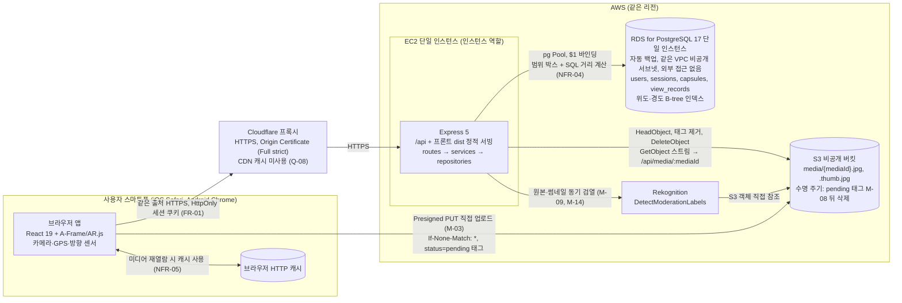
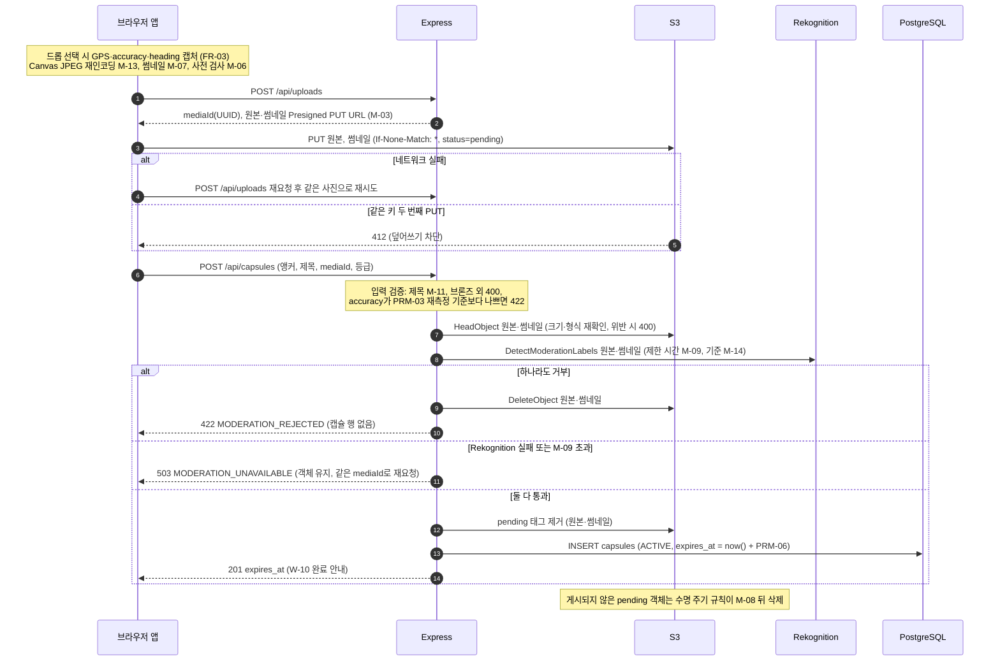
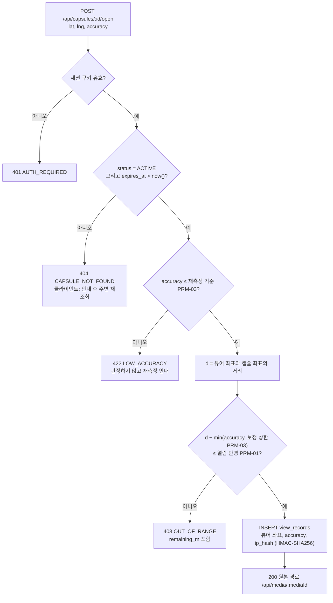
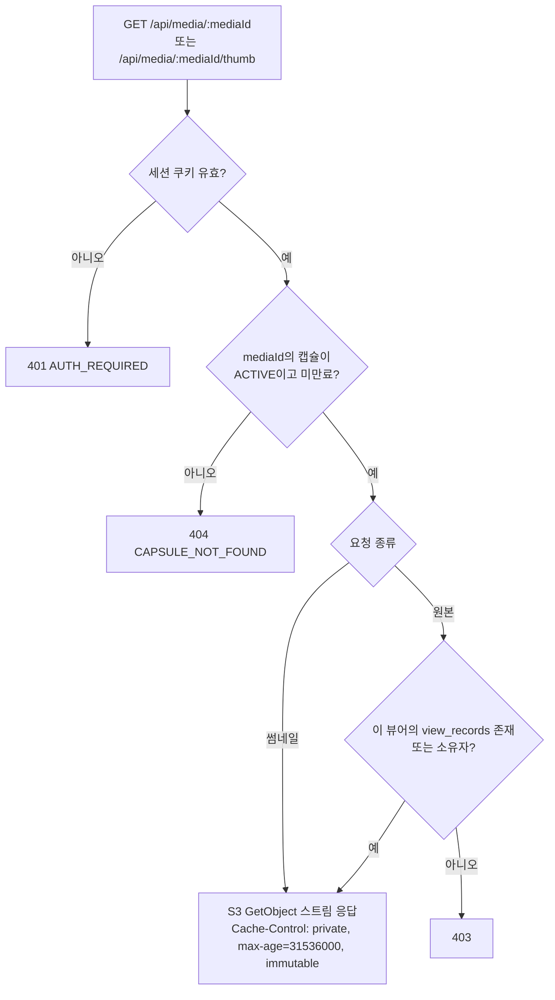

# Drop 기술 아키텍처 다이어그램

> 출처: `1-domain-definition.md`(도메인 정의서 v0.7), `2-PRD.md`(PRD v0.7), `3-user-scenario.md`(시나리오 v0.3), `4-wireframes.md`(와이어프레임 v0.3), `5-project-principle.md`(프로젝트 원칙 v0.3). MVP(PRD 3.1) 기준이며, 수치는 PRM-xx(도메인 정의서 5.3)·M-xx(PRD 4.1) ID로만 참조한다.

## 변경 이력

| 버전 | 일자 | 변경자 | 변경내용 |
|---|---|---|---|
| 0.1 | 2026-10-01 | Claude Code | 초안 작성 |
| 0.2 | 2026-10-01 | Claude Code | 확인 필요 결정 반영: PostgreSQL을 RDS 단일 인스턴스로 표기, 열람 확인 순서 확정, 열람 기록의 증명 ID 컬럼 제거, 4장을 결정 내역으로 변경 |

---

## 1. 시스템 아키텍처 (메인)

EC2 한 대의 Express가 API와 프론트 빌드 결과(`dist`)를 같은 출처로 서빙하고, 앞단 Cloudflare 프록시가 HTTPS를 맡는다. 업로드만 브라우저가 S3로 직접 보내고, 미디어 읽기는 Express가 프록시한다. 열람·검열·만료 판정은 모두 서버에서 한다.
근거: PRD 6장, NFR-05~08, FR-01, FR-04, FR-06, FR-10, 원칙 2.1·5.2

- Express 응답 중 미디어(`/api/media/:mediaId`, `/thumb`)는 `Cache-Control: private, max-age=31536000, immutable`이라 Cloudflare는 저장하지 않고 브라우저만 저장한다 (NFR-05, NFR-06).
- 브라우저에는 S3 읽기 URL을 주지 않는다. AWS 자격 증명은 EC2 인스턴스 역할로만 받는다 (원칙 5.1, 5.2).
- PostgreSQL은 AWS RDS for PostgreSQL 17 단일 인스턴스로, EC2와 같은 VPC의 비공개 서브넷에 두고 외부 접근을 막는다. 백업은 관리형 자동 백업을 쓴다 (4장 A4).

---

## 2. 복잡한 로직 다이어그램

### 2.1 캡슐 드롭: 업로드·검열·게시

캡슐 행은 원본·썸네일이 모두 검열을 통과한 뒤에만 만든다. 게시 전 실패는 행을 남기지 않고, 버려진 업로드 객체는 S3 수명 주기 규칙이 정리한다. 처리 순서는 "태그 제거 → 행 생성"이다(행은 있는데 객체가 지워지는 일 방지). 브라우저→Express 구간은 Cloudflare를 거치지만 그림에서는 생략한다.
근거: FR-03, FR-04, FR-06, FR-07, BR-10, BR-33, M-03, M-06~09, M-11, M-13, M-14, PRM-03, PRM-06, 원칙 5.2

### 2.2 캡슐 열람: 서버 판정

열람 요청마다 서버가 캡슐 상태·만료와 GPS 거리 판정을 다시 하고, 통과한 경우에만 열람 기록을 남기고 원본 경로를 돌려준다. MVP는 별도 현장 증명을 발급하지 않고 GPS 판정만 한다(Q-11). 확인 순서는 401 → 404 → 422 → 403으로 확정했다(존재하지 않는 캡슐에 정확도 안내를 먼저 하지 않음, 4장 A5).
근거: FR-10, BR-27, 도메인 5.4, NFR-08, PRM-01, PRM-03, Q-03, Q-11, PRV-04, 원칙 3.3

### 2.3 미디어 프록시: 권한 확인

원본은 2.2 판정을 통과해 열람 기록이 있는 뷰어나 소유자만 받는다. Express가 인스턴스 역할로 S3 GetObject 스트림을 그대로 흘려보내고, URL이 영구히 같아 재열람은 브라우저 캐시에서 끝난다.
근거: FR-08, FR-10, NFR-05, NFR-06, NFR-08, 원칙 2.1·5.2

---

## 3. 후속 단계에서 추가될 구성 요소

메인 다이어그램에는 넣지 않는다 (PRD 3.2, FR-12).

- Unity/ARCore 네이티브 앱: 평면 스캔, 기기 무결성, 전체 현장 증명 판정 (Q-01, Q-02, Q-11, 도메인 5.4)
- App Store / Google Play 인앱결제와 스토어 서버 알림(환불) (BR-07~09, IAP-01~07)
- 보상형 광고 SDK, 송금(정산 출금), 본인인증 (PRM-10, ST-07, ST-09)
- 푸시(FCM/APNs)와 지오펜싱 (BR-25)
- 지도 (BR-26, Q-06)
- Cloudflare CDN 캐시 (Q-08), Rekognition 비동기 영상 검열 (FR-05, Q-09)
- 관리자 화면(신고 검토·블라인드·정산 승인·차단) (BR-34~37)

---

## 4. 결정 내역

v0.1의 확인 필요 3건과 추가 쟁점 2건을 아래와 같이 결정했다.

| # | 항목 | 결정 | 반영 위치 |
|---|---|---|---|
| A1 | 3D 프레임 에셋 위치 | S3가 아니라 `frontend/public/`의 정적 파일로 Express가 같은 출처로 서빙(원칙 6.3 따름). S3에는 사진 원본·썸네일만 둠 | PRD 6장 미디어 행 |
| A2 | 열람 기록 IP 표기 | 시나리오 SC-05의 "IP"를 "IP 해시(HMAC)"로 수정 | 시나리오 SC-05 |
| A3 | 비용 지표 | "같은 뷰어가 같은 미디어를 다시 열람할 때 미디어 프록시(`/api/media`) 재다운로드 비율" | PRD 1.3 |
| A4 | PostgreSQL 위치 | AWS RDS for PostgreSQL 17 단일 인스턴스(관리형 자동 백업, EC2와 같은 VPC의 비공개 서브넷, 외부 접근 없음). 1인 운영에서 백업·패치를 직접 하지 않기 위함 | 1장 다이어그램, PRD 6장 배포 행, 원칙 5.2 |
| A5 | 열람 판정 확인 순서 | 401 → 404 → 422 → 403 확정(존재하지 않는 캡슐에 정확도 안내를 먼저 하지 않음) | 2.2, 원칙 5.2 |
