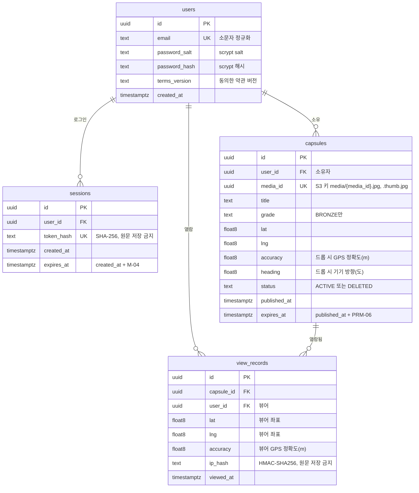
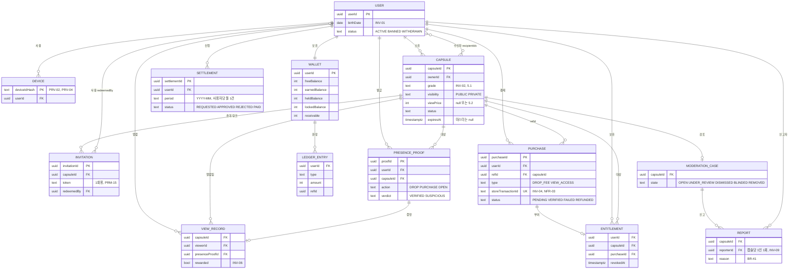

# Drop ERD

> 출처: `1-domain-definition.md`(도메인 정의서 v0.9), `2-PRD.md`(PRD v0.9), `3-user-scenario.md`(시나리오 v0.4), `4-wireframes.md`(와이어프레임 v0.5), `5-project-principle.md`(프로젝트 원칙 v0.5), `6-arch-diagram.md`(아키텍처 v0.4). 수치는 PRM-xx(도메인 정의서 5.3)·M-xx(PRD 4.1) ID로만 참조한다.

## 변경 이력

| 버전 | 일자 | 변경자 | 변경내용 |
|---|---|---|---|
| 0.1 | 2026-10-01 | Claude Code | 초안 작성 |
| 0.2 | 2026-10-01 | Claude Code | 확인 필요 8건 결정 반영: 잠금 컬럼 삭제(메모리 카운터), 증명 ID 컬럼 삭제, `users.terms_version` 추가, 운영용 테이블 `schema_migrations`, 로그인 성공 시 만료 세션 삭제, 3장을 결정 내역으로 변경 |
| 0.3 | 2026-10-01 | Claude Code | 문서 정합성 점검: 출처 문서 버전을 최신(도메인 v0.8, PRD v0.8, 시나리오 v0.4, 와이어프레임 v0.4, 원칙 v0.4, 아키텍처 v0.3)으로 갱신 |

---

## 1. MVP 물리 ERD

PostgreSQL 17 기준. 테이블은 원칙 3.2의 4개(`users`, `sessions`, `capsules`, `view_records`)만 둔다. 후속 단계 컬럼(`view_price`, `visibility`, `device_id`, `rewarded` 등)은 두지 않는다(P-02). 마이그레이션 적용 이력 테이블은 도메인과 무관해 다이어그램에서 빼고 1.5 운영용 테이블 표에만 적는다(3장 E4).

- mermaid 속성 타입에는 공백을 쓸 수 없어 `double precision`을 동의어 `float8`로 표기한다. 아래 표는 `double precision`으로 적는다.
- 검열 거부(Rejected)·검열 실패·업로드 이탈 캡슐은 행을 만들지 않는다. 행은 원본·썸네일 검열 통과 후 바로 `ACTIVE`로 생성된다(FR-06, 원칙 5.2).

### 1.1 users

| 컬럼 | 타입 | 제약 | 근거 ID |
|---|---|---|---|
| id | uuid | PK, DEFAULT `gen_random_uuid()` | 원칙 3.2 |
| email | text | NOT NULL, UNIQUE | FR-01(중복 409), 원칙 3.2 |
| password_salt | text | NOT NULL | FR-01, Q-05, 원칙 5.2(사용자별 랜덤 salt) |
| password_hash | text | NOT NULL | FR-01, Q-05 |
| terms_version | text | NOT NULL | FR-01, PRV-07 (동의 시각은 `created_at`) |
| created_at | timestamptz | NOT NULL, DEFAULT `now()` | 원칙 3.2 |

- 잠금(M-05)은 DB에 저장하지 않는다. Express 프로세스 메모리 `Map`(키: 소문자 이메일)에서 가입 여부와 무관하게 세어 미가입 이메일도 같은 조건에서 429가 나온다(FR-01, 3장 E1).
- 이메일은 앱에서 소문자로 정규화한 뒤 저장·조회한다(3장 E6).

### 1.2 sessions

| 컬럼 | 타입 | 제약 | 근거 ID |
|---|---|---|---|
| id | uuid | PK, DEFAULT `gen_random_uuid()` | 원칙 3.2 |
| user_id | uuid | NOT NULL, FK → users.id | FR-01 |
| token_hash | text | NOT NULL, UNIQUE | 원칙 5.2(`randomBytes` 토큰의 SHA-256 해시만 저장), Q-05 |
| created_at | timestamptz | NOT NULL, DEFAULT `now()` | 원칙 3.2 |
| expires_at | timestamptz | NOT NULL | FR-01, M-04 |

- 세션 확인: `token_hash = $1 AND expires_at > now()`. `token_hash` UNIQUE 인덱스로 조회한다.
- 로그아웃 시 행을 삭제한다(FR-01).
- 만료 세션 정리: 배치 없이 로그인 성공 시 `DELETE FROM sessions WHERE user_id = $1 AND expires_at < now()`로 그 유저의 만료 세션을 지운다(3장 E7).

### 1.3 capsules

| 컬럼 | 타입 | 제약 | 근거 ID |
|---|---|---|---|
| id | uuid | PK, DEFAULT `gen_random_uuid()` | 원칙 3.2, INV-02 |
| user_id | uuid | NOT NULL, FK → users.id (소유자) | INV-02(ownerId), FR-11 |
| media_id | uuid | NOT NULL, UNIQUE | FR-04, NFR-05, 원칙 5.2. 원본 `media/{media_id}.jpg`, 썸네일 `media/{media_id}.thumb.jpg`는 이 값에서 만들고 키 컬럼은 따로 두지 않는다 |
| title | text | NOT NULL | FR-07, M-11 |
| grade | text | NOT NULL, DEFAULT `'BRONZE'` | FR-07, Q-04, BR-06 |
| lat | double precision | NOT NULL | FR-03, NFR-04 |
| lng | double precision | NOT NULL | FR-03, NFR-04 |
| accuracy | double precision | NOT NULL | FR-03, PRM-03 |
| heading | double precision | NOT NULL | FR-03, FR-02(방향 센서 필수), Q-02 |
| status | text | NOT NULL, DEFAULT `'ACTIVE'` | 원칙 3.2, FR-11 |
| published_at | timestamptz | NOT NULL, DEFAULT `now()` | INV-02, FR-07 |
| expires_at | timestamptz | NOT NULL | FR-07, PRM-06, BR-11 |

- 만료: `expires_at`은 게시 시 `now() + PRM-06(브론즈)`로 계산해 저장하고, 조회·열람·미디어 프록시에서 `status = 'ACTIVE' AND expires_at > now()`로 판정한다. 상태를 `EXPIRED`로 바꾸는 갱신은 없다(원칙 3.2, 7장 #16).
- 삭제(FR-11): 행을 지우지 않고 `status = 'DELETED'`로 바꾼다. 원본·썸네일 S3 객체는 `DeleteObject`로 지운다(원칙 5.2). 열람 기록 FK는 그대로 유지된다.
- MVP 마스터 등급이 없으므로 `expires_at`은 NOT NULL이다(INV-02의 마스터 null은 후속).
- CHECK:
  - `grade = 'BRONZE'` (FR-07, 브론즈 외는 route에서 400 `GRADE_NOT_ALLOWED`)
  - `status IN ('ACTIVE', 'DELETED')` (원칙 3.2)
  - `char_length(title) >= 1` (M-11 상한은 조정 가능한 값이라 route에서 검증, P-05)
  - `lat BETWEEN -90 AND 90`, `lng BETWEEN -180 AND 180`, `accuracy >= 0`, `heading >= 0 AND heading < 360` (원칙 5.2 입력 범위)
  - accuracy의 재측정 기준(PRM-03)은 조정 가능한 값이라 CHECK에 넣지 않고 service에서 422로 거부한다(FR-03).
- 인덱스:
  - `idx_capsules_lat_lng` (lat, lng) B-tree: 주변 조회의 위경도 범위 박스로 먼저 좁힌 뒤 SQL로 거리 계산(FR-08, NFR-04, Q-06)
  - `media_id` UNIQUE 인덱스: 미디어 프록시 `GET /api/media/:mediaId`의 캡슐 조회(NFR-08)

### 1.4 view_records

| 컬럼 | 타입 | 제약 | 근거 ID |
|---|---|---|---|
| id | uuid | PK, DEFAULT `gen_random_uuid()` | 원칙 3.2 |
| capsule_id | uuid | NOT NULL, FK → capsules.id | INV-06, FR-10 |
| user_id | uuid | NOT NULL, FK → users.id (뷰어) | INV-06(viewerId), FR-10 |
| lat | double precision | NOT NULL | FR-10 |
| lng | double precision | NOT NULL | FR-10 |
| accuracy | double precision | NOT NULL | FR-10, PRM-03 |
| ip_hash | text | NOT NULL | FR-10, PRV-04, 원칙 3.2·5.2(`IP_HASH_SECRET` HMAC-SHA256) |
| viewed_at | timestamptz | NOT NULL, DEFAULT `now()` | INV-06 |

- 판정(FR-10, 도메인 5.4)을 통과한 열람마다 한 행을 만든다. 같은 뷰어·캡슐도 열람할 때마다 기록하므로 (capsule_id, user_id)에 UNIQUE를 두지 않는다.
- INV-06의 deviceId·rewarded는 MVP 범위 밖(기기 식별 불가 Q-01, 조회 보상 후속)이라 두지 않는다. 현장 증명 ID 컬럼도 두지 않고 현장 증명을 도입할 때 추가한다(P-02, Q-11, 3장 E2). IP는 원문 대신 `ip_hash`만 저장한다.
- CHECK: `lat BETWEEN -90 AND 90`, `lng BETWEEN -180 AND 180`, `accuracy >= 0`.
- 인덱스:
  - `idx_view_records_capsule_id_user_id` (capsule_id, user_id): 원본 미디어 권한 확인 "이 뷰어의 해당 캡슐 열람 기록 존재"(FR-10, NFR-08, 원칙 5.2). `capsule_id` FK 조회도 이 인덱스로 처리한다.

### 1.5 운영용 테이블

도메인과 무관해 1장 다이어그램에는 넣지 않는다(3장 E4).

| 테이블 | 컬럼 | 용도 |
|---|---|---|
| schema_migrations | filename text PK, applied_at timestamptz NOT NULL DEFAULT `now()` | `scripts/migrate.js`의 적용 이력(원칙 5.3) |

---

## 2. 후속 단계 개념 ERD

도메인 정의서 5장 애그리거트(INV-01~10) 기준의 **개념 모델**이다. 엔티티와 관계, 키와 핵심 속성 몇 개만 적었고, **실제 테이블·컬럼·타입·인덱스 설계는 하지 않는다.** 실제 설계는 해당 FR을 구현할 때(FR-12, 네이티브 전환 Q-01) 별도로 한다(P-02).

MVP 테이블에서의 확장 방향:

- `capsules`에 `visibility`·`view_price`가 붙고, `grade`·`status` CHECK가 5.1 등급과 6장 상태(UNDER_REVIEW, BLINDED, REMOVED 등)로 넓어진다. Expired를 지금처럼 `expires_at`으로 판정할지 상태로 둘지는 열람권 종료·검토 사건 처리(INV-05, 6.2)와 함께 그때 정한다.
- `view_records`에 PresenceProof를 가리키는 FK와 deviceId·rewarded가 붙는다. `users`에는 생년월일·상태·기기·동의가 붙고, 결제·지갑·정산·신고·초대는 새 엔티티로 추가된다.

---

## 3. 결정 내역

v0.1의 확인 필요 8건을 아래와 같이 결정했다.

| # | 항목 | 결정 | 반영 위치 |
|---|---|---|---|
| E1 | 로그인 실패 잠금(M-05) 저장 위치 | `users` 컬럼(`failed_login_count`, `locked_until`) 삭제. Express 프로세스 메모리 `Map`(키: 소문자 이메일, 가입 여부와 무관하게 똑같이 셈)으로 처리해 미가입 이메일도 같은 조건에서 429(계정 존재 여부 비노출, FR-01). 단일 EC2 인스턴스 전제, 재시작 시 초기화 수용 | 1장 다이어그램, 1.1, PRD FR-01, 원칙 5.2 |
| E2 | `view_records` 증명 ID 컬럼 | MVP에 두지 않음(P-02). 현장 증명 도입 시 추가 | 1장 다이어그램, 1.4, 2장, PRD FR-10, 시나리오 SC-05, 원칙 3.2 |
| E3 | 소유자·뷰어 FK 이름 | `user_id`로 통일(원칙 3.2), 컬럼 주석으로 소유자/뷰어 의미 표기 — 확정 | 1.3, 1.4 |
| E4 | 마이그레이션 이력 테이블 | `schema_migrations(filename text PK, applied_at timestamptz NOT NULL DEFAULT now())`. 1장 다이어그램에는 넣지 않음 | 1.5, 원칙 3.2·5.3 |
| E5 | 필수 동의 증빙 | `users.terms_version text NOT NULL`(동의한 약관 버전) 추가, 동의 시각은 `created_at`. 위치정보 동의 증빙에 필요한 최소 정보 | 1장 다이어그램, 1.1, PRD FR-01 |
| E6 | 이메일 대소문자 | 앱에서 소문자로 정규화해 저장, UNIQUE는 그 값에 — 확정 | 1.1 |
| E7 | 만료 세션 정리 | 배치 없이 로그인 성공 시 `DELETE FROM sessions WHERE user_id = $1 AND expires_at < now()`. 세션 조회는 항상 `expires_at > now()` 조건 | 1.2, 원칙 5.2 |
| E8 | 시나리오 SC-06 만료 표현 | "Expired가 된다" → "만료 시각(`expires_at`)이 지나면 조회·열람에서 제외된다(상태값 갱신 없음)" | 시나리오 SC-06 |
