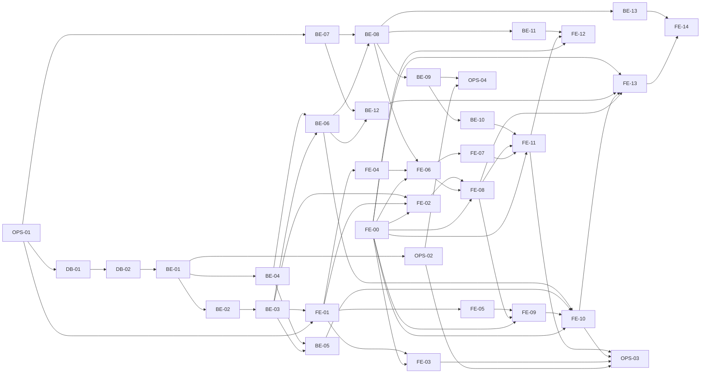

# Drop MVP 실행 계획

> 출처: `1-domain-definition.md`(도메인 정의서 v0.9), `2-PRD.md`(PRD v1.0), `3-user-scenario.md`(시나리오 v0.4), `4-wireframes.md`(와이어프레임 v0.5), `5-project-principle.md`(프로젝트 원칙 v0.6), `6-arch-diagram.md`(아키텍처 v0.4), `7-erd.md`(ERD v0.3), `schema.sql`, `.claude/skills/develop-backend`·`develop-frontend` SKILL. 수치는 PRM-xx(도메인 정의서 5.3)·M-xx(PRD 4.1) ID로만 참조한다.

## 1. 변경 이력

| 버전 | 일자 | 변경자 | 변경내용 |
|---|---|---|---|
| 0.1 | 2026-10-01 | Claude Code | 초안 작성 |
| 0.2 | 2026-10-01 | Claude Code | 확인 필요 9건 결정 반영: 계획 경로 확정, 개발 의존성 승인, DB-01을 schema.sql 그대로 복사 + migrate 트랜잭션으로 수정, FE-00 스타일 가이드 Task 추가, BE-03·FE-01에 `GET /api/me`, BE-06 같은 `media_id` 멱등 200·409 `MEDIA_ALREADY_USED`, 남은 거리 올림, S3 CORS 범위, 8장을 결정 내역으로 변경 |
| 0.3 | 2026-10-01 | Claude Code | DB 생성·수정 시 postgresql MCP 사용 규칙(2.5) 추가, DB-01·DB-02의 `psql` 사용을 MCP로 변경 |
| 0.4 | 2026-10-01 | Claude Code | 개발 DB 이름을 사용자 결정에 따라 `drop_dev`에서 `drop_app`으로 변경(DB-02), OPS-01~BE-11 완료 조건 체크 |
| 0.5 | 2026-10-02 | Claude Code | 프론트 구현 계획 반영: FE-03 선행에 FE-02 추가(Button·사진 배경 화면 재사용) |
| 0.6 | 2026-10-02 | Claude Code | 드롭 위치 직접 배치(도메인 v1.0 OQ-34, PRD v1.1 Q-13) 반영: BE-12 드롭 배치 거리 검증, FE-13 드롭 위치 정하기 Task 추가, 결정 #10 |
| 0.7 | 2026-10-02 | Claude Code | 프레임 방향 회전(PRD v1.2 Q-14) 반영: BE-13 주변 조회 응답 `heading`, FE-14 사진 먼저 → 위치·방향 정하기 Task 추가, 결정 #11 |

---

## 2. 개요

### 2.1 범위

- PRD 3.1 MVP In과 FR P0(FR-01~04, FR-06~10)를 구현한다. FR-11 삭제(P1)와 NFR-01·02 부하 테스트는 **여유 Task**로 둔다.
- PRD 3.2 MVP Out과 FR P2(FR-05, FR-12)는 Task를 만들지 않는다(7장). 후속 단계용 디렉토리·스텁·컬럼도 만들지 않는다(원칙 P-02).
- 파일 경로는 원칙 6장 디렉토리 구조를 따른다. 레이어·네이밍·에러 코드·테스트 규칙은 원칙 2~5장을 따른다.

### 2.2 Task ID 규칙

| 접두어 | 단위 | 담당 스킬 |
|---|---|---|
| `DB-xx` | 마이그레이션·테스트 DB (`backend/db/`, `backend/scripts/migrate.js`, `backend/test/helpers/`) | `develop-backend` |
| `BE-xx` | Express API (`backend/src/`), 기능(FR) 단위 | `develop-backend` |
| `FE-xx` | React 웹앱·WebAR (`frontend/src/`), 화면(W-xx)·기능 단위. FE-00만 문서(`docs/9-style-guide.md`) 작업 | `develop-frontend` (FE-00은 문서 작성) |
| `OPS-xx` | 저장소 구조, 배포·HTTPS, 실기기·부하 테스트 | 수동(사람이 수행) |

### 2.3 스킬 사용법

`/develop-backend BE-03` 또는 `/develop-frontend FE-06`처럼 Task ID를 TASK_NUMBER로 넘긴다. 스킬은 이 문서(`docs/8-plan.md`)에서 해당 Task를 읽어 구현하고, 완료 조건을 모두 충족하면 체크박스에 체크한다(8장 #1).

### 2.4 체크 규칙

- 완료 조건은 모두 `- [ ]`이며, 검증이 끝난 항목만 `- [x]`로 바꾼다. 체크 외의 문장은 고치지 않는다.
- 공통 완료 조건: BE·DB Task는 `backend`에서 `npm test`(`node --test --experimental-test-coverage --test-coverage-lines=90`) 전체 통과, FE Task는 `frontend`에서 `npm test`(Vitest 커버리지, 라인 90%, `src/ar/` 제외) 전체 통과. 각 Task의 완료 조건에 다시 적는다.
- 테스트 이름에는 근거 ID를 넣는다(원칙 P-04, 4.1).
- 선행 Task가 모두 체크된 뒤 시작한다. OPS Task와 실기기 항목은 사람이 확인하고 체크한다.

### 2.5 DB 작업 도구 규칙

- Task를 수행하면서 PostgreSQL DB를 **생성하거나 수정**할 때(DB 생성·삭제, 스키마 적용, 테이블·인덱스·제약 변경, 데이터 수정)는 `psql` CLI 대신 **postgresql MCP 도구**(`mcp__postgresql__*`)를 쓴다.
  - DB 생성·스키마 적용: `pg_execute_sql`(예: `CREATE DATABASE drop_test`, `docs/schema.sql` 내용 실행)
  - 데이터 변경: `pg_execute_mutation`
  - 결과 확인: `pg_execute_query`, `pg_manage_schema`, `pg_manage_indexes`, `pg_manage_constraints`
- 예외: 앱 코드인 `backend/scripts/migrate.js`(`npm run migrate`)와 테스트 헬퍼(DB-02)는 `pg`로 DB에 접속한다. 이 코드를 MCP로 대체하지 않는다. RDS(비공개 서브넷, OPS-02)는 MCP로 접근할 수 없으므로 EC2에서 `npm run migrate`로 적용한다.

---

## 3. Task 의존 관계

---

## 4. 일정 배치 (PRD 8장)

| 시점 | Task | 완료 기준 (PRD 8장) |
|---|---|---|
| 1일차 오전 | OPS-01, DB-01, DB-02, BE-01, BE-02, BE-03, OPS-02 | 로그인 후 세션 쿠키로 보호 API 호출 성공 |
| 1일차 오후 | BE-04, BE-05, BE-06, BE-07, FE-00, FE-01, FE-02, FE-05 | 사진 업로드 → 검열 → capsules 행이 Active로 저장 |
| 2일차 오전 | BE-08, FE-03, FE-04, FE-06, FE-07, FE-08, FE-09, FE-10 | 실기기에서 드롭한 캡슐이 AR 뷰에 보임 |
| 2일차 오후 | BE-09, BE-10, FE-11, OPS-03 | 1.3 MVP 검증 지표 충족 |
| 여유 시 | BE-11, FE-12 (FR-11, P1), OPS-04 (NFR-01·02) | — |
| 추가 (v0.6) | BE-12, FE-13 (FR-03 드롭 위치 직접 배치) | 프레임을 끌어 내 위치 10m 안에 놓은 캡슐이 그 자리에 보임 |
| 추가 (v0.7) | BE-13, FE-14 (FR-03 프레임 방향 회전) | 슬라이더로 돌린 방향 그대로 다른 사용자에게도 프레임이 보임 |

> OPS-04는 PRD 8장 주석대로 2일 안에 못 끝나면 MVP 완료 직후 첫 작업으로 한다.

---

## 5. Task 목록 요약

| ID | 이름 | 단위 | 선행 | 우선순위 |
|---|---|---|---|---|
| OPS-01 | 저장소 구조·패키지 초기화 | OPS | — | P0 |
| DB-01 | 초기 마이그레이션·migrate 스크립트 | DB | OPS-01 | P0 |
| DB-02 | 테스트 DB 준비·정리 헬퍼 | DB | DB-01 | P0 |
| BE-01 | 백엔드 앱 골격·헬스 체크 | BE | DB-02 | P0 |
| BE-02 | 회원가입·로그인 (세션 발급, 로그인 잠금) | BE | BE-01 | P0 |
| BE-03 | 세션 확인 미들웨어·로그아웃·현재 사용자 조회 | BE | BE-02 | P0 |
| BE-04 | AWS 래퍼 (S3 storage, Rekognition moderation) | BE | BE-01 | P0 |
| BE-05 | 업로드 URL 발급 | BE | BE-03, BE-04 | P0 |
| BE-06 | 캡슐 게시·검열 | BE | BE-03, BE-04 | P0 |
| BE-07 | 거리·판정 lib | BE | OPS-01 | P0 |
| BE-08 | 주변 캡슐 조회 | BE | BE-06, BE-07 | P0 |
| BE-09 | 캡슐 열람 판정 | BE | BE-08 | P0 |
| BE-10 | 미디어 프록시 | BE | BE-09 | P0 |
| BE-11 | 내 캡슐 삭제 | BE | BE-08 | P1 (여유) |
| BE-12 | 드롭 배치 거리 검증 | BE | BE-06, BE-07 | P0 |
| BE-13 | 주변 조회 응답에 프레임 방향 | BE | BE-08 | P0 |
| FE-00 | 스타일 가이드 작성 | FE(문서) | — | P0 |
| FE-01 | 프론트 골격·API 클라이언트·스토어·화면 전환 | FE | OPS-01, BE-03 | P0 |
| FE-02 | 로그인·회원가입 화면 | FE | FE-00, FE-01, BE-03 | P0 |
| FE-03 | 시작(권한 요청)·권한 거부 화면 | FE | FE-00, FE-01, FE-02 | P0 |
| FE-04 | 남은 거리·표시 구분 lib | FE | FE-01 | P0 |
| FE-05 | 이미지 사전 검사·JPEG 재인코딩 lib | FE | FE-01 | P0 |
| FE-06 | AR 화면 골격 (위치·방향 수집, 주변 조회, 배너, 상태 한 줄, FAB) | FE | FE-00, FE-04, BE-08 | P0 |
| FE-07 | AR 장면 래퍼 (프레임 표시·탭) | FE | FE-06 | P0 |
| FE-08 | FAB 메뉴·안내(W-12) 컴포넌트 | FE | FE-00, FE-06, FE-02 | P0 |
| FE-09 | 드롭 시트 1·2단계 (사진 선택, 제목 입력) | FE | FE-00, FE-08, FE-05 | P0 |
| FE-10 | 드롭 시트 3·4단계 (업로드·게시, 완료) | FE | FE-00, FE-09, BE-05, BE-06 | P0 |
| FE-11 | 열람 화면·프레임 탭 분기 | FE | FE-00, FE-07, FE-08, BE-10 | P0 |
| FE-12 | 열람 화면 삭제 버튼 | FE | FE-00, FE-11, BE-11 | P1 (여유) |
| FE-13 | 드롭 위치 정하기 (프레임 끌어 놓기) | FE | FE-00, FE-08, FE-10, BE-12 | P0 |
| FE-14 | 사진 먼저 고르고 위치·방향 정하기 (프레임 회전) | FE | FE-13, BE-13 | P0 |
| OPS-02 | AWS 인프라·배포·HTTPS | OPS | BE-01 | P0 |
| OPS-03 | 배포·실기기 현장 테스트 | OPS | OPS-02, FE-03, FE-10, FE-11 | P0 |
| OPS-04 | 부하 테스트 | OPS | OPS-02, BE-09 | 여유 (MVP 직후) |

---

## 6. Task 상세

### 6.1 데이터베이스

#### DB-01 초기 마이그레이션·migrate 스크립트

- **목표:** `docs/schema.sql`을 첫 마이그레이션으로 그대로 복사하고, 번호 순서대로 한 번씩만 적용하는 `migrate.js`를 만든다.
- **수행 작업**
  - `backend/db/migrations/001_init.sql` 생성: `docs/schema.sql`을 **그대로 복사**한다(내용 수정 없음). `docs/schema.sql`은 `BEGIN/COMMIT`이 없고 `schema_migrations`를 `CREATE TABLE IF NOT EXISTS`로 만든다(8장 #3).
  - `backend/scripts/migrate.js` 작성: 시작 시 `CREATE TABLE IF NOT EXISTS schema_migrations(filename text PRIMARY KEY, applied_at timestamptz NOT NULL DEFAULT now())`(ERD 1.5)를 실행한다. 이어서 `db/migrations/*.sql`을 파일명 순으로 읽고, `schema_migrations`에 없는 파일만 파일 하나당 한 트랜잭션(`BEGIN` → 파일 SQL 실행 → `INSERT INTO schema_migrations(filename) VALUES ($1)` → `COMMIT`, 실패 시 `ROLLBACK` 후 비정상 종료)으로 적용한다. `pg` 직접 사용, `DATABASE_URL`에서 접속.
  - 스크립트 없이 스키마만 확인할 때는 postgresql MCP `pg_execute_sql`로 빈 DB에 `docs/schema.sql` 내용을 실행한다(2.5).
  - 다른 모듈(DB-02 헬퍼)이 재사용할 수 있게 적용 함수(`migrate(pool)`)를 export하고, 직접 실행 시에만 Pool을 만들어 실행한다.
  - `backend/package.json`에 `"migrate": "node scripts/migrate.js"` 스크립트 추가.
  - `backend/test/integration/migrate.test.js`: 빈 테스트 DB에 적용, 재실행 시 변경 없음, 실패 파일 롤백을 검증한다.
- **완료 조건**
  - [x] `backend/db/migrations/001_init.sql`이 `docs/schema.sql`과 바이트 단위로 같다(diff 없음)
  - [x] 빈 PostgreSQL 17 DB에서 `npm run migrate` 실행 후 `users`, `sessions`, `capsules`, `view_records`, `schema_migrations` 5개 테이블과 `idx_capsules_lat_lng`, `idx_view_records_capsule_id_user_id` 인덱스가 존재한다(테스트로 확인)
  - [x] 같은 DB에서 다시 실행하면 아무 파일도 재적용하지 않고 `schema_migrations` 행 수가 그대로다
  - [x] SQL 오류가 있는 마이그레이션 파일은 그 파일의 변경과 이력 INSERT가 함께 롤백되어(테이블 미생성, `schema_migrations` 미기록) 프로세스가 0이 아닌 코드로 끝난다
  - [x] 빈 DB에서 postgresql MCP `pg_execute_sql`로 `docs/schema.sql`을 실행하면 오류 없이 끝나고, `pg_manage_schema`로 5개 테이블이 확인된다
  - [x] CHECK 제약 확인: `grade = 'SILVER'`, `status = 'EXPIRED'`, `heading = 360`, `lat = 91`, 빈 제목 INSERT가 모두 실패한다
  - [x] `npm test` 전체 통과, `scripts/migrate.js` 라인 커버리지 90% 이상
- **선행 Task:** OPS-01
- **관련 ID:** 원칙 3.2·5.3·7장 #5, ERD 1.1~1.5·E4, PRD 8장, NFR-04, INV-02, INV-06

#### DB-02 테스트 DB 준비·정리 헬퍼

- **목표:** 통합 테스트가 실제 PostgreSQL 17 테스트 DB를 마이그레이션된 상태로 쓰고 파일마다 비울 수 있게 한다.
- **수행 작업**
  - 로컬에 PostgreSQL 17 개발 DB(`drop_app`)와 테스트 전용 DB(`drop_test`)를 postgresql MCP `pg_execute_sql`(`CREATE DATABASE`)로 만든다(2.5). 테스트는 커밋하지 않는 `backend/.env.test`의 `DATABASE_URL`을 쓴다(`.env.example`에 변수 이름만 기록).
  - `backend/test/helpers/db.js` 작성: 테스트 DB에 DB-01의 `migrate(pool)` 적용, `TRUNCATE users, sessions, capsules, view_records CASCADE`로 비우는 함수, 사용자·캡슐 테스트 행을 넣는 최소 픽스처 함수(`insertUser`, `insertCapsule`).
  - 실수로 다른 DB를 비우지 않도록 DB 이름이 `_test`로 끝나지 않으면 헬퍼가 즉시 오류를 던진다.
  - `backend/package.json`의 `test` 스크립트를 `node --env-file=.env.test --test --experimental-test-coverage --test-coverage-lines=90 test/`로 정한다(테스트 파일 동시 실행으로 TRUNCATE가 겹치지 않게 `--test-concurrency=1`).
- **완료 조건**
  - [x] `drop_app`·`drop_test`가 postgresql MCP로 생성되어 있다(`pg_execute_query`로 `pg_database` 조회 확인)
  - [x] `npm test` 실행 시 마이그레이션이 테스트 DB에 자동 적용된다
  - [x] 헬퍼 테스트: TRUNCATE 후 4개 테이블 행 수가 0이다
  - [x] DB 이름이 `_test`로 끝나지 않는 `DATABASE_URL`이면 헬퍼가 오류를 던진다(테스트로 확인)
  - [x] `insertUser`·`insertCapsule`로 넣은 행이 FK·CHECK를 만족한다
  - [x] `npm test` 전체 통과, 라인 커버리지 90% 이상
- **선행 Task:** DB-01
- **관련 ID:** 원칙 4.2(DB 행), 4.1, 5.1

### 6.2 백엔드

#### BE-01 백엔드 앱 골격·헬스 체크

- **목표:** 설정·DB 풀·에러 형식·로그·정적 서빙을 갖춘 Express 5 앱과 `GET /api/health`를 만든다.
- **수행 작업**
  - `src/config.js`: `PORT`, `DATABASE_URL`, `DB_POOL_MAX`(기본 10), `AWS_REGION`, `S3_BUCKET`, `IP_HASH_SECRET`을 읽고 누락이면 즉시 종료(원칙 5.1).
  - `src/params.js`: 백엔드에서 쓰는 PRM·M 상수(PRM-01, PRM-03 보정 상한·재측정 기준, PRM-06 브론즈 720시간, M-01, M-03~M-06, M-09~M-11, M-14)를 ID 접두어 이름으로 정의(원칙 P-05, 3.1). 약관 버전 상수도 여기에 둔다.
  - `src/db.js`: `pg` Pool 하나, `max = DB_POOL_MAX`.
  - `src/errors.js`: 원칙 3.3 에러 코드표 전체를 코드 → HTTP 상태로 매핑, `{ error: { code, message, ...extra } }` 응답 생성, 앱 에러 클래스.
  - `src/lib/log.js`: 요청당 한 줄 JSON(시각, 레벨, 메서드, 경로, 상태, 소요 ms, 에러 코드). 이메일 마스킹, 좌표·토큰·쿠키·IP·Presigned URL 미기록(원칙 5.3).
  - `src/app.js`: `trust proxy`, JSON 본문 파싱(파싱 실패 400 `VALIDATION_FAILED`), 요청 로그, 라우트 연결, 에러 핸들러(알 수 없는 오류는 500 `INTERNAL_ERROR`, 스택 미노출), `../frontend/dist` 정적 서빙. CORS 미들웨어 없음.
  - `src/routes/health.js`(또는 `app.js` 안): `GET /api/health`는 `SELECT 1` 결과만 반환.
  - `src/server.js`: 포트 열기만.
  - `test/helpers/app.js`: 앱을 임의 포트로 띄우고 내장 `fetch`로 호출하는 헬퍼.
- **완료 조건**
  - [x] `GET /api/health`가 DB 정상 시 200, `SELECT 1` 실패 시 500 `INTERNAL_ERROR`를 반환한다(통합 테스트)
  - [x] 필수 환경 변수가 하나라도 없으면 config 로딩이 실패한다(단위 테스트)
  - [x] 처리되지 않은 오류 응답이 `{ "error": { "code": "INTERNAL_ERROR", ... } }`이고 스택·내부 메시지를 담지 않는다
  - [x] 잘못된 JSON 본문 요청은 400 `VALIDATION_FAILED`
  - [x] 로그 한 줄에 이메일 원문·쿠키·좌표가 들어가지 않는다(단위 테스트)
  - [x] `src/` 안에 숫자 리터럴로 된 PRM·M 값이 `params.js` 밖에 없다(코드 확인)
  - [x] `npm test` 전체 통과, 라인 커버리지 90% 이상
- **선행 Task:** DB-02
- **관련 ID:** 원칙 2.1·3.3·5.1·5.3, NFR-04, NFR-07, P-05, P-07

#### BE-02 회원가입·로그인 (세션 발급, 로그인 잠금)

- **목표:** 이메일+비밀번호 가입·로그인을 만들고, 성공 시 HttpOnly 세션 쿠키를 발급하며, 연속 실패를 메모리 카운터로 잠근다.
- **수행 작업**
  - `src/repositories/users.js`: 이메일(소문자)로 조회, INSERT(UNIQUE 위반 감지). `src/repositories/sessions.js`: 세션 INSERT, 사용자의 만료 세션 삭제.
  - `src/services/auth.js`: `crypto.scrypt` + 사용자별 랜덤 salt 해시, `timingSafeEqual` 비교, `crypto.randomBytes` 토큰 생성과 SHA-256 해시 저장(만료 M-04), 로그인 성공 시 `DELETE FROM sessions WHERE user_id = $1 AND expires_at < now()`.
  - 같은 파일에 로그인 실패 카운터: 프로세스 메모리 `Map`(키: 소문자 이메일, 가입 여부와 무관). M-05 횟수 실패 시 M-05 시간 동안 잠금, 성공 시 초기화. 원칙 5.2의 `ponytail:` 주석 그대로 남긴다.
  - `src/routes/auth.js`: `POST /api/auth/signup`(이메일 형식, 비밀번호 M-10, 필수 동의 3개 `true` 검증, `terms_version` 저장, 성공 시 로그인 상태로 세션 쿠키 발급 — W-02), `POST /api/auth/login`.
  - 쿠키: `Set-Cookie: sid=<토큰>; HttpOnly; Secure; SameSite=Strict; Path=/; Max-Age=<M-04>`.
  - 테스트: `test/unit/auth.test.js`(해시·검증, 토큰, 잠금 경계), `test/integration/auth.test.js`.
- **완료 조건**
  - [x] FR-01 가입 성공 201, 응답에 `HttpOnly`, `Secure`, `SameSite=Strict`, `Max-Age`(M-04) 쿠키가 있고 DB에는 토큰 원문이 아니라 해시만 저장된다
  - [x] 이메일 대소문자만 다른 중복 가입 409 `EMAIL_TAKEN`
  - [x] 비밀번호 M-10 미만, 이메일 형식 오류, 동의 3개 중 하나라도 누락이면 400 `VALIDATION_FAILED`
  - [x] `users.password_hash`가 평문과 다르고 `terms_version`이 저장된다
  - [x] 로그인 성공 200 + 세션 쿠키, 그 유저의 만료 세션 행이 삭제된다
  - [x] 비밀번호 불일치와 미가입 이메일이 같은 메시지의 401 `INVALID_CREDENTIALS`
  - [x] M-05 횟수 연속 실패 후 다음 요청은 올바른 비밀번호여도 429 `ACCOUNT_LOCKED`, 미가입 이메일도 같은 조건에서 429, 잠금 시간 경과 후(시간 대체) 다시 로그인 가능
  - [x] `npm test` 전체 통과, 라인 커버리지 90% 이상
- **선행 Task:** BE-01
- **관련 ID:** FR-01, BR-01, Q-05, M-04, M-05, M-10, PRV-07, SC-01, W-01, W-02, ERD E1·E5~E7, 원칙 5.2

#### BE-03 세션 확인 미들웨어·로그아웃·현재 사용자 조회

- **목표:** 가입·로그인·헬스 체크를 뺀 모든 `/api`에 세션 확인을 적용하고 로그아웃과 `GET /api/me`를 만든다.
- **수행 작업**
  - `src/middleware/auth.js`: `req.headers.cookie`를 직접 파싱해 `sid` 추출 → SHA-256 → `token_hash = $1 AND expires_at > now()` 조회 → `req.userId` 설정, 실패 시 401 `AUTH_REQUIRED`.
  - `src/app.js`에서 `/api/health`, `/api/auth/signup`, `/api/auth/login`을 뺀 `/api` 전체에 적용.
  - `POST /api/auth/logout`: 세션 행 삭제, 쿠키 삭제(`Max-Age=0`), 204.
  - `GET /api/me`: 세션 유저의 `{ id, email }`을 200으로 반환, 세션이 없거나 만료면 미들웨어가 401. 앱 재진입 시 W-01/W-03 분기에 쓴다(FE-01, 8장 #6).
- **완료 조건**
  - [x] FR-01 쿠키 없음, 위조 토큰, 만료 세션(`expires_at` 과거)으로 보호 API 호출 시 401 `AUTH_REQUIRED`
  - [x] `GET /api/health`, `POST /api/auth/signup`, `POST /api/auth/login`은 쿠키 없이도 401이 아니다
  - [x] 로그인 쿠키로 `POST /api/auth/logout` 204, 세션 행이 삭제되고 같은 쿠키로 재호출 시 401
  - [x] 로그아웃 응답이 `sid` 쿠키를 지운다(`Max-Age=0`)
  - [x] `GET /api/me`가 로그인 쿠키로 200 `{ id, email }`(다른 필드 없음), 쿠키 없음·만료 세션·로그아웃 후에는 401 `AUTH_REQUIRED`
  - [x] PRD 8장 1일차 오전 기준 "로그인 후 세션 쿠키로 보호 API 호출 성공"을 통합 테스트로 확인한다
  - [x] `npm test` 전체 통과, 라인 커버리지 90% 이상
- **선행 Task:** BE-02
- **관련 ID:** FR-01, BR-01, M-04, 원칙 2.1·5.2, SC-01, W-05(세션 만료 401)

#### BE-04 AWS 래퍼 (S3 storage, Rekognition moderation)

- **목표:** AWS SDK를 `aws/storage.js`, `aws/moderation.js` 두 모듈에만 가두고 서비스가 부를 함수를 만든다.
- **수행 작업**
  - 의존성: `@aws-sdk/client-s3`, `@aws-sdk/s3-request-presigner`, `@aws-sdk/client-rekognition`(필요 모듈만, 원칙 2.3). 자격 증명은 SDK 기본 체인(EC2 인스턴스 역할).
  - `src/aws/storage.js`: 키 생성(`media/{mediaId}.jpg`, `media/{mediaId}.thumb.jpg`), Presigned PUT 발급(유효 M-03, `ContentType: image/jpeg`, `Tagging: status=pending`, `IfNoneMatch: *`를 서명하고 브라우저가 보내야 할 헤더 목록을 함께 반환), `headObject`(크기·형식), `getObjectStream`, `removePendingTag`(DeleteObjectTagging), `deleteObjects`(원본·썸네일).
  - `src/aws/moderation.js`: `DetectModerationLabels`(S3 객체 직접 참조, MinConfidence·거부 최상위 라벨은 M-14, 제한 시간 M-09). 결과를 `{ rejected: boolean, labels: string[] }`로 반환하고, 실패·시간 초과는 구분 가능한 오류로 던진다.
  - 테스트: SDK 클라이언트의 `send`를 `node:test` `mock`으로 대체해 명령 종류·파라미터를 검증한다(실제 AWS 호출 없음).
- **완료 조건**
  - [x] Presigned PUT URL 서명 대상에 `if-none-match`, `x-amz-tagging`(`status=pending`), `content-type`(`image/jpeg`)이 포함되고 유효 시간이 M-03이다(단위 테스트)
  - [x] M-14 거부 라벨(Explicit, Violence, Visually Disturbing, Hate Symbols)이 최상위 또는 상위 라벨로 오면 `rejected: true`, 수영복 등 다른 라벨은 `false`
  - [x] Rekognition 호출이 M-09를 넘거나 오류면 "검열 불가" 오류를 던진다
  - [x] `removePendingTag`, `deleteObjects`, `headObject`, `getObjectStream`이 올바른 버킷·키로 명령을 보낸다
  - [x] `src/aws/` 밖에서 `@aws-sdk`를 import하지 않는다(코드 확인)
  - [x] `npm test` 전체 통과, 라인 커버리지 90% 이상
- **선행 Task:** BE-01
- **관련 ID:** FR-04, FR-06, NFR-05, NFR-07, M-03, M-09, M-14, 원칙 2.1·4.1·5.2·7장 #13~15

#### BE-05 업로드 URL 발급

- **목표:** `POST /api/uploads`로 서버 발급 UUID `media_id`와 원본·썸네일 Presigned PUT URL을 준다.
- **수행 작업**
  - `src/services/uploads.js`: `crypto.randomUUID()`로 `media_id` 생성, `storage.js`로 원본·썸네일 URL 발급(DB 기록 없음, 캡슐 행은 게시 시 생성 — FR-06).
  - `src/routes/uploads.js`: 세션 필요, 응답 `200 { media_id, original: { url, headers }, thumb: { url, headers } }`.
  - 재시도(FR-04 네트워크 실패)는 새 `media_id`로 다시 발급받는 것으로 충분하다(서버 추가 처리 없음).
  - 테스트는 `aws/storage.js`만 대체한다.
- **완료 조건**
  - [x] FR-04 로그인 상태에서 200, `media_id`가 UUID이고 두 URL의 키가 `media/{media_id}.jpg`, `media/{media_id}.thumb.jpg`이다
  - [x] 두 번 호출하면 서로 다른 `media_id`가 나온다(키 재사용 없음, NFR-05)
  - [x] 응답 `headers`에 브라우저가 PUT에 실어야 할 `Content-Type`, `If-None-Match: *`, `x-amz-tagging` 값이 있다
  - [x] 비로그인 401 `AUTH_REQUIRED`
  - [x] 요청 로그에 Presigned URL이 남지 않는다
  - [x] `npm test` 전체 통과, 라인 커버리지 90% 이상
- **선행 Task:** BE-03, BE-04
- **관련 ID:** FR-04, NFR-02, NFR-05, NFR-07, M-03, M-08, SC-03, W-09, 원칙 3.3·5.2

#### BE-06 캡슐 게시·검열

- **목표:** `POST /api/capsules`로 앵커·제목·미디어를 받아 원본·썸네일을 검열하고, 통과하면 태그 제거 → ACTIVE 행 생성 순서로 게시한다.
- **수행 작업**
  - 요청: `{ media_id, title, grade, lat, lng, accuracy, heading }`.
  - `src/routes/capsules.js`: 형식·범위 검증(`media_id` UUID, 제목 M-11, 위경도 범위, `accuracy >= 0`, `heading` 0 이상 360 미만) → 400 `VALIDATION_FAILED`, `grade !== 'BRONZE'` → 400 `GRADE_NOT_ALLOWED`.
  - `src/services/capsules.js`(게시): 먼저 `media_id`로 기존 캡슐을 조회해 같은 유저면 그 캡슐의 `{ id, expires_at }`을 200으로 그대로 반환(응답 유실 후 재시도 멱등, 검열·S3 호출 없음), 다른 유저면 409 `MEDIA_ALREADY_USED` → accuracy가 재측정 기준(PRM-03)보다 나쁘면 422 `LOW_ACCURACY` → `headObject` 원본·썸네일(없음·`image/jpeg` 아님·M-06 초과 → 400 `VALIDATION_FAILED`) → 원본·썸네일 검열 → 하나라도 거부면 `deleteObjects` 후 422 `MODERATION_REJECTED`(error 객체에 거부 라벨 포함) → 검열 불가면 503 `MODERATION_UNAVAILABLE`(객체 유지) → 둘 다 통과면 `removePendingTag` → INSERT.
  - `src/repositories/capsules.js`: INSERT(`expires_at = now() + PRM-06 브론즈 시간`, `status = 'ACTIVE'`), `RETURNING id, expires_at`.
  - 동시 요청으로 INSERT가 `media_id` UNIQUE 위반이면 다시 조회해 위 규칙(같은 유저 200, 다른 유저 409)으로 응답한다(8장 #7).
  - 응답 새 게시 `201 { id, expires_at }`, 같은 유저 재요청 `200 { id, expires_at }`.
- **완료 조건**
  - [x] FR-06·FR-07 원본·썸네일 모두 통과 시 201, `expires_at - published_at`이 PRM-06(720시간)이고 행 `status`가 `ACTIVE`, `removePendingTag`가 INSERT보다 먼저 호출된다
  - [x] 원본만 거부, 썸네일만 거부 각각 422 `MODERATION_REJECTED`, 캡슐 행 없음, `deleteObjects` 호출
  - [x] 검열 실패·M-09 초과 시 503 `MODERATION_UNAVAILABLE`, 행 없음, `deleteObjects` 미호출, 같은 `media_id`로 재요청하면 201
  - [x] 제목 0자·M-11 초과·위경도 범위 밖·`heading` 360은 400 `VALIDATION_FAILED`, `grade: 'SILVER'`는 400 `GRADE_NOT_ALLOWED`
  - [x] FR-03 accuracy가 PRM-03 재측정 기준과 같으면 통과, 초과하면 422 `LOW_ACCURACY`(경계값 테스트)
  - [x] HeadObject 결과가 M-06 초과이거나 `image/jpeg`가 아니면 400 `VALIDATION_FAILED`
  - [x] 게시 성공 후 같은 유저가 같은 `media_id`로 다시 요청하면 200과 처음과 같은 `id`·`expires_at`, 캡슐 행은 1개 그대로이고 검열·S3 호출이 없다
  - [x] 다른 유저가 이미 게시된 `media_id`로 요청하면 409 `MEDIA_ALREADY_USED`, 행 변화 없음
  - [x] 비로그인 401 `AUTH_REQUIRED`
  - [x] `npm test` 전체 통과, 라인 커버리지 90% 이상
- **선행 Task:** BE-03, BE-04
- **관련 ID:** FR-03, FR-04, FR-06, FR-07, BR-10, BR-33, Q-04, PRM-03, PRM-06, M-06, M-09, M-11, M-14, SC-03, W-09, W-10, 아키텍처 2.1, 원칙 5.2

#### BE-07 거리·판정 lib

- **목표:** 거리, 주변 조회 범위 박스, 열람 판정식, 남은 거리를 순수 함수로 만들고 프론트(FE-04)와 같은 테스트 표로 검증한다.
- **수행 작업**
  - `src/lib/geo.js`: `distanceM(a, b)`(하버사인, 지구 반지름 6,371,000m), `boundingBox(center, radiusM)`, `isLowAccuracy(accuracy)`(PRM-03 재측정 기준 초과), `judgeOpen(d, accuracy)` → `{ allowed, remainingM }`. 판정식은 `d − min(accuracy, PRM-03 보정 상한) ≤ PRM-01`, `remainingM = max(0, d − min(accuracy, 보정 상한) − PRM-01)`.
  - 다른 레이어를 import하지 않는다(원칙 2.1).
  - `test/unit/geo.test.js`에 아래 **공통 테스트 표**를 그대로 넣는다(FE-04도 같은 표 사용).

  공통 테스트 표 (PRM-01 = 10m, PRM-03 보정 상한 20m / 재측정 기준 30m 기준)

  | # | 함수 | 입력 | 기대값 |
  |---|---|---|---|
  | G-01 | distanceM | (37.5665, 126.9780) → (37.5665, 126.9780) | 0 |
  | G-02 | distanceM | (37.5665, 126.9780) → (37.5666, 126.9780) | 11.12 (±0.01) |
  | G-03 | distanceM | (37.5665, 126.9780) → (37.5667, 126.9780) | 22.24 (±0.01) |
  | G-04 | distanceM | (37.5665, 126.9780) → (37.5669, 126.9780) | 44.48 (±0.01) |
  | J-01 | judgeOpen | d=0, accuracy=5 | 허용, remaining 0 |
  | J-02 | judgeOpen | d=10, accuracy=0 | 허용(경계 같음), remaining 0 |
  | J-03 | judgeOpen | d=10.5, accuracy=0 | 거부, remaining 0.5 |
  | J-04 | judgeOpen | d=30, accuracy=20 | 허용(경계), remaining 0 |
  | J-05 | judgeOpen | d=30, accuracy=25 | 허용(보정 상한 20 적용), remaining 0 |
  | J-06 | judgeOpen | d=40, accuracy=25 | 거부, remaining 10 |
  | J-07 | judgeOpen | d=22.24, accuracy=5 | 거부, remaining 7.24 (±0.01) |
  | A-01 | isLowAccuracy | accuracy=30 | false (판정함) |
  | A-02 | isLowAccuracy | accuracy=30.01 | true (재측정 안내) |

- **완료 조건**
  - [x] 공통 테스트 표 G-01~G-04, J-01~J-07, A-01~A-02가 모두 통과한다
  - [x] `boundingBox`가 M-01 반경 원을 포함한다: 중심에서 남북 189m 지점은 박스 안, 남북 212m 지점은 박스 밖(위도 37.5665 기준)
  - [x] `src/lib/geo.js`가 다른 레이어를 import하지 않는다
  - [x] `npm test` 전체 통과, 라인 커버리지 90% 이상
- **선행 Task:** OPS-01
- **관련 ID:** FR-08, FR-10, BR-27, 도메인 5.4, PRM-01, PRM-03, Q-03, NFR-04, NFR-08, PRD 7장, 원칙 4.2·4.3(공통 공식)

#### BE-08 주변 캡슐 조회

- **목표:** `GET /api/capsules/nearby?lat=&lng=`로 M-01 반경 안의 ACTIVE·미만료 캡슐 목록을 `is_mine`과 함께 준다.
- **수행 작업**
  - `src/routes/capsules.js`: `lat`, `lng` 숫자·범위 검증 → 400 `VALIDATION_FAILED`.
  - `src/repositories/capsules.js`: `lat BETWEEN $1 AND $2 AND lng BETWEEN $3 AND $4`(BE-07 `boundingBox`) + `status = 'ACTIVE' AND expires_at > now()`로 좁힌 뒤 SQL에서 하버사인 거리(R = 6,371,000m)로 M-01 이내만 반환. `is_mine = (user_id = $세션유저)`.
  - 응답 `200 { capsules: [{ id, title, lat, lng, thumb_url: "/api/media/{media_id}/thumb", is_mine }] }`. 원본 경로·`user_id`·`media_id` 원문 외 정보는 담지 않는다.
- **완료 조건**
  - [x] FR-08 중심에서 남북 189m 캡슐은 포함, 212m 캡슐은 제외된다(M-01)
  - [x] 만료(`expires_at` 과거), `DELETED` 캡슐은 목록에 없다(BR-11, BR-33: 검열 미통과 캡슐은 행이 없음)
  - [x] 본인 캡슐은 `is_mine: true`, 타인 캡슐은 `false`
  - [x] `thumb_url`이 `/api/media/{media_id}/thumb` 형식이고 원본 경로는 응답에 없다(NFR-06)
  - [x] `lat` 누락·91, `lng` 문자열은 400 `VALIDATION_FAILED`, 비로그인 401 `AUTH_REQUIRED`
  - [x] 쿼리가 `$n` 파라미터 바인딩만 쓴다(NFR-07, 코드 확인)
  - [x] `npm test` 전체 통과, 라인 커버리지 90% 이상
- **선행 Task:** BE-06, BE-07
- **관련 ID:** FR-08, FR-09, FR-11(`is_mine`), BR-11, BR-26, BR-33, M-01, NFR-04, NFR-06, NFR-07, Q-06, SC-04, SC-06, W-05

#### BE-09 캡슐 열람 판정

- **목표:** `POST /api/capsules/:id/open`에서 401 → 400 → 404 → 422 → 403 순서로 판정하고, 통과 시 열람 기록을 남기고 원본 경로를 준다.
- **수행 작업**
  - 요청 `{ lat, lng, accuracy }`. route에서 `:id` UUID 형식·위경도·accuracy 범위 검증 → 400 `VALIDATION_FAILED`.
  - `src/services/capsules.js`(열람): `status = 'ACTIVE' AND expires_at > now()` 캡슐 조회(없으면 404 `CAPSULE_NOT_FOUND`) → `isLowAccuracy`면 422 `LOW_ACCURACY` → `distanceM` + `judgeOpen` 거부 시 403 `OUT_OF_RANGE`(`remaining_m` 포함) → 통과 시 INSERT.
  - IP 해시: `req.ip`(`trust proxy` 적용)를 `IP_HASH_SECRET`으로 HMAC-SHA256(`crypto.createHmac`).
  - `src/repositories/viewRecords.js`: INSERT(capsule_id, user_id, lat, lng, accuracy, ip_hash), 원본 권한 확인용 존재 조회(BE-10에서 사용).
  - 응답 `200 { media_url: "/api/media/{media_id}" }`. 소유자도 같은 판정을 거친다.
  - MVP 단순화 주석(Q-11): 평면 일치·이동 속도·무결성·유효 시간 생략.
- **완료 조건**
  - [x] FR-10 비로그인 401 → `:id` 형식 오류 400 → 없는·만료·`DELETED` 캡슐 404 → accuracy 재측정 기준 초과 422 → 반경 밖 403 순서가 지켜진다(예: 없는 캡슐 + 나쁜 accuracy는 404, 반경 밖 + 나쁜 accuracy는 422)
  - [x] 공통 테스트 표 J-02(경계 허용)·J-03(경계 밖 거부)에 해당하는 좌표 입력으로 200·403이 나온다
  - [x] 403 응답 `error.remaining_m`이 BE-07 `judgeOpen`의 남은 거리와 같다
  - [x] 200이면 `view_records`에 한 행이 생기고 `ip_hash`가 IP 원문이 아니며 같은 IP는 같은 해시다(PRV-04)
  - [x] 403·404·422에서는 `view_records` 행이 생기지 않는다
  - [x] 같은 뷰어가 두 번 열면 두 행이 생긴다(UNIQUE 없음, ERD 1.4)
  - [x] `npm test` 전체 통과, 라인 커버리지 90% 이상
- **선행 Task:** BE-08
- **관련 ID:** FR-10, BR-27, 도메인 5.4, INV-06, PRM-01, PRM-03, Q-03, Q-11, NFR-02, NFR-08, PRV-04, SC-05, SC-06, W-11, W-12, 아키텍처 2.2·A5, 원칙 5.2

#### BE-10 미디어 프록시

- **목표:** `GET /api/media/:mediaId`(원본)와 `/thumb`(썸네일)를 권한 확인 후 S3 스트림으로 흘려보내고 장기 브라우저 캐시 헤더를 붙인다.
- **수행 작업**
  - `src/routes/media.js`: 세션 필요. `mediaId`가 UUID 형식이 아니면 DB 조회 없이 404 `CAPSULE_NOT_FOUND`(아키텍처 2.3에 400 분기 없음).
  - `src/services/media.js`: `media_id`로 `status = 'ACTIVE' AND expires_at > now()` 캡슐 조회(없으면 404) → 썸네일은 통과 → 원본은 소유자이거나 `view_records`에 (capsule_id, 세션 유저) 행이 있을 때만 통과, 아니면 403 `MEDIA_FORBIDDEN`.
  - 통과 시 `storage.getObjectStream`을 `pipeline`으로 응답에 흘려보낸다(메모리 적재 금지). 헤더: `Content-Type: image/jpeg`, `Cache-Control: private, max-age=31536000, immutable`.
- **완료 조건**
  - [x] FR-10 비로그인 401 `AUTH_REQUIRED`(원본·썸네일 모두)
  - [x] 열람 기록 없는 타인의 원본 요청 403 `MEDIA_FORBIDDEN`, 같은 사용자의 썸네일 요청은 200
  - [x] BE-09 판정 통과 뒤 원본 200, 소유자는 열람 기록 없이 원본 200
  - [x] 만료·`DELETED` 캡슐의 원본·썸네일 404 `CAPSULE_NOT_FOUND`, UUID가 아닌 `mediaId`도 404
  - [x] 200 응답 헤더가 `Cache-Control: private, max-age=31536000, immutable`이고 본문이 `aws/storage.js` 대체 스트림 내용과 같다(NFR-05)
  - [x] 응답에 S3 URL이 포함되지 않는다
  - [x] `npm test` 전체 통과, 라인 커버리지 90% 이상
- **선행 Task:** BE-09
- **관련 ID:** FR-08, FR-10, NFR-05, NFR-06, NFR-08, Q-07, Q-08, SC-05, W-11, 아키텍처 2.3, 원칙 2.1·5.2·7장 #11

#### BE-11 내 캡슐 삭제 (P1, 여유)

- **목표:** `DELETE /api/capsules/:id`로 소유자만 캡슐을 `DELETED`로 바꾸고 원본·썸네일 S3 객체를 지운다.
- **수행 작업**
  - route: `:id` UUID 형식 검증(400). service: ACTIVE·미만료 캡슐 조회(없으면 404 `CAPSULE_NOT_FOUND`) → 소유자 아니면 403 `NOT_OWNER` → `UPDATE capsules SET status = 'DELETED'` → `storage.deleteObjects`(원본·썸네일).
  - 응답 204. 행은 지우지 않는다(열람 기록 FK 유지, ERD 1.3).
- **완료 조건**
  - [x] FR-11 소유자 삭제 204, 행 `status`가 `DELETED`, `deleteObjects`가 원본·썸네일 키로 호출된다
  - [x] 삭제 후 주변 조회(BE-08)에 나오지 않고, 열람(BE-09)·미디어(BE-10)는 404
  - [x] 타인 캡슐 삭제 403 `NOT_OWNER`, 행 변화 없음, S3 삭제 미호출
  - [x] 없는·이미 삭제된 캡슐 404, 형식 오류 400, 비로그인 401
  - [x] `npm test` 전체 통과, 라인 커버리지 90% 이상
- **선행 Task:** BE-08
- **관련 ID:** FR-11, SC-07, W-11, 도메인 6장 Deleted, ERD 1.3, 원칙 5.2·7장 #20

#### BE-12 드롭 배치 거리 검증

- **목표:** `POST /api/capsules`에 드롭하는 사람의 좌표를 받아, 앵커가 그 위치에서 드롭 배치 반경(PRM-20) 안인지 서버에서 검증한다.
- **수행 작업**
  - 요청: BE-06 본문에 `user_lat`, `user_lng`(드롭하는 사람의 GPS 좌표, 필수)를 더한다. `lat`, `lng`는 사용자가 끌어 놓은 앵커 좌표다.
  - `src/params.js`: `PRM_20_DROP_PLACE_RADIUS_M = 10`.
  - `src/routes/capsules.js`: `user_lat`·`user_lng` 위경도 형식·범위 검증 → 400 `VALIDATION_FAILED`.
  - `src/services/capsules.js`(게시): 기존 `media_id` 확인 → `LOW_ACCURACY` 확인 다음에 `distanceM(사용자 좌표, 앵커) > PRM-20`이면 422 `DROP_TOO_FAR`(S3·검열 호출 없음). 사용자 좌표는 검증에만 쓰고 저장하지 않는다(8장 #10).
  - `src/errors.js`: `DROP_TOO_FAR`(422) 추가.
- **완료 조건**
  - [x] FR-03 앵커와 사용자 좌표 거리가 PRM-20과 같으면 통과, 넘으면 422 `DROP_TOO_FAR`이고 캡슐 행이 없으며 HeadObject·검열이 호출되지 않는다(경계값 테스트)
  - [x] `user_lat`·`user_lng`가 없거나 범위 밖이면 400 `VALIDATION_FAILED`
  - [x] 저장된 캡슐의 `lat`·`lng`는 앵커 좌표다(사용자 좌표가 아니다)
  - [x] `npm test` 전체 통과, 라인 커버리지 90% 이상
- **선행 Task:** BE-06, BE-07
- **관련 ID:** FR-03, BR-04, PRM-20, Q-13, SC-03, W-13, 원칙 3.3

#### BE-13 주변 조회 응답에 프레임 방향

- **목표:** 모든 사용자가 같은 방향으로 프레임을 그리도록 `GET /api/capsules/nearby` 응답에 `heading`(프레임이 바라보는 방위)을 담는다.
- **수행 작업**
  - `src/repositories/capsules.js`: 주변 조회 SELECT에 `heading` 추가.
  - `src/services/capsules.js`: 응답 항목을 `{ id, title, lat, lng, heading, thumb_url, is_mine }`로.
  - 게시 요청의 `heading`은 그대로 받는다(의미만 프레임 방향으로 바뀜, 검증 0 이상 360 미만 동일).
- **완료 조건**
  - [x] FR-08 주변 조회 응답 항목에 저장된 `heading` 값이 그대로 담긴다
  - [x] `npm test` 전체 통과, 라인 커버리지 90% 이상
- **선행 Task:** BE-08
- **관련 ID:** FR-03, FR-08, Q-14, ERD v0.4

### 6.3 프론트엔드

> UI를 그리는 FE Task는 FE-00의 `docs/9-style-guide.md`를 적용한다(develop-frontend SKILL, 8장 #5).

#### FE-00 스타일 가이드 작성

- **목표:** 와이어프레임 W-01~W-12 기준의 최소 스타일 가이드 `docs/9-style-guide.md`를 작성한다(문서 작업, 코드 없음).
- **수행 작업**
  - 디자인 토큰: 색상(배경·텍스트·주요 동작·경고·오류, 반경 안·밖 프레임 구분색), 간격 단계, 타이포(크기·굵기 단계). 토큰 이름은 CSS 변수 이름으로 적는다.
  - 컴포넌트 규칙: 버튼(주요·보조·텍스트, 비활성·전송 중 상태), 바텀시트(단계 표시, 닫기, 진행 중 닫기 없음 — W-07~W-10), 배너(정확도 경고 — W-05 ①)·안내(W-12), FAB(하단 중앙 고정, 메뉴 — W-05 ⑤, W-06).
  - 각 규칙에 적용 화면 ID(W-xx)를 적는다. 접근성 섹션은 두지 않는다(PRD 3.2).
  - 변경 이력 표와 출처(와이어프레임 v0.5, PRD v1.0)를 머리말에 둔다.
- **완료 조건**
  - [x] `docs/9-style-guide.md`가 존재하고 변경 이력 표(0.1)가 있다
  - [x] 색상·간격·타이포 토큰이 표로 정의되어 있고 각 토큰에 이름이 있다
  - [x] 버튼·바텀시트·배너·FAB 4종 규칙이 있고 각 규칙에 적용 W-xx ID가 있다
  - [x] W-01~W-12 모든 화면이 한 번 이상 규칙에 참조된다
  - [x] 접근성 섹션, 새 라이브러리·폰트 의존이 없다
- **선행 Task:** —
- **관련 ID:** W-01~W-12, PRD 7장, 원칙 6.1, develop-frontend SKILL

#### FE-01 프론트 골격·API 클라이언트·스토어·화면 전환

- **목표:** Vite + React 19 + TS 앱 골격과 `fetch` 클라이언트(401 처리), Zustand 스토어, 상태 기반 화면 전환을 만든다.
- **수행 작업**
  - `frontend/index.html`, `tsconfig.json`, `vite.config.ts`(개발 중 `/api` → 백엔드 프록시, Vitest jsdom, 커버리지 라인 90%·`src/ar/**` 제외).
  - `src/params.ts`: 프론트에서 쓰는 PRM·M 상수(PRM-01, PRM-03, M-02, M-06, M-07, M-10, M-11, M-13), 백엔드 `params.js`와 같은 값.
  - `src/api/client.ts`: 같은 출처 `/api` `fetch` 래퍼, JSON 파싱, `{ error: { code, message, ... } }`를 오류 객체로 변환, 401이면 세션 스토어를 로그아웃 상태로 바꾸고 W-01로 보낸다.
  - `src/stores/session.ts`: 로그인 여부, 현재 화면(`login`·`signup`·`start`·`denied`·`ar`). `src/stores/ar.ts`: 권한 결과, 위치·accuracy·heading.
  - `src/api/auth.ts`: `useMe` Query(`GET /api/me`, BE-03 계약).
  - `src/main.tsx`: QueryClient 생성·루트 렌더링. `src/App.tsx`: 현재 화면 값으로 W-01~W-05 화면 컴포넌트를 고른다(라우터 없음). 앱 시작 시 `GET /api/me`를 호출해 200이면 로그인 상태로 W-03, 401이면 W-01로 보낸다(응답 전에는 화면 없이 대기, `localStorage` 미사용, 8장 #6).
- **완료 조건**
  - [x] `npm run build`가 `frontend/dist`를 만든다
  - [x] FR-01 `client.ts`가 401을 받으면 로그인 상태가 지워지고 화면이 `login`이 된다(테스트)
  - [x] 오류 응답의 `code`·`message`·추가 필드(`remaining_m`)가 호출자에게 전달된다
  - [x] `App`이 화면 상태 값마다 해당 화면 컴포넌트를 렌더링한다(화면 컴포넌트는 대체)
  - [x] 앱 시작 시 `GET /api/me`가 200이면 W-03, 401이면 W-01이 첫 화면이다(`fetch` 대체 테스트), `localStorage`를 쓰지 않는다
  - [x] `params.ts` 값이 백엔드 `params.js`와 같다(값 목록 대조)
  - [x] `npm test` 전체 통과, 라인 커버리지 90% 이상(`src/ar/` 제외)
- **선행 Task:** OPS-01, BE-03
- **관련 ID:** FR-01, BR-01, PRD 6장·7장, P-05, 원칙 2.2·3.3·5.1·6.3, W-01~W-05

#### FE-02 로그인·회원가입 화면

- **목표:** W-01 로그인, W-02 회원가입 화면과 인증 Mutation 훅을 만든다.
- **수행 작업**
  - `src/api/auth.ts`: `useSignup`, `useLogin`, `useLogout` Mutation(BE-02·BE-03 계약).
  - `src/screens/LoginScreen.tsx`(W-01): 이메일·비밀번호, 오류 영역, 전송 중 버튼 비활성, 401·429 메시지 구분, 성공 시 화면 `start`, "가입하기"로 `signup`. 비밀번호 분실 링크 없음.
  - `src/screens/SignupScreen.tsx`(W-02): 이메일, 비밀번호(M-10 안내), 필수 동의 3개(각 전문 보기 링크), 3개 모두 체크해야 가입 버튼 활성, 409 중복 안내, 성공 시 로그인 상태로 `start`.
- **완료 조건**
  - [x] FR-01 동의 3개 중 하나라도 빠지면 가입 버튼이 비활성, 모두 체크하면 활성(비밀번호 M-10 미만이면 비활성)
  - [x] 가입 409 응답 시 이메일 중복 안내가 보인다
  - [x] 로그인 401은 계정 존재 여부를 드러내지 않는 메시지, 429는 잠금 메시지가 보인다
  - [x] 전송 중에는 로그인·가입 버튼이 비활성이다
  - [x] 로그인·가입 성공 시 화면이 W-03(`start`)으로 바뀐다
  - [x] `npm test` 전체 통과, 라인 커버리지 90% 이상(`src/ar/` 제외)
- **선행 Task:** FE-00, FE-01, BE-03
- **관련 ID:** FR-01, BR-01, M-05, M-10, PRV-07, SC-01, W-01, W-02

#### FE-03 시작(권한 요청)·권한 거부 화면

- **목표:** 매 진입 시 W-03 "시작" 탭으로 카메라·위치·방향 센서 권한을 받고, 하나라도 거부하면 W-04를 보여 준다.
- **수행 작업**
  - `src/screens/StartScreen.tsx`(W-03): "시작" 탭 핸들러에서 `DeviceOrientationEvent.requestPermission`(있을 때만, iOS), `navigator.mediaDevices.getUserMedia({ video: true })`(확인 후 트랙 정지), `navigator.geolocation.getCurrentPosition`을 요청하고 결과를 `stores/ar.ts`에 저장.
  - 세 권한 모두 허용 시 화면 `ar`, 하나라도 거부 시 `denied`.
  - `src/screens/PermissionDeniedScreen.tsx`(W-04): 거부된 권한 이름, 세 권한이 모두 필요한 이유, 브라우저 설정 허용 안내 고정 문구, "재시도"로 `start`.
- **완료 조건**
  - [x] FR-02 세 권한 모두 허용(브라우저 API 대체) 시 화면이 `ar`
  - [x] 카메라·위치·방향 중 하나만 거부해도 `denied`, W-04에 거부된 권한 이름이 보인다(각각 테스트)
  - [x] `DeviceOrientationEvent.requestPermission`이 없는 환경(Android)에서는 호출하지 않고 통과한다
  - [x] W-04에 브라우저 설정 안내 문구가 있고 "재시도"가 W-03으로 돌아간다
  - [x] `npm test` 전체 통과, 라인 커버리지 90% 이상(`src/ar/` 제외)
- **선행 Task:** FE-00, FE-01, FE-02
- **관련 ID:** FR-02, Q-12, SC-02, W-03, W-04, 와이어프레임 6장 #2·#3

#### FE-04 남은 거리·표시 구분 lib

- **목표:** 서버 판정식과 같은 기준의 남은 거리·열람 가능 구분을 순수 함수로 만들고 BE-07 공통 테스트 표로 검증한다.
- **수행 작업**
  - `src/lib/geo.ts`: `distanceM`, `isLowAccuracy`, `judgeOpen`(BE-07과 같은 식·이름·지구 반지름, 남은 거리는 계산값 그대로), 표시용 `formatRemaining`(`Math.ceil`로 정수 m 올림, 8장 #8). 서버 403의 `remaining_m`(계산값 그대로)도 같은 함수로 표시한다.
  - `src/lib/geo.test.ts`: BE-07 공통 테스트 표 G-01~G-04, J-01~J-07, A-01~A-02를 그대로 옮긴다.
- **완료 조건**
  - [x] BE-07 공통 테스트 표의 모든 행이 같은 기대값으로 통과한다
  - [x] PRD 7장 반경 안 프레임 = `remaining === 0`, 반경 밖 = `remaining > 0`으로 구분된다
  - [x] `formatRemaining`이 올림(ceil)한다: `7.24` → `8m`, `0.5` → `1m`, `10` → `10m`
  - [x] `judgeOpen`의 `remaining`은 반올림 없이 계산값이다(J-03 0.5, J-07 7.24)
  - [x] `src/lib/geo.ts`가 React·네트워크를 import하지 않는다
  - [x] `npm test` 전체 통과, 라인 커버리지 90% 이상(`src/ar/` 제외)
- **선행 Task:** FE-01
- **관련 ID:** PRD 7장, FR-10, BR-27, 도메인 5.4, PRM-01, PRM-03, NFR-08, W-05 ③, W-12, 원칙 4.3(공통 공식)

#### FE-05 이미지 사전 검사·JPEG 재인코딩 lib

- **목표:** 사진 사전 검사와 Canvas JPEG 재인코딩(원본 M-13, 썸네일 M-07)을 순수 함수 중심으로 만든다.
- **수행 작업**
  - `src/lib/image.ts`: `checkFile(file)`(이미지 MIME 여부, M-06 이하), `fitSize(w, h, maxLongSide)`(긴 변 기준 축소, 확대 없음), `encodeJpeg(file, maxLongSide)`(`createImageBitmap` 또는 `` → Canvas → `toBlob('image/jpeg')`), 원본·썸네일을 한 번에 만드는 함수.
  - 테스트는 Canvas·`toBlob`·이미지 디코딩을 대체한다(jsdom 미지원).
- **완료 조건**
  - [x] FR-04 이미지가 아닌 파일, M-06 초과 파일은 사유와 함께 거부, 경계(정확히 M-06)는 통과
  - [x] `fitSize(4000, 3000, M-13)`이 긴 변 M-13 비율 유지, `fitSize(1000, 800, M-13)`은 원래 크기 유지
  - [x] 썸네일은 긴 변 M-07로 계산된다
  - [x] 재인코딩 결과 Blob 타입이 `image/jpeg`(대체 Canvas로 확인)
  - [x] `npm test` 전체 통과, 라인 커버리지 90% 이상(`src/ar/` 제외)
- **선행 Task:** FE-01
- **관련 ID:** FR-04, M-06, M-07, M-13, PRV-07(EXIF 제거), W-07, 원칙 5.2·7장 #12·#13

#### FE-06 AR 화면 골격 (위치·방향 수집, 주변 조회, 배너, 상태 한 줄, FAB)

- **목표:** W-05의 비 AR 부분(위치·방향 수집, 주변 조회 훅, 정확도 배너, 상태 한 줄, FAB)을 만든다.
- **수행 작업**
  - `src/screens/ArScreen.tsx`: `watchPosition`(고정밀)과 방향 이벤트(iOS `webkitCompassHeading`, Android `deviceorientationabsolute`)로 `stores/ar.ts`의 위치·accuracy·heading 갱신. 방향 값 변환은 `src/lib/geo.ts`에 순수 함수로 추가.
  - `src/api/capsules.ts`: `useNearbyCapsules` Query(BE-08 계약). 위치 갱신 시 마지막 조회 후 M-02가 지났을 때만 다시 조회, 수동 새로고침 함수 제공.
  - `src/components/AccuracyBanner.tsx`: accuracy가 PRM-03 재측정 기준보다 나쁠 때만 상단 배너.
  - 상태 한 줄(FAB 위): 조회 중 "주변 확인 중…", 결과 0건 "주변에 캡슐이 없어요. 첫 캡슐을 남겨 보세요", 그 외 숨김.
  - `src/components/Fab.tsx`: 하단 중앙 고정, 항상 표시(메뉴 열기는 FE-08에서 연결).
  - `ar/ArScene`은 이 Task에서 테스트 대체로만 연결한다(FE-07에서 구현).
- **완료 조건**
  - [x] FR-09 위치가 M-02 안에 여러 번 바뀌어도 주변 조회는 한 번, M-02 경과 후 갱신되면 다시 조회(가짜 타이머 테스트)
  - [x] PRD 7장 accuracy가 재측정 기준보다 나쁘면 배너 표시, 회복되면 사라진다(경계 같음은 미표시)
  - [x] 조회 중 "주변 확인 중…", 0건이면 빈 상태 문구, 1건 이상이면 상태 줄이 없다
  - [x] 주변 조회 401이면 W-01로 이동한다
  - [x] FAB가 배너·로딩·빈 상태 어느 경우에도 렌더링된다
  - [x] iOS·Android 방향 이벤트 값이 0 이상 360 미만 heading으로 변환된다(단위 테스트)
  - [x] `npm test` 전체 통과, 라인 커버리지 90% 이상(`src/ar/` 제외)
- **선행 Task:** FE-00, FE-04, BE-08
- **관련 ID:** FR-02, FR-08, FR-09, PRM-03, M-01, M-02, NFR-06, PRD 7장, SC-04, W-05 ①⑤⑥, 원칙 2.2

#### FE-07 AR 장면 래퍼 (프레임 표시·탭)

- **목표:** A-Frame + AR.js 위치 기반 모드로 캡슐을 3D 프레임으로 띄우고 탭 이벤트만 올려 보내는 얇은 래퍼를 만든다.
- **수행 작업**
  - 의존성: A-Frame, AR.js npm 패키지(버전 고정, CDN 미사용).
  - `src/ar/ArScene.tsx`: props `capsules`(각 항목에 `openable`, `remainingLabel` 등 계산된 값 포함)와 `onTap(capsuleId)`만 받는다. 위치 기반 카메라·엔티티로 프레임과 썸네일(`thumb_url`), 제목, 반경 밖 남은 거리를 그린다. 반경 안은 실선·불투명, 반경 밖은 점선·낮은 투명도. 로직·API 호출 없음.
  - `src/ar/` 안에 A-Frame 커스텀 요소 JSX 타입 선언.
  - 3D 프레임 에셋은 `frontend/public/`에 둔다(아키텍처 A1).
  - `ArScreen`에서 `lib/geo.ts`로 계산한 값을 넘기는 연결 코드와 그 테스트는 `ArScreen.test.tsx`에 둔다(래퍼는 대체).
- **완료 조건**
  - [x] `ArScreen`이 각 캡슐의 `openable`·남은 거리 표시값을 `lib/geo.ts` 결과대로 `ArScene`에 넘긴다(테스트)
  - [x] `src/ar/`에 거리·판정 계산, `api/` import가 없다(코드 확인)
  - [x] 커버리지 설정에서 `src/ar/`만 제외되어 있다
  - [x] 실기기 체크리스트 4개 항목(카메라 영상 위 프레임 표시 / 반경 안·밖 구분 / 남은 거리 표시 / 프레임 탭이 `onTap`으로 전달)이 OPS-03 완료 조건에 들어 있다(실제 확인은 OPS-03)
  - [x] `npm test` 전체 통과, 라인 커버리지 90% 이상(`src/ar/` 제외)
- **선행 Task:** FE-06
- **관련 ID:** FR-09, PRD 6장 AR 행, PRD 7장, Q-02, Q-12, NFR-09, W-05 ②③④, 원칙 2.2·4.3·7장 #6·#7, 아키텍처 A1

#### FE-08 FAB 메뉴·안내(W-12) 컴포넌트

- **목표:** W-06 FAB 메뉴(주변 스캔, 여기에 드롭, 로그아웃)와 W-12 가벼운 안내 컴포넌트를 만든다.
- **수행 작업**
  - `src/components/FabMenu.tsx`(W-06): "주변 스캔" → 주변 조회 즉시 갱신 후 닫기(정확도 경고 중에도 허용). "여기에 드롭" → accuracy가 재측정 기준보다 나쁘면 W-12 재측정 안내, 아니면 현재 위치·accuracy·heading을 앵커로 캡처해 드롭 시트(FE-09) 열기. "로그아웃" 작은 텍스트 버튼 → `useLogout` 후 W-01. FAB 탭으로 열고 닫는다.
  - `src/components/Notice.tsx`(W-12): 반경 밖(남은 거리), 열람 재측정, 드롭 재측정, 404 "더 이상 볼 수 없는 캡슐이에요" 4가지 문구, 닫기. AR 뷰를 가리지 않는 소형 표시.
- **완료 조건**
  - [x] FR-03 accuracy가 재측정 기준보다 나쁠 때 "여기에 드롭"은 시트를 열지 않고 드롭 재측정 안내를 띄운다
  - [x] 정확도 정상일 때 "여기에 드롭"은 그 순간의 lat·lng·accuracy·heading을 앵커로 넘기며 시트를 연다
  - [x] "주변 스캔"이 정확도 경고 중에도 주변 조회를 다시 부르고 메뉴를 닫는다
  - [x] FR-01 "로그아웃"이 로그아웃 API 호출 후 W-01로 이동한다
  - [x] Notice가 4가지 상태별 문구를 보여 주고 닫기로 사라진다
  - [x] `npm test` 전체 통과, 라인 커버리지 90% 이상(`src/ar/` 제외)
- **선행 Task:** FE-00, FE-06, FE-02
- **관련 ID:** FR-01, FR-03, FR-08, FR-10, PRM-03, PRD 7장, SC-03, SC-04, W-06, W-12

#### FE-09 드롭 시트 1·2단계 (사진 선택, 제목 입력)

- **목표:** 바텀시트 W-07(사진 선택)과 W-08(제목 입력)을 만든다.
- **수행 작업**
  - `src/components/DropSheet.tsx`: 단계 상태는 `useState`. 단계 표시(4단계), 1·2단계 × 닫기.
  - W-07: `<input type="file" accept="image/*">`(촬영 옵션 허용), 선택 즉시 `checkFile`(FE-05)로 검사해 위반 사유 표시, 미리보기, 사진이 있고 검사 통과 시에만 "다음" 활성.
  - W-08: 선택 사진 썸네일, 제목 입력(M-11, 글자 수 표시, 상한 초과 입력 차단), "이전" → W-07, 제목 1자 이상일 때 "드롭하기" 활성 → 3단계(FE-10)로 넘김. 등급·열람가·공개 범위 입력 없음.
- **완료 조건**
  - [x] FR-04 이미지가 아닌 파일·M-06 초과 파일은 안내가 보이고 "다음"이 비활성
  - [x] 사진 선택 전 "다음" 비활성, 선택 후 활성, 누르면 2단계
  - [x] FR-07 제목이 비어 있으면 "드롭하기" 비활성, M-11 상한을 넘는 입력은 잘리고 글자 수가 표시된다
  - [x] "이전"이 1단계로 가고 선택한 사진이 유지된다
  - [x] 1·2단계 ×가 시트를 닫고 W-05로 돌아간다
  - [x] 등급 선택 UI가 없다
  - [x] `npm test` 전체 통과, 라인 커버리지 90% 이상(`src/ar/` 제외)
- **선행 Task:** FE-00, FE-08, FE-05
- **관련 ID:** FR-04, FR-07, BR-05(완화, Q-10), M-06, M-11, PRD 7장, SC-03, W-07, W-08

#### FE-10 드롭 시트 3·4단계 (업로드·게시, 완료)

- **목표:** W-09에서 재인코딩·S3 직접 업로드·게시 요청을 진행하고, W-10에서 만료일을 안내한 뒤 주변 목록을 다시 받는다.
- **수행 작업**
  - `src/api/uploads.ts`: `POST /api/uploads` 호출 후 원본·썸네일을 응답 `headers` 그대로 실어 S3에 `PUT`(BE-05 계약).
  - `src/api/capsules.ts`: `useCreateCapsule` Mutation(`{ media_id, title, grade: 'BRONZE', lat, lng, accuracy, heading }`, BE-06 계약).
  - W-09: "사진 업로드 중…" → "검열 확인 중…" 순서 표시, 진행 중 닫기 없음. 실패 처리: 업로드 네트워크 실패 → "업로드에 실패했어요" + 다시 시도(새 Presigned URL로 같은 사진) / 취소(W-05). 422 `MODERATION_REJECTED` → 사유 안내 + 확인으로 W-05. 503 → "다시 시도"(같은 `media_id`로 게시만 재요청). 400 `VALIDATION_FAILED` → 사유 + "사진 다시 선택"(W-07). 422 `LOW_ACCURACY` → 재측정 안내.
  - 게시 응답 201(새 게시)과 200(같은 `media_id` 재요청, BE-06)은 모두 성공으로 W-10에 간다. 409 `MEDIA_ALREADY_USED`는 "사진 다시 선택"(W-07).
  - W-10: "캡슐을 남겼어요", 제목, `expires_at`으로 "○월 ○일까지 보여요", 확인 → 시트 닫기. 완료 시 주변 목록 즉시 무효화.
- **완료 조건**
  - [x] FR-04·FR-06 성공 흐름: 업로드 URL 발급 → 원본·썸네일 PUT(응답 헤더 포함) → 게시 → W-10 순서로 호출된다(`fetch` 대체)
  - [x] FR-07 W-10에 `expires_at` 기준 "○월 ○일까지 보여요"가 보이고, 완료 시 주변 조회가 다시 호출된다
  - [x] 진행 중에는 닫기 버튼이 없다
  - [x] 업로드 네트워크 실패 → 다시 시도 시 `/api/uploads`를 새로 호출해 같은 사진을 올린다, 취소 시 W-05
  - [x] 422 검열 거부는 사유 안내 후 W-05, 503은 "다시 시도"가 업로드 없이 같은 `media_id`로 게시만 재요청, 400·409는 W-07로 이동
  - [x] 게시 재요청이 200을 받아도 201과 같이 W-10으로 간다
  - [x] `npm test` 전체 통과, 라인 커버리지 90% 이상(`src/ar/` 제외)
- **선행 Task:** FE-00, FE-09, BE-05, BE-06
- **관련 ID:** FR-03, FR-04, FR-06, FR-07, BR-10, BR-33, M-03, M-07, M-09, M-13, M-14, PRD 7장, SC-03, W-09, W-10, 와이어프레임 6장 #11·#13·#15

#### FE-11 열람 화면·프레임 탭 분기

- **목표:** 프레임 탭을 반경 안/밖·정확도로 나누고, 반경 안이면 W-11에서 서버 판정 후 원본을 보여 주며, 거부·404는 W-12로 넘긴다.
- **수행 작업**
  - `ArScreen`의 `onTap` 처리: accuracy 나쁨 → W-12 열람 재측정(서버 호출 없음), 반경 밖 → W-12 남은 거리(서버 호출 없음), 반경 안 → W-11.
  - `src/api/capsules.ts`: `useOpenCapsule` Mutation(BE-09 계약).
  - `src/components/OpenView.tsx`(W-11): 풀스크린, 판정 대기 중 로딩, 제목은 주변 목록 값, 200이면 ``(같은 경로라 재열람은 브라우저 캐시), 닫기 → W-05.
  - 응답 분기: 403 `OUT_OF_RANGE` → W-12 남은 거리(`remaining_m`), 422 → W-12 재측정, 404 → W-12 "더 이상 볼 수 없는 캡슐이에요" + 주변 목록 다시 받기.
- **완료 조건**
  - [x] PRD 7장 반경 밖 프레임 탭은 열람 API를 호출하지 않고 W-12에 남은 거리를 보여 준다
  - [x] accuracy가 재측정 기준보다 나쁘면 열람 API를 호출하지 않고 재측정 안내
  - [x] FR-10 반경 안 탭 → 로딩 표시 → 200이면 `media_url` 이미지와 제목이 보인다
  - [x] 403은 `remaining_m` 남은 거리 안내, 422는 재측정 안내로 W-12에 넘어간다
  - [x] 404면 "더 이상 볼 수 없는 캡슐이에요"를 보여 주고 주변 조회를 다시 호출한다
  - [x] `npm test` 전체 통과, 라인 커버리지 90% 이상(`src/ar/` 제외)
- **선행 Task:** FE-00, FE-07, FE-08, BE-10
- **관련 ID:** FR-10, BR-27, NFR-05, NFR-08, PRM-01, PRM-03, PRD 7장, SC-05, SC-06, W-11, W-12, 와이어프레임 6장 #8·#9·#14

#### FE-12 열람 화면 삭제 버튼 (P1, 여유)

- **목표:** 소유자에게만 W-11에 "삭제" 버튼을 보이고, 확인 후 삭제한다.
- **수행 작업**
  - `src/api/capsules.ts`: `useDeleteCapsule` Mutation(BE-11 계약).
  - `OpenView.tsx`: `is_mine`일 때만 "삭제" 버튼. 누르면 `confirm('삭제하면 되돌릴 수 없어요')`, 확인 시 삭제 → 주변 목록 무효화 → W-05. 403·404 응답은 W-12 안내.
- **완료 조건**
  - [x] FR-11 `is_mine: false`면 삭제 버튼이 렌더링되지 않는다
  - [x] `confirm` 취소 시 삭제 API를 호출하지 않는다
  - [x] `confirm` 확인 시 `DELETE /api/capsules/:id` 호출 후 주변 조회가 다시 호출되고 W-05로 돌아간다
  - [x] `npm test` 전체 통과, 라인 커버리지 90% 이상(`src/ar/` 제외)
- **선행 Task:** FE-00, FE-11, BE-11
- **관련 ID:** FR-11, FR-08(`is_mine`), SC-07, W-11 ④, 와이어프레임 6장 #10

#### FE-13 드롭 위치 정하기 (프레임 끌어 놓기)

- **목표:** "여기에 드롭" 뒤 W-13에서 미리보기 프레임을 끌어 앵커 위치를 정하고, 드롭 배치 반경(PRM-20) 안에서만 놓게 한다.
- **수행 작업**
  - `src/params.ts`: `PRM_20_DROP_PLACE_RADIUS_M = 10`(백엔드와 공유 상수, `params.test.ts` 대조 목록에 추가).
  - `src/lib/geo.ts`: `clampOffset(eastM, northM, maxM)`(반경 밖이면 같은 방향으로 경계까지 줄임), `offsetToLatLng(origin, eastM, northM)`(동·북 m 이동한 좌표), `latLngToOffset(origin, p)`(그 역).
  - `src/ar/ArScene.tsx`: 위치 정하기 중에는 미리보기 프레임을 그린다. 시작하면 보고 있는 방향 3m 앞을, 프레임을 끌면 화면 좌표를 바닥(y=0)에 투영한 지점의 위경도를 알린다(AR.js 월드 좌표 = 스페리컬 메르카토르 역변환). 프레임 위에서 시작한 드래그만 위치를 바꾸고, 그 동안 화면 둘러보기를 멈춘다.
  - `src/components/PlaceBar.tsx`(W-13 ①③④): 안내 문구, 내 위치에서 프레임까지 거리(m 반올림), "취소", "여기에 놓기". 거리가 PRM-20을 넘으면 "여기에 놓기" 비활성 + "내 위치에서 10m 안에만 놓을 수 있어요".
  - `ArScreen`: "여기에 드롭"(정확도 통과) → 위치 정하기 시작(FAB 숨김). 알린 지점을 `latLngToOffset(현재 위치)` → `clampOffset` → `offsetToLatLng(현재 위치)`로 프레임 좌표를 정한다. "여기에 놓기" → 앵커 `{ lat, lng(프레임), accuracy, heading, user_lat, user_lng(현재 위치) }`로 드롭 시트(W-07) 열기. 이때 정확도가 나쁘면 W-12 드롭 재측정.
  - `src/components/FabMenu.tsx`의 `Anchor` 타입에 `user_lat`, `user_lng` 추가(게시 요청 본문에 그대로 실린다, BE-12 계약).
  - `DropStepProgress`(W-09): 422 `DROP_TOO_FAR` → "위치를 다시 정해 주세요" + 확인으로 W-05.
- **완료 조건**
  - [x] FR-03 `clampOffset`이 반경 안은 그대로, 반경 밖은 같은 방향 PRM-20 거리로 줄인다. `offsetToLatLng`로 옮긴 좌표와 원점의 `distanceM`이 이동 거리와 0.1m 안에서 같다
  - [x] "여기에 드롭"(정확도 통과)이 드롭 시트 대신 W-13을 열고 FAB를 숨긴다. "취소"는 W-05로 돌아간다
  - [x] "여기에 놓기"가 프레임 좌표를 `lat`·`lng`로, 현재 위치를 `user_lat`·`user_lng`로 넘기며 W-07을 연다
  - [x] 내 위치에서 프레임까지 PRM-20을 넘으면 "여기에 놓기"가 비활성이고 안내 문구가 보인다
  - [x] 게시 응답 422 `DROP_TOO_FAR`이면 "위치를 다시 정해 주세요"가 보이고 확인으로 시트가 닫힌다
  - [x] `npm test` 전체 통과, 라인 커버리지 90% 이상(`src/ar/` 제외)
- **선행 Task:** FE-00, FE-08, FE-10, BE-12
- **관련 ID:** FR-03, BR-04, PRM-20, Q-13, SC-03, W-06, W-13, W-09

#### FE-14 사진 먼저 고르고 위치·방향 정하기 (프레임 회전)

- **목표:** 드롭 순서를 W-07 사진 선택 → W-13 위치·방향 정하기 → W-08 제목으로 바꾸고, W-13에서 고른 사진을 담은 프레임을 끌고 슬라이더로 0~359° 돌려 앵커 방향을 정한다.
- **수행 작업**
  - `ArScreen`: "여기에 드롭"(정확도 통과) → 드롭 시트(W-07). W-07 "다음"에 위치가 없으면 시트를 숨기고 W-13 시작(시트는 그대로 두어 사진·제목 상태 유지). "여기에 놓기" → 앵커 `{ lat, lng, heading(슬라이더), accuracy, user_lat, user_lng }`로 W-08. W-13 "취소"는 드롭 전체 취소(W-05). 위치를 정한 뒤 W-08 "이전" → W-07 → "다음"은 바로 W-08.
  - `src/components/DropSheet.tsx`: `anchor`가 없을 수 있고, 1단계 "다음"에서 위치가 없으면 `onPlace(file)`을 부른다. 위치를 정하는 동안은 시트를 그리지 않는다.
  - `src/components/PlaceBar.tsx`: 방향 슬라이더(`<input type="range" min=0 max=359 step=1>`, 라벨 "방향", 값 °) 추가.
  - `src/lib/geo.ts`: `bearingDeg(from, to)`(북 0° 시계 방향 방위). 슬라이더를 움직이기 전에는 프레임을 옮길 때마다 `bearingDeg(프레임, 내 위치)`로 나를 바라보게 맞춘다.
  - `src/ar/ArScene.tsx`: 미리보기 프레임에 고른 사진(Object URL)을 담고, 미리보기와 주변 캡슐 프레임 모두 `rotation="0 (180 − heading) 0"`으로 그린다(평면 앞면 기본 방향 +z = 남쪽).
  - `src/api/capsules.ts`: `NearbyCapsule`에 `heading`(BE-13 계약).
- **완료 조건**
  - [x] FR-03 "여기에 드롭" → W-07, 사진을 고르고 "다음" → W-13(시트 숨김, 미리보기에 고른 사진), "여기에 놓기" → W-08 순서로 간다
  - [x] 슬라이더 값이 게시 요청의 `heading`으로 실린다. 슬라이더를 움직이기 전에는 `heading`이 프레임에서 내 위치를 바라보는 방위다
  - [x] `bearingDeg`가 북·동·남·서를 0·90·180·270으로 돌려준다
  - [x] W-13 "취소"는 시트까지 닫고 W-05로, 위치를 정한 뒤 W-08 "이전" → W-07 "다음"은 W-13을 거치지 않고 W-08로 간다
  - [x] `npm test` 전체 통과, 라인 커버리지 90% 이상(`src/ar/` 제외)
- **선행 Task:** FE-13, BE-13
- **관련 ID:** FR-03, FR-04, FR-08, Q-14, SC-03, W-07, W-08, W-13

### 6.4 공통 준비 (OPS)

#### OPS-01 저장소 구조·패키지 초기화

- **목표:** 원칙 6장 구조대로 `backend/`, `frontend/` 패키지를 만들고 승인된 의존성만 설치한다.
- **수행 작업**
  - `backend/package.json`: `"type": "module"` 여부 결정 후 고정, Node 22 LTS 이상(`engines`), 런타임 `express`(5), `pg`. (AWS SDK는 BE-04에서 추가)
  - `frontend/package.json`: `react`(19), `react-dom`, `zustand`, `@tanstack/react-query`, 개발 `vite`, `vitest`, `@vitest/coverage-v8`, `@testing-library/react`, `jsdom`, `typescript`, `@types/react`, `@types/react-dom`(8장 #2 승인). `"test"`, `"build"` 스크립트.
  - `backend/.env.example`(원칙 5.1 변수 이름만), 저장소 `.gitignore`(`.env`, `.env.test`, `node_modules`, `dist`, `coverage`).
  - lock 파일 커밋.
- **완료 조건**
  - [x] `backend`, `frontend`에서 `npm ci`가 성공한다
  - [x] 두 `package.json`의 의존성이 원칙 2.3·PRD 6장 목록 밖 패키지를 포함하지 않는다
  - [x] `.env.example`에 원칙 5.1 변수 6개 이름만 있고 값이 없다
  - [x] `.env`, `.env.test`가 git에 추적되지 않는다
- **선행 Task:** —
- **관련 ID:** 원칙 2.3·5.1·6장·7장 #1~#4, PRD 6장, NFR-07

#### OPS-02 AWS 인프라·배포·HTTPS

- **목표:** EC2·RDS·S3·Rekognition 권한·Cloudflare HTTPS를 준비하고 백엔드를 배포해 HTTPS 헬스 체크를 통과시킨다.
- **수행 작업**
  - RDS for PostgreSQL 17 단일 인스턴스(자동 백업, EC2와 같은 VPC 비공개 서브넷, EC2 보안 그룹에서만 접근).
  - S3 비공개 버킷(퍼블릭 액세스 차단), 수명 주기 규칙: 태그 `status=pending` 객체를 M-08 뒤 삭제. 브라우저 직접 PUT용 CORS: AllowedOrigins = 서비스 도메인 하나, AllowedMethods = `PUT`만, AllowedHeaders = Presigned URL에 서명된 헤더만(`Content-Type`, `If-None-Match`, `x-amz-tagging`)(8장 #9, 원칙 5.2).
  - EC2 인스턴스 역할: 버킷 `media/*`에 PutObject·GetObject·DeleteObject·DeleteObjectTagging·PutObjectTagging(Presigned 태그용), Rekognition `DetectModerationLabels`. 장기 액세스 키 없음.
  - EC2: Node 22 LTS, 환경 변수 설정, `npm run migrate`, 백엔드 실행과 재시작 시 자동 기동(systemd).
  - Cloudflare: 프록시 활성, Origin Certificate를 EC2에 설치, SSL 모드 Full (strict). EC2 인바운드는 Cloudflare 경유만 허용.
- **완료 조건**
  - [ ] `https://<서비스 도메인>/api/health`가 200을 반환한다
  - [ ] Cloudflare SSL 모드가 Full (strict)이고 EC2 원본 인증서가 Origin Certificate다
  - [ ] RDS에 외부(인터넷)에서 접속할 수 없고 EC2에서는 접속된다
  - [ ] S3 객체 URL을 브라우저에서 직접 열면 403이다(버킷 비공개)
  - [ ] 수명 주기 규칙(`status=pending`, M-08)이 버킷에 적용되어 있다
  - [ ] 버킷 CORS가 서비스 도메인 하나·`PUT`·서명된 헤더만 허용한다(다른 출처의 PUT 사전 요청은 거부)
  - [ ] EC2·저장소 어디에도 AWS 장기 액세스 키가 없다
- **선행 Task:** BE-01
- **관련 ID:** PRD 6장 배포 행·8장, NFR-06, NFR-07, M-08, 원칙 5.1·5.2·7장 #10, 아키텍처 1장·A4

#### OPS-03 배포·실기기 현장 테스트

- **목표:** 프론트 빌드를 포함해 배포하고 iOS Safari·Android Chrome 실기기로 드롭→열람 전 흐름과 MVP 검증 지표를 확인한다.
- **수행 작업**
  - `frontend`에서 `npm run build` → 백엔드가 `frontend/dist`를 같은 출처로 서빙하도록 배포.
  - 실기기 2대(iOS Safari, Android Chrome 최신 2개 버전 중 하나 이상)로 아래 체크리스트를 현장에서 확인하고 결과를 이 Task 완료 조건에 기록한다.
- **완료 조건**
  - [ ] 배포 URL에서 가입 → 로그인 → W-03 → AR 뷰 진입이 iOS·Android 모두 성공
  - [ ] FE-07 실기기 체크리스트 4개 항목(프레임 표시, 반경 안·밖 구분, 남은 거리, 탭 전달)이 iOS·Android 모두 통과
  - [ ] PRD 1.3 드롭 → 업로드 → 검열 → 게시 → 다른 계정으로 열람 전 흐름이 iOS·Android 모두 성공
  - [ ] PRD 1.3 드롭한 캡슐을 같은 장소 재방문 시 AR 뷰에 표시: 10회 중 8회 이상 (결과: __/10)
  - [ ] NFR-05 같은 사진 재열람 시 개발자 도구(원격 디버깅)에서 `/api/media` 응답이 disk/memory cache로 표시된다
  - [ ] FR-02 iOS에서 방향 센서 권한 요청이 "시작" 탭으로 뜨고, 거부 시 W-04가 보인다
  - [ ] 반경 밖 좌표로 열람 API를 직접 호출하면 403이다(NFR-08)
- **선행 Task:** OPS-02, FE-03, FE-10, FE-11
- **관련 ID:** PRD 1.3·8장, NFR-05, NFR-08, NFR-09, FR-01~FR-10, SC-01~SC-06, 원칙 4.4, P-08

#### OPS-04 부하 테스트 (여유, MVP 직후)

- **목표:** 캡슐 10만 건 시드에서 주변 조회·열람 API의 p95·오류율과 DB 커넥션 수를 측정한다.
- **수행 작업**
  - `backend/db/seed-load.sql`: `generate_series`로 사용자와 캡슐 10만 건 시드(ACTIVE·미만료, 서비스 지역 좌표 분포).
  - `backend/scripts/load-test.js`: 내장 `fetch`로 동시 1,000명(각 M-02마다 FR-08) 약 100 RPS, 열람 API, 업로드 URL 발급을 호출해 p95·오류율 출력. 측정 중 `pg_stat_activity` 커넥션 수 기록.
  - 운영 DB가 아닌 별도 DB에서 실행한다.
- **완료 조건**
  - [ ] NFR-01 주변 조회 p95 300ms 이하, 오류율 0.1% 미만 (결과: p95 __ms, 오류율 __%)
  - [ ] NFR-02 열람 API p95 300ms 이하, 업로드 URL 발급 p95 500ms 이하 (결과: __ms / __ms)
  - [ ] NFR-04 측정 중 DB 커넥션 수가 `DB_POOL_MAX`를 넘지 않는다
  - [ ] 기준 미달 시 결과와 함께 PostGIS 승인 요청 여부를 기록한다(Q-06)
- **선행 Task:** OPS-02, BE-09
- **관련 ID:** NFR-01, NFR-02, NFR-04, Q-06, PRD 8장, 원칙 4.4·5.1·7장 #8·#18

---

## 7. 후속 단계 (계획 제외)

결제·유료 체크포인트·열람권·환불(BR-07~09, BR-12~20, BR-38, IAP-01~07), 캡처 차단·워터마크(BR-21), 크리스탈 지갑·광고·조회 보상·판매 수익·정산(BR-28~32, ST-01~12), 프라이빗·초대·지오펜싱(BR-22~25), 신고·관리자·블라인드(BR-34~36, BR-41), 연령·기기 차단(BR-02·03·37·42), 회원 탈퇴(BR-39), 전체 현장 증명(5.4, BR-40), 미완성 캡슐 폐기(PRM-16), 비밀번호 재설정, 영상 업로드(FR-05), 실버·마스터 등급, 지도 탭, 만료 캡슐 S3 객체 정리, Cloudflare CDN 캐시(Q-08), 네이티브 앱 전환(Q-01).

---

## 8. 결정 내역

v0.1의 확인 필요 9건을 아래와 같이 결정했다.

| # | 항목 | 결정 | 반영 위치 |
|---|---|---|---|
| 1 | 실행 계획 파일 경로 | 실행 계획은 `docs/8-plan.md`로 확정. 원칙의 `5-plan.md` 참조를 모두 `8-plan.md`로 변경(스킬 2개는 사용자가 수정) | 2.3, 원칙 4.4·6.1·7장 #21 |
| 2 | 개발 의존성 | `@vitest/coverage-v8`, `@types/react`, `@types/react-dom` 승인 | OPS-01, 원칙 2.3, PRD 6장 빌드·테스트 도구 행 |
| 3 | `schema_migrations` 생성 순서 | `docs/schema.sql`은 `BEGIN/COMMIT` 없이 `schema_migrations`를 `CREATE TABLE IF NOT EXISTS`로 만든다(사용자가 수정). `001_init.sql`은 그대로 복사. `migrate.js`가 시작 시 `schema_migrations`를 `IF NOT EXISTS`로 만들고 파일 실행과 이력 INSERT를 한 트랜잭션으로 묶는다. 단독 실행은 `psql -1 -f docs/schema.sql` | DB-01, 원칙 5.3 (v0.3: `psql` 단독 실행은 postgresql MCP로 대체, 2.5) |
| 4 | 마이그레이션 경로 | `backend/db/migrations/` 확정 | DB-01, 원칙 6.2 |
| 5 | 스타일 가이드 | FE-00 Task로 `docs/9-style-guide.md` 작성(토큰, 버튼·바텀시트·배너·FAB 규칙, W-01~W-12 기준, 접근성 섹션 없음). UI Task(FE-02, FE-03, FE-06, FE-08~FE-12)의 선행 | FE-00, 3~5장, 원칙 6.1·7장 #21 |
| 6 | 앱 재진입 로그인 확인 | `localStorage` 플래그안 폐기. `GET /api/me`(세션 쿠키로 `{ id, email }` 200, 없으면 401)로 앱 시작 시 W-01/W-03 분기 | BE-03, FE-01, 원칙 3.3, PRD FR-01 |
| 7 | 같은 `media_id` 재게시 | 같은 유저면 기존 캡슐을 200으로 반환(멱등), 다른 유저가 이미 쓰면 409 `MEDIA_ALREADY_USED` | BE-06, FE-10, 원칙 3.3, PRD FR-06 |
| 8 | 남은 거리 반올림 | 서버 `remaining_m`은 계산값 그대로, 화면 표시는 정수 m 올림(ceil) | FE-04, 원칙 2.2·4.3 |
| 9 | S3 CORS | AllowedOrigins = 서비스 도메인 하나, AllowedMethods = PUT, AllowedHeaders = 서명된 헤더만(`Content-Type`, `If-None-Match`, `x-amz-tagging`) | OPS-02, 원칙 5.2 |
| 10 | 드롭 위치 직접 배치 (v0.6) | 프레임을 끌어 앵커를 정하고 드롭하는 사람 위치에서 PRM-20(10m) 안으로 제한, 서버가 `user_lat`·`user_lng`로 검증. 사용자 좌표는 저장하지 않아 DB·ERD 변경 없음 | BE-12, FE-13, PRD FR-03·Q-13, 도메인 OQ-34 |
| 11 | 프레임 방향 회전 (v0.7) | 사진을 먼저 고르고 W-13에서 위치와 함께 슬라이더로 0~359° 회전. 기존 `heading` 컬럼을 프레임 방향으로 쓰고 주변 조회 응답에 담는다. DB 변경 없음 | BE-13, FE-14, PRD FR-03·FR-08·Q-14, 도메인 OQ-35, ERD v0.4 |
